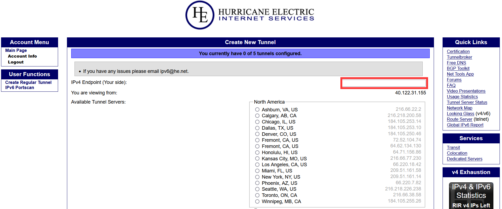
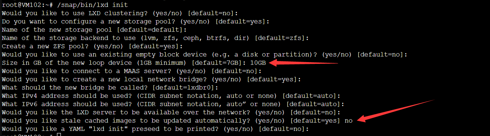

## LXD Installation Guide

If your host does not have an IPV6 subnet and you want to assign IPV6 addresses to containers, then please check the ``Customize`` partition in the ``LXD`` module for the ``Attach a free IPV6 address segment`` to the host, and attach an IPV6 subnet to the host before installing the environment.

### One-Click Installation

:::warning
If this is a new server, make sure that both ```apt update``` and ```apt install curl``` are working properly before executing this script. It is recommended to pre-install ```btrfs-progs``` to speed up the subsequent installation process, after installation it is recommended to reboot the system to load the settings, if it is not pre-installed it is no problem, just follow the prompts to execute the script.
:::

:::tip
It's recommended to wait for at least 5 minutes after the system boots up before executing the following commands. This is to avoid the script being executed by the default system settings, which could cause issues with apt sources.
:::

- Prerequisites: Ubuntu 18+ (recommended), Debian 8+ (x86_64 architecture only)
- The virtual memory here is talking about the size of the SWAP to be opened, and the storage pool is the sum of the sizes of the disks occupied by all your servers to be opened
- The server needs to be restarted after the environment installation process to load some default configurations
- By default, lxd's lxcfs-related configuration is enabled, so that in-container querying of container information changes to information about the container itself rather than the host

Command:

```shell
curl -L https://raw.githubusercontent.com/oneclickvirt/lxd/main/scripts/lxdinstall.sh -o lxdinstall.sh && chmod +x lxdinstall.sh && bash lxdinstall.sh
```

Example of initialization configuration:

If there is 18GB of unused disk space on the system disk, after deducting the space already occupied, and you want to allocate 2GB of virtual memory (2048MB of SWAP) and a 15GB storage pool, then following the prompts in the command line, enter ```2048``` and ```15```.

### Installation of WEB Control Panel

Customization There are tutorials on how to enable the official panel, but here do not choose to use the official panel, because the official panel in order to security, at the expense of a lot of user experience, this piece of using the

https://github.com/turtle0x1/LxdMosaic

third-party panels

```shell
sudo snap install lxdmosaic
```

Do a straightforward one-click install, then open the current host's ```https://<public IP address>/``` and force access to it to get to the setup page





This piece can be changed if you need to set up the site name


Better than nothing can only mean that there is no RBAC access control for sub-user segregation

### Manual installation (optional)

Not recommended, just for some odd environments where one-click scripts won't run.

#### Disable Firewall

```bash
apt update
apt install curl wget sudo dos2unix ufw jq -y
ufw disable
```

#### Enabling Virtual Memory SWAP

The amount of memory depends on how many instances you want to run. If you want to run 8 instances and calculate, you'll need 2GB of memory. If your actual physical memory is 512MB, you'll need an additional 1.5GB. To be cautious, allocate 2GB of virtual memory.

Execute the following commands: Enter '1', then enter '2048'. This signifies allocating 2GB of virtual memory.

Command:

```shell
curl -L https://raw.githubusercontent.com/oneclickvirt/lxd/main/scripts/swap.sh -o swap.sh && chmod +x swap.sh && bash swap.sh
```

#### Installing LXD

Actually, the virtual memory allocated for swap should be twice the size of the actual memory. So, it's reasonable to allocate 1GB if the actual memory is 500MB. The scenario I described above is an excessive allocation.

```
apt install snapd -y
snap install lxd
/snap/bin/lxd init
```

If the following error occurs in the above command

(snap "lxd" assumes unsupported features: snapd2.39 (try to update snapd and refresh the core snap))

Use the command patch before installing lxd

```
snap install core
```

If there are no exceptions, the results of the above three lines of commands are as follows



Just enter the default for the normal options

Choose the size of the physical disk (hint: select the default option with a minimum of 1GB). Generally, I fill in the available disk space minus the memory size, then multiply by 0.95 and round down. Here, I entered 10GB.

Remember to select 'no' for options containing 'auto' when prompted to update the image, in order to avoid occupying the system.

Test whether symbolic links are functioning in LXC.

```
lxc -h
```

If an error is reported then execute the following command to soft connect the lxc command

```bash
! lxc -h >/dev/null 2>&1 && echo 'alias lxc="/snap/bin/lxc"' >> /root/.bashrc && source /root/.bashrc
export PATH=$PATH:/snap/bin
```

After connecting, test the lxc command again to see if there is an error about not being able to find it
