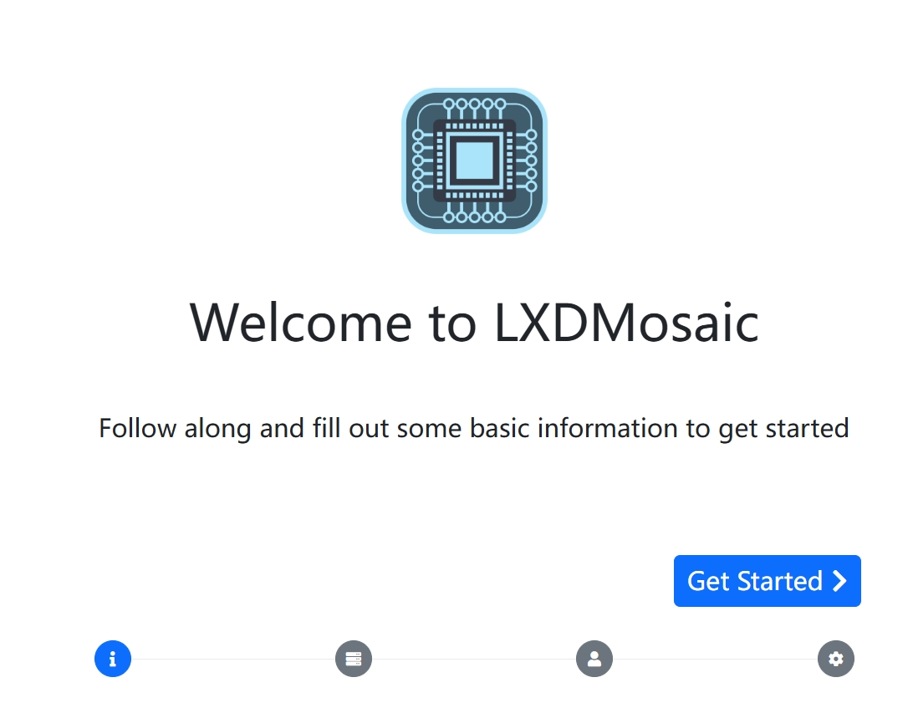
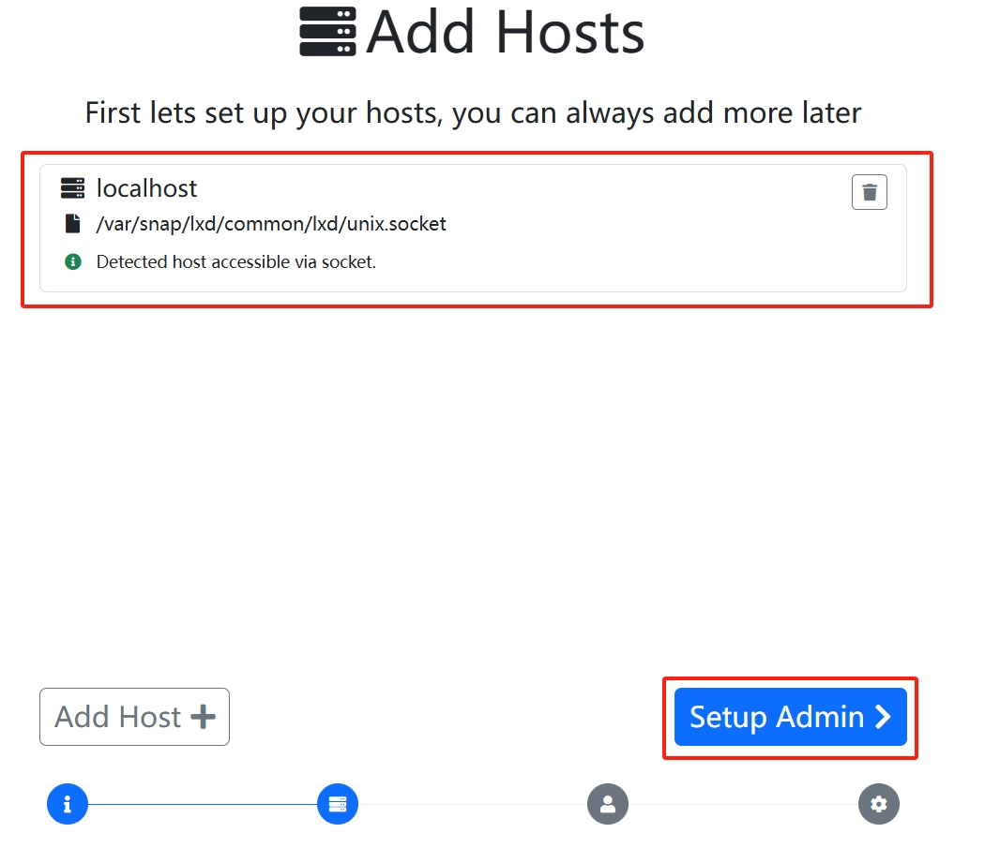
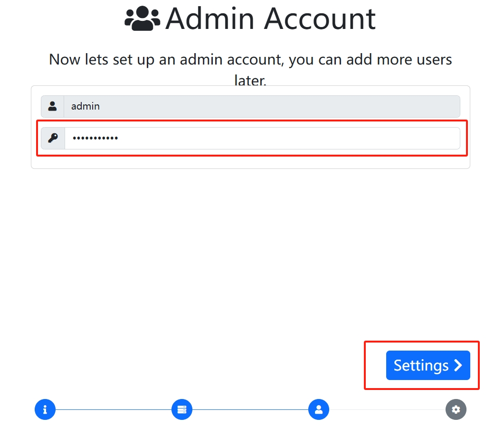
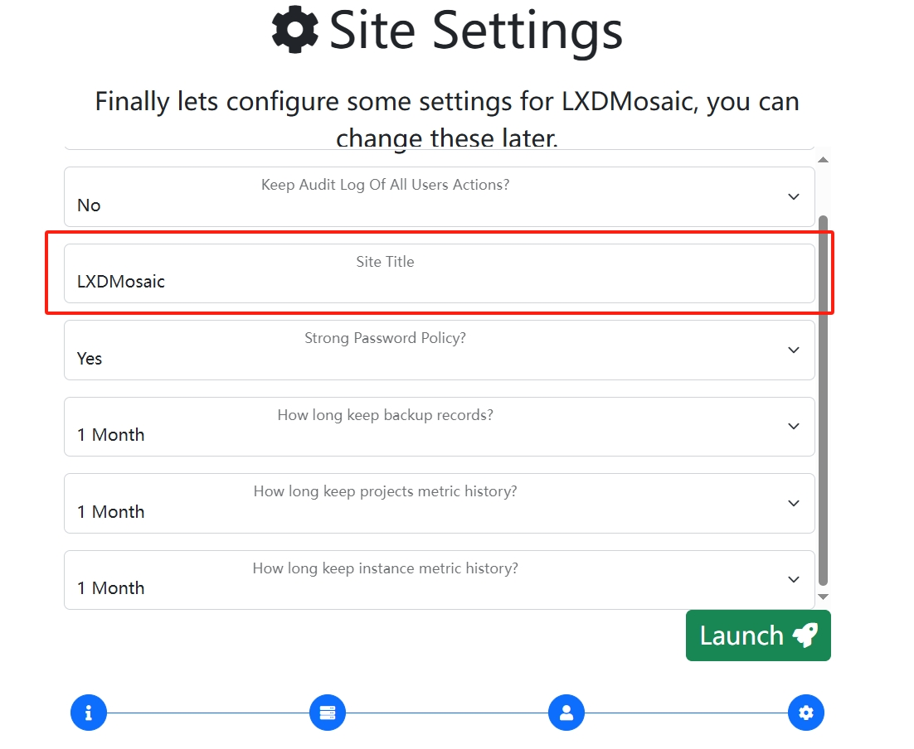
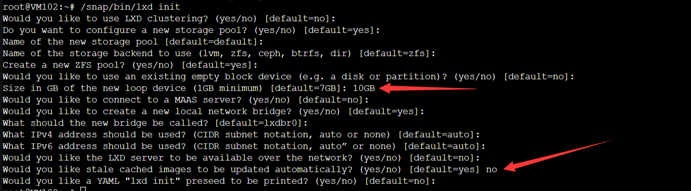

# LXD

If your host has no IPv6 subnet but you want to assign IPv6 addresses to containers, check the ```Customize``` section in the ```LXD``` module for ```Attach a free IPv6 address segment to the host```, then attach an IPv6 subnet before installation.


## Setting up virtual memory (SWAP) (optional, not required)

:::tip
If your host has limited memory and enough free disk space, add swap to reduce OOM risk.
:::

Unit conversion: Enter 1024 to generate 1G SWAP-virtual memory, virtual memory occupies hard disk space.

When the actual memory is not enough, the virtual memory will be automatically used for memory usage, but it will bring high IO usage and CPU performance.

For swap sizing guidance, refer to [this guide](https://github.com/oneclickvirt/ecs/blob/master/README_NEW_USER.md).

| Physical Memory Size | Recommended SWAP Size |
| -------------------- | --------------------- |
| ≤ 2G                | 2x memory size        |
| 2G < memory ≤ 8G    | Equal to physical memory |
| ≥ 8G                | About 8G is sufficient |
| Hibernation needed  | At least equal to physical memory |

The above values are only recommended settings, the actual value according to their own needs, do not blindly copy the value!

```shell
curl -L https://raw.githubusercontent.com/spiritLHLS/addswap/main/addswap.sh -o addswap.sh && chmod +x addswap.sh && bash addswap.sh
```

## LXD One-Click Installation Guide

:::warning
If this is a new server, make sure that both ```apt update``` and ```apt install curl``` are working properly before executing this script.
:::

:::tip
It's recommended to wait for at least 5 minutes after the system boots up before executing the following commands. This is to avoid the script being executed by the default system settings, which could cause issues with apt sources.
:::

- Prerequisites: Ubuntu 18+ (recommended), Debian 8+ (Incus more recommended)
- During installation, you will be prompted to enter the storage pool creation path as well as the size, and all the VMs or containers you want to open end up taking up space in the storage pool
- The server needs to be restarted after the environment installation process to load some default configurations
- By default, lxd's lxcfs-related configuration is enabled, so that in-container querying of container information changes to information about the container itself rather than the host
- This installer has been tested to work on either physical or non-physical machines

Command:

```shell
curl -L https://raw.githubusercontent.com/oneclickvirt/lxd/main/scripts/lxdinstall.sh -o lxdinstall.sh && chmod +x lxdinstall.sh && bash lxdinstall.sh
```

OR

```shell
bash lxdinstall.sh
```

Example of initialization configuration:

If you don't need to specify the path of a non-system disk as the default storage pool, then you can directly enter or type ```n``` when choosing whether to customize the storage pool path, and you don't need to specify the path.

If you need to specify the path of a non-system disk as the default pool, then you need to select ```y``` and enter the corresponding path (the actual absolute path of the disk you mounted).

If the corresponding disk has 18 Gigabytes of free hard disk space in addition to the occupied space and you want to open a 15 Gigabyte storage pool, follow the command line prompts to enter ```15```.

:::warning
If you plan to run more than 200 LXD containers on one server, this solution is not recommended. `lxcfs` drift can cause persistent I/O load that is hard to recover from. (This is an upstream LXC limitation.)
:::

## Installation of WEB Control Panel

The customization section also includes guidance for enabling the official panel. Here we recommend a third-party panel instead, because the official panel prioritizes security over user experience in several workflows.

https://github.com/turtle0x1/LxdMosaic

Third-party panel:

```shell
sudo snap install lxdmosaic
```

Run the one-click installation, then open ```https://<public IP address>/``` on the host. Accept the browser warning if needed to enter the setup page.







You can change this section if you want to customize the site name.



This panel is practical, but it does not provide complete RBAC-style sub-user isolation.

## Manual installation (optional)

Not recommended for normal usage. Use it only when one-click scripts cannot run in your environment, or when you want to learn the base LXD installation process.

### Disable Firewall

```bash
apt update
apt install curl wget sudo dos2unix ufw jq -y
ufw disable
```

### Enabling Virtual Memory SWAP

The amount of memory depends on how many instances you want to run. If you want to run 8 instances and calculate, you'll need 2GB of memory. If your actual physical memory is 512MB, you'll need an additional 1.5GB. To be cautious, allocate 2GB of virtual memory.

Execute the following commands: Enter '1', then enter '2048'. This signifies allocating 2GB of virtual memory.

Command:

```shell
curl -L https://raw.githubusercontent.com/oneclickvirt/lxd/main/scripts/swap.sh -o swap.sh && chmod +x swap.sh && bash swap.sh
```

### Installing LXD

Actually, the virtual memory allocated for swap should be twice the size of the actual memory. So, it's reasonable to allocate 1GB if the actual memory is 500MB. The scenario I described above is an excessive allocation.

```
apt install snapd -y
snap install lxd
/snap/bin/lxd init
```

If the following error occurs in the above command

(snap "lxd" assumes unsupported features: snapd2.39 (try to update snapd and refresh the core snap))

Use the command patch before installing lxd

```
snap install core
```

If no errors occur, the result of the commands above should look like this:



For standard options, keep the defaults.

Choose the size of the physical disk (hint: select the default option with a minimum of 1GB). Generally, I fill in the available disk space minus the memory size, then multiply by 0.95 and round down. Here, I entered 10GB.

When prompted about automatic image updates, choose `no` to avoid unnecessary resource usage.

Test whether symbolic links are functioning in LXC.

```
lxc -h
```

If an error is reported, run the following command to add an `lxc` alias:

```bash
! lxc -h >/dev/null 2>&1 && echo 'alias lxc="/snap/bin/lxc"' >> /root/.bashrc && source /root/.bashrc
export PATH=$PATH:/snap/bin
```

Then test `lxc` again to confirm it can be found.


