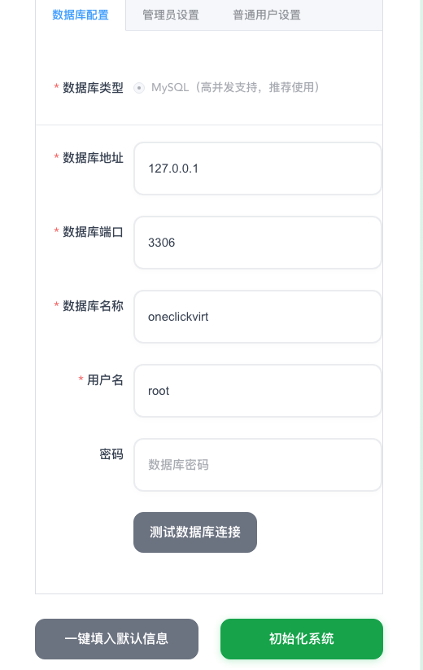

# OneClickVirt Advanced Installation

:::tip Choose one installation page
Read either this page or [Basic Installation](./oneclickvirt_install), then choose one method from that page's table. Do not run multiple installation methods for the same panel.
:::

Advanced installation is intended for users who already use 1Panel, need an external database or custom reverse proxy, want to manage release binaries themselves, or need source builds. Controlled-node requirements are the same as for basic installation; read [Configuration Requirements](./oneclickvirt_precheck) first.

## Methods on This Page

The table contains only methods documented on this page, ordered from easiest to most involved.

| Difficulty | Method | Best for | Main requirement |
| --- | --- | --- | --- |
| Easy | 1Panel third-party app store | Existing 1Panel users | Import and manage the third-party local app store |
| Easy to moderate | Precompiled all-in-one binary | Users who want to manage one program file | Provide a database and manage the process |
| Moderate | Precompiled separate frontend/backend | Higher performance or a custom frontend path | Provide a database and reverse proxy |
| Moderate | Docker external-database image | Existing external MySQL/MariaDB | Docker and an external database |
| Advanced | Docker Compose source build | Modified source with a multi-container deployment | Git, Docker Compose, and build time |
| Advanced | Dockerfile source build | Full control of image builds and runtime options | Maintain images, containers, and volumes |

## 1Panel Third-Party App Store

[okxlin/appstore](https://github.com/okxlin/appstore/tree/localApps) includes OneClickVirt. It is an unofficial application configuration collection for 1Panel 2.0. Treat the README on its `localApps` branch as the source of truth for importing the store.

When 1Panel uses its default `/opt/1panel` path, run the upstream synchronization commands in a terminal or a 1Panel Shell scheduled task:

```bash
git clone -b localApps https://github.com/okxlin/appstore /opt/1panel/resource/apps/local/appstore-localApps
cp -rf /opt/1panel/resource/apps/local/appstore-localApps/apps/* /opt/1panel/resource/apps/local/
rm -rf /opt/1panel/resource/apps/local/appstore-localApps
```

Refresh the local app store, search for `oneclickvirt`, and complete its form. Adjust the paths if 1Panel is installed somewhere other than `/opt/1panel`.

### Upgrade

Run the upstream synchronization commands again and refresh the local app list, then upgrade OneClickVirt from 1Panel's installed-applications page. Create an application backup in 1Panel first.

### View Logs

Open the OneClickVirt container logs from 1Panel's installed-applications page. You can also enter the application's Compose directory and run:

```bash
docker compose logs -f --tail 200
```

### Uninstall

Uninstall OneClickVirt from 1Panel's installed-applications page. Whether persistent data is also removed depends on the data-removal option in the uninstall dialog. Leave that option disabled when the data must remain available for recovery.

:::warning
Button labels can differ between 1Panel versions. Create a restorable application backup and confirm how the data directory will be handled before uninstalling.
:::

## Precompiled Binary Installation

Two methods are distinguished here:
- Frontend-backend separated deployment (backend and frontend are compiled separately into corresponding files for deployment), better performance
- All-in-one deployment (frontend and backend combined into one file for deployment), relatively poorer performance

#### Frontend-Backend Separated Deployment

##### Linux

###### Download Script

```shell
curl -L https://raw.githubusercontent.com/oneclickvirt/oneclickvirt/refs/heads/main/scripts/install.sh -o install.sh && chmod +x install.sh
```

###### Environment Installation

Interactive environment installation

```
./install.sh env
```

Non-interactive environment installation (use `export noninteractive=true` to enable non-interactive mode)

```
export noninteractive=true && ./install.sh env
```

###### Main Installation

```
./install.sh install
```

Installation directory: ```/opt/oneclickvirt```

After successful installation, you need to manually start the service:

```shell
systemctl start oneclickvirt
```

Other usage methods:

Stop service:

```shell
systemctl stop oneclickvirt
```

Enable auto-start on boot:

```shell
systemctl enable oneclickvirt
```

Check status:

```shell
systemctl status oneclickvirt
```

View logs:

```shell
journalctl -u oneclickvirt -f
```

Restart service:

```shell
systemctl restart oneclickvirt
```

###### Upgrade Frontend and Backend

```
./install.sh upgrade
```

Except for configuration files, both backend and frontend files will be upgraded

During the upgrade process, you will be prompted whether you need to customize the frontend file path. If you choose not to customize, it will be extracted to ```/opt/oneclickvirt/web/``` by default

This setting is mainly to accommodate the issue that 1panel cannot customize the frontend file path. The 1panel file path is similar to ```/opt/1panel/www/sites/beta/index/web```, where ```beta``` is the name of the website you set up

###### Deploy Frontend

The installation script will extract the static files to the following directory (if not customized):

```shell
cd /opt/oneclickvirt/web/
```

You can use `nginx` or `caddy` to serve a static website from this directory. Binding a domain name is optional (but recommended if you want to enable HTTPS easily).

* `nginx`: Includes `OpenResty`, `1Panel` built-in nginx, etc. Configuration is generally similar.
* `caddy`: Easier to configure, **automatically obtains HTTPS certificates by default** (requires your domain to point to the server).

After deploying the static files, you need to configure a reverse proxy so the frontend can access the backend. Below is an example using `OpenResty` built into `1Panel`:


You need to proxy the `/api` path to the backend address `http://127.0.0.1:8888`. If you are using `1Panel`, you only need to fill in these values. The default backend domain `$host` does not need to be modified.

If you are using `nginx` or `OpenResty`, add the following configuration to your site:

```nginx
location /api/v1/ws/ {
    proxy_pass http://127.0.0.1:8888;
    proxy_http_version 1.1;
    proxy_set_header Upgrade $http_upgrade;
    proxy_set_header Connection "upgrade";
    proxy_buffering off;
    proxy_read_timeout 3600s;
    proxy_send_timeout 3600s;
}

location /api {
    proxy_pass http://127.0.0.1:8888; 
    proxy_set_header Host $host; 
    proxy_set_header X-Real-IP $remote_addr; 
    proxy_set_header X-Forwarded-For $proxy_add_x_forwarded_for; 
    proxy_set_header REMOTE-HOST $remote_addr; 
    proxy_set_header X-Forwarded-Proto $scheme; 
    proxy_set_header X-Forwarded-Port $server_port; 
    
    # WebSocket support
    proxy_set_header Upgrade $http_upgrade;
    proxy_set_header Connection "upgrade";
    
    proxy_http_version 1.1; 
    
    # SSL settings
    proxy_ssl_server_name off; 
    proxy_ssl_name $proxy_host;
    
    # Timeout settings
    proxy_connect_timeout 60s;
    proxy_send_timeout 600s;
    proxy_read_timeout 600s;
    
    # Cache and buffering
    proxy_buffering off;
    add_header X-Cache $upstream_cache_status;
    add_header Cache-Control no-cache;
}
```

If you are using `caddy`, a configuration without a domain would look like this:

```text
:80 {

    root * /opt/oneclickvirt/web
    file_server

    # WebSocket
    @ws path /api/v1/ws/*
    reverse_proxy @ws 127.0.0.1:8888 {
        header_up Host {host}
        header_up X-Real-IP {remote_host}
        header_up X-Forwarded-For {remote_host}
        header_up X-Forwarded-Proto {scheme}
        header_up X-Forwarded-Port {server_port}

        transport http {
            read_timeout 3600s
            write_timeout 3600s
        }
    }

    # Normal API
    @api path /api/*
    reverse_proxy @api 127.0.0.1:8888 {
        header_up Host {host}
        header_up X-Real-IP {remote_host}
        header_up X-Forwarded-For {remote_host}
        header_up X-Forwarded-Proto {scheme}
        header_up X-Forwarded-Port {server_port}

        transport http {
            read_timeout 600s
            write_timeout 600s
        }
    }
}
```

If you have a domain, simply replace `:80` with `example.com`. Replace `example.com` with your actual domain. The domain must be pointed to your server IP in advance. `caddy` will automatically obtain an HTTPS certificate and enable port 443 (no need to manually configure SSL).

###### View Status and Logs

The installer provides unified lifecycle commands:

```bash
./install.sh status
./install.sh logs --lines 200
./install.sh logs --follow
```

###### Uninstall

The default uninstall removes the service, program, and default web files while retaining `config.yaml` and `storage`:

```bash
./install.sh uninstall
```

After confirming that application configuration and storage are no longer needed, remove the entire application directory:

```bash
./install.sh uninstall --purge
```

Non-interactive use also requires `--yes`. The script does not remove databases, reverse proxies, or TLS certificates because other services may share them. Review and remove any custom web path separately.

##### Windows

View

https://github.com/oneclickvirt/oneclickvirt/releases/latest

Download the latest compressed file for the corresponding architecture, extract it, and execute it in the background.

In the same directory as the binary file being executed, download

https://raw.githubusercontent.com/oneclickvirt/oneclickvirt/refs/heads/main/server/config.yaml

This is the configuration file that will be needed later.

After downloading the ```web-dist.zip``` file, extract it and use the corresponding program to establish a static website, similar to Linux, set up the reverse proxy accordingly.

###### Status, Upgrade, Logs, and Uninstall

- Status: use Windows Task Manager to confirm whether the OneClickVirt process is running.
- Upgrade: stop the OneClickVirt process, back up `config.yaml` and `storage`, replace the backend and `web-dist.zip` files with matching files from the latest release, and restart the process.
- Logs: inspect console output and the `storage/logs` directory under the runtime directory.
- Uninstall: stop the process and remove the program and web files. Move `config.yaml` and `storage` elsewhere first when retaining data. Review the database and reverse proxy separately.

#### All-in-One Deployment

Here we no longer distinguish between frontend and backend concepts. From

https://github.com/oneclickvirt/oneclickvirt/releases/latest

Find the compressed package with the ```allinone``` tag for download. Note the distinction between ```amd64``` and ```arm64``` architectures, as well as the corresponding systems.

In Linux, use the ```tar -zxvf``` command to extract the ```tar.gz``` compressed package. In Windows, use the corresponding extraction tool to extract the ```zip``` compressed package, and copy and paste the binary file to the location where you need to deploy the project.

It's best to move it to a dedicated folder, as structured log files will be generated during operation.

(The following instructions will use the amd64 architecture Linux system file as an example)

On Linux, make the file executable:

```shell
chmod +x server-allinone-linux-amd64
```

Then download

https://github.com/oneclickvirt/oneclickvirt/blob/main/server/config.yaml

File to the same folder.

On Linux, start the process with `nohup` and record its process ID:

```shell
nohup ./server-allinone-linux-amd64 > oneclickvirt-console.log 2>&1 &
echo $! > oneclickvirt.pid
```

Then open port 8888 of the corresponding IP address to see the frontend for use, such as

```
http://your-IP-address:8888
```

If you are on a Windows system, you need to start the exe file with administrator privileges, and ensure that the ```config.yaml``` configuration file exists in the same folder as the exe file before starting, otherwise a white screen or connectivity issues will occur upon startup. As for how to execute it in the background, explore it yourself. It's also fine to just leave the cmd interface running.

The all-in-one deployment mode is suitable for situations where the local machine does not have a public IP. Your IP address can be ```localhost``` or ```127.0.0.1```, or it can be the corresponding public IPv4 address. Test it yourself in the specific deployment environment.

##### Upgrade

Stop the process and back up configuration and storage first:

```bash
kill "$(cat oneclickvirt.pid)"
cp -a config.yaml config.yaml.bak
cp -a storage storage.bak
```

Download the matching `allinone` archive from the latest release, replace only the binary, retain `config.yaml` and `storage`, and restart it with the command above.

##### View Status and Logs

```bash
kill -0 "$(cat oneclickvirt.pid)" && echo "OneClickVirt is running"
```

```bash
tail -f oneclickvirt-console.log
```

Structured application logs are under `storage/logs` in the runtime directory.

##### Uninstall

```bash
kill "$(cat oneclickvirt.pid)" 2>/dev/null || true
```

After confirming that the process has stopped, back up `config.yaml` and `storage` if needed, then remove the runtime directory. Any external database used by this method must be handled separately.

## Docker External-Database Image

:::warning
This method does not include a database. Prepare a reachable MySQL or MariaDB instance and create a `oneclickvirt` database with a dedicated account first.
:::

Available image versions are listed at:

https://hub.docker.com/r/oneclickvirt/oneclickvirt

https://github.com/oneclickvirt/oneclickvirt/pkgs/container/oneclickvirt

Use `oneclickvirt/oneclickvirt:no-db` for the latest release and a dated tag to pin a version. The image supports `linux/amd64` and `linux/arm64`.

##### Fresh Deployment

Replace the example host and credentials with the external database values:

```bash
docker run -d \
  --name oneclickvirt \
  -p 80:80 \
  -e FRONTEND_URL="https://your-domain.com" \
  -e DB_HOST="your-mysql-host" \
  -e DB_PORT="3306" \
  -e DB_NAME="oneclickvirt" \
  -e DB_USER="oneclickvirt" \
  -e DB_PASSWORD="your-password" \
  -v oneclickvirt-storage:/app/storage \
  --restart unless-stopped \
  oneclickvirt/oneclickvirt:no-db
```

`FRONTEND_URL` must match the URL users open. Runtime configuration is stored at `/app/storage/config.yaml` in the `oneclickvirt-storage` volume. Reuse that volume and the same database variables whenever the container is recreated.

##### Upgrade Only in Old Environment

Back up the runtime configuration first:

```shell
docker cp oneclickvirt:/app/storage/config.yaml ./config.yaml
```

Delete only the container itself without deleting the mount volumes:

```shell
docker rm -f oneclickvirt
```

Then delete the original image:

```shell
docker image rm -f oneclickvirt/oneclickvirt:no-db
```

Pull the container image again:

```shell
docker pull oneclickvirt/oneclickvirt:no-db
```

Recreate the container with the fresh-deployment command and continue mounting `oneclickvirt-storage`. The external database is not changed by this container upgrade.

##### Fresh Deployment in Old Environment

Remove the container and local runtime-configuration volume:

```shell
docker rm -f oneclickvirt
docker volume rm oneclickvirt-storage
```

Then delete the original image:

```shell
docker image rm -f oneclickvirt/oneclickvirt:no-db
```

Pull the container image again:

```shell
docker pull oneclickvirt/oneclickvirt:no-db
```

These commands do not delete the external database. Remove it separately only after confirming backups and dependencies.

##### View Status and Logs

```bash
docker ps --filter name=oneclickvirt
```

```bash
docker logs -f --tail 200 oneclickvirt
```

##### Uninstall

Retain the runtime-configuration volume:

```bash
docker rm -f oneclickvirt
docker image rm oneclickvirt/oneclickvirt:no-db
```

Run `docker volume rm oneclickvirt-storage` only when deleting local runtime configuration. Always handle the external database separately.

## Docker Compose Source Build

Using Docker Compose allows one-click deployment of a complete development environment, adopting a **separate container deployment** architecture, including independent frontend container, backend container, and database container:

```bash
git clone https://github.com/oneclickvirt/oneclickvirt.git
cd oneclickvirt
cat > .env << 'EOF'
MYSQL_ROOT_PASSWORD=change-this-root-password
MYSQL_PASSWORD=change-this-app-password
EOF
docker compose up -d --build
```

**Default Configuration Description:**

- Frontend service: `http://localhost:8888`
- Backend API: Accessed through frontend proxy
- MariaDB database: port 3306, database name `oneclickvirt`
- Database credentials: `MYSQL_ROOT_PASSWORD` and `MYSQL_PASSWORD` from `.env`
- Data persistence:
  - Database data: Docker volume `mysql_data`
  - Application storage: `./data/app/`

**Initialization Configuration:**

When accessing for the first time, you will enter the initialization interface. Please fill in the database configuration:
- Database address: `mysql` (container name, not 127.0.0.1)
- Database port: `3306`
- Database name: `oneclickvirt`
- Database user: `oneclickvirt`
- Database password: `MYSQL_PASSWORD` from `.env`

**Custom Port (Optional):**

If you need to modify the frontend access port, edit the ports configuration in the `docker-compose.yaml` file:

```yaml
services:
  web:
    ports:
      - "your-port:80"  # For example "80:80" or "8080:80"
```

### Upgrade

```bash
git pull --ff-only
docker compose up -d --build
```

### View Status and Logs

```bash
docker compose ps
```

```bash
docker compose logs -f --tail 200
```

### Uninstall

Stop and remove the containers while retaining the volume and `./data/app`:

```bash
docker compose down
```

After confirming that the data is no longer needed, remove it completely:

```bash
docker compose down -v
rm -rf ./data/app
```

Keep `.env`, `server/config.yaml`, and the source directory for a future restore, or back them up before deletion.

## Dockerfile Source Build

This method is suitable for modifying source code and custom builds:

##### All-in-One Version (Built-in Database)

```bash
git clone https://github.com/oneclickvirt/oneclickvirt.git
cd oneclickvirt
docker build -t oneclickvirt .
docker run -d \
  --name oneclickvirt \
  -p 80:80 \
  -v oneclickvirt-data:/var/lib/mysql \
  -v oneclickvirt-storage:/app/storage \
  --restart unless-stopped \
  oneclickvirt
```

##### Independent Database Version (No Built-in Database)

```bash
git clone https://github.com/oneclickvirt/oneclickvirt.git
cd oneclickvirt
docker build -f Dockerfile.no-db -t oneclickvirt:no-db .
docker run -d \
  --name oneclickvirt \
  -p 80:80 \
  -e FRONTEND_URL="https://your-domain.com" \
  -e DB_HOST="your-mysql-host" \
  -e DB_PORT="3306" \
  -e DB_NAME="oneclickvirt" \
  -e DB_USER="root" \
  -e DB_PASSWORD="your-password" \
  -v oneclickvirt-storage:/app/storage \
  --restart unless-stopped \
  oneclickvirt:no-db
```

The `no-db` image stores its runtime configuration at `/app/storage/config.yaml` in the `oneclickvirt-storage` volume. Reuse the same storage volume when updating the image or recreating the container; database settings entered on the initialization page and other system-level settings then survive replacement, so database initialization is not repeated. Non-empty `DB_*` variables take precedence over the file, while deployments that explicitly mount `/app/config.yaml` continue to use that file first.

### Upgrade

Pull source updates and rebuild the same image variant used originally:

```bash
git pull --ff-only
docker build -t oneclickvirt .
# External database variant: docker build -f Dockerfile.no-db -t oneclickvirt:no-db .
```

Remove the old container, then rerun the `docker run` command for the original variant while continuing to mount the same volumes.

### View Status and Logs

```bash
docker ps --filter name=oneclickvirt
```

```bash
docker logs -f --tail 200 oneclickvirt
```

### Uninstall

```bash
docker rm -f oneclickvirt
docker image rm oneclickvirt 2>/dev/null || true
docker image rm oneclickvirt:no-db 2>/dev/null || true
```

These commands retain volumes. For a complete all-in-one removal, also remove `oneclickvirt-data` and `oneclickvirt-storage`. The external-database variant only uses `oneclickvirt-storage` locally; handle its external database separately.

## Initialization After Advanced Installation

Except for Docker Compose and the Dockerfile all-in-one variant, methods on this page usually require MySQL or MariaDB to be prepared first. Create an empty `oneclickvirt` database with the `utf8mb4` character set and a dedicated account, and restrict the database's network exposure.

After opening the corresponding frontend page, it will automatically redirect to the initialization interface.



Fill in the database information and related user information. If the database connection test is successful, you can click Initialize System.


After completing initialization, it will automatically redirect to the homepage, and you can explore and use it yourself.


The initialization form creates the administrator account. Use a random strong password and save the credentials before submitting the form.

During the initialization process, all image seed data is loaded into the database by default, but by default only ```debian``` and ```alpine``` related version images are enabled. This is to avoid user selection difficulties caused by too many enabled images.

If you need additional types of images, you need to search by type, architecture, and version in the system image management interface under administrator privileges and enable them. Windows, Android, macOS, and other non-Linux/BSD images are also imported as preset seeds, but they are disabled by default and have higher CPU, memory, and disk requirements to prevent accidental creation on low-end nodes. Before enabling these images, confirm that the target provider satisfies the required nested virtualization, disk space, KVM, or Docker special runtime conditions.

After initialization, please immediately change the default administrator username and password, and disable or delete the default enabled test user ```testuser```. This can be done in the administrator's user management page.
