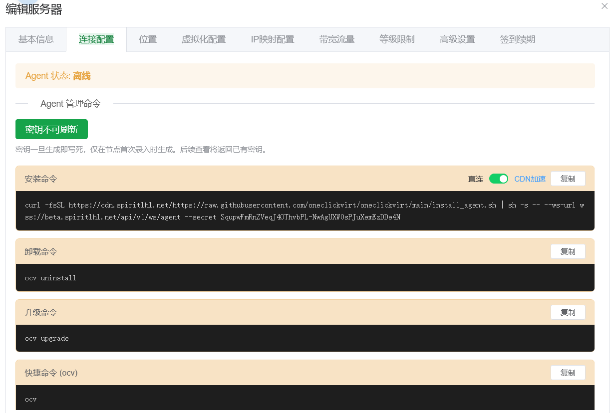
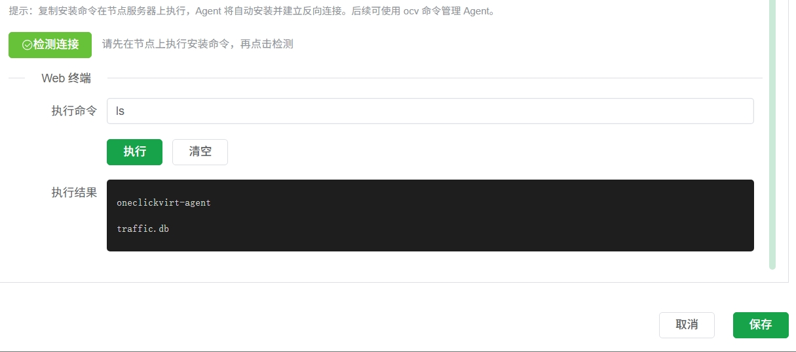
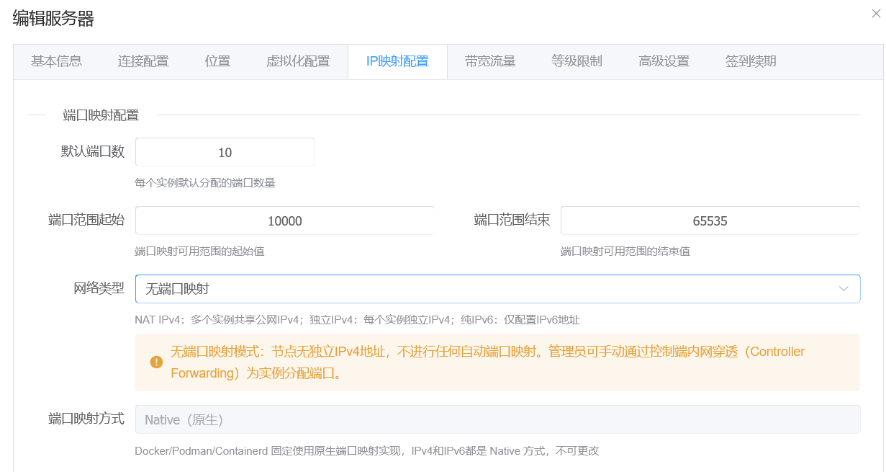
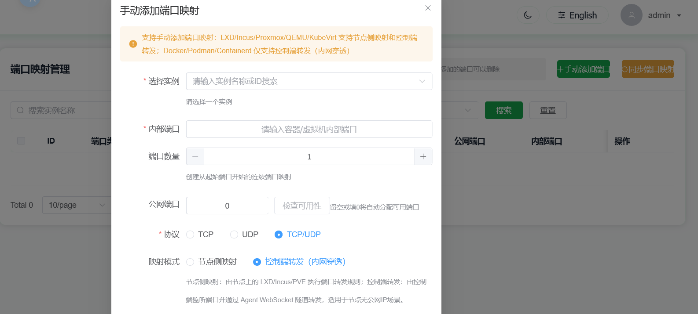
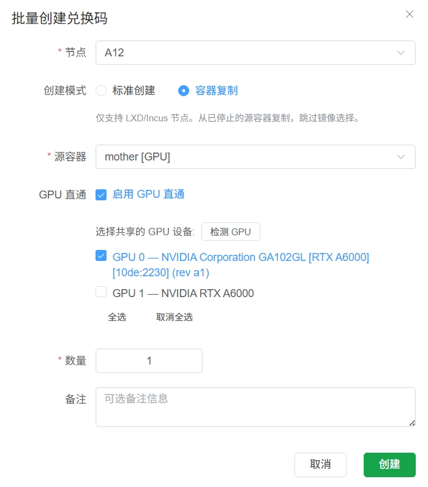
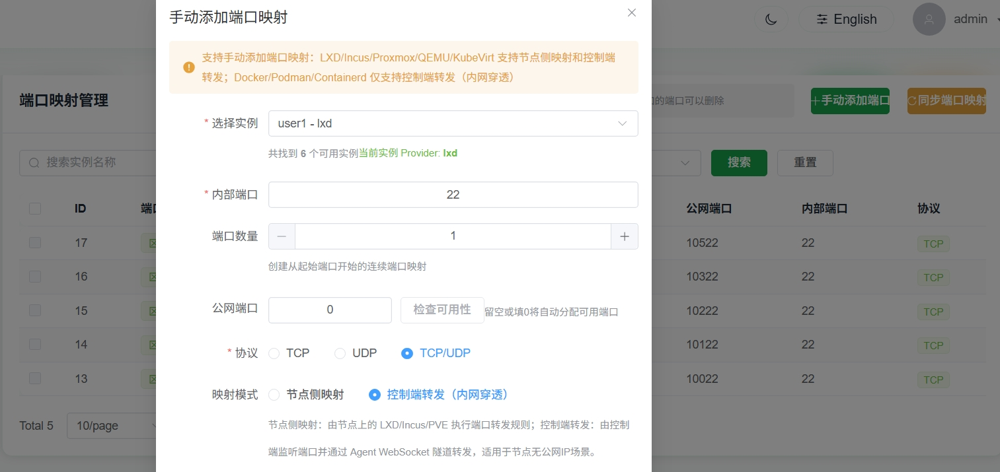
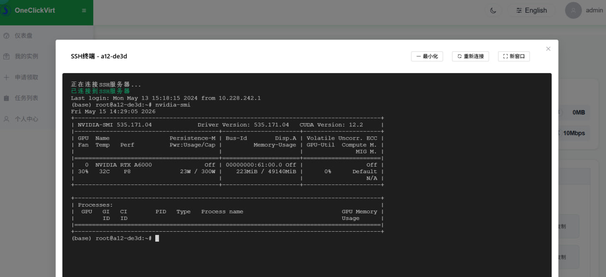

# Custom

## Manage nodes without a dedicated public IPv4 address via Agent mode

For some local devices, the node may have IPv4 internet access but does not have a fixed/dynamic dedicated public IPv4 address. In this case, you cannot directly manage the node through SSH in standard mode. Here we provide a new management method: Agent mode.


When adding a new node, click the corresponding mode, then enter the Basic Information page.


Unlike standard mode, IP address and port are no longer required fields. You can still manage the node if they are left empty. For local nodes, do not fill these two fields. For cloud servers or other nodes with a fixed public IPv4 address, you can fill them in. If they are left empty, only the `Network Type` option `No Port Mapping` is supported later. If filled in, the `Network Type` options are the same as standard mode.


After clicking Save, you can see the command generation button in `Connection Configuration`. Once saved, the node token is fixed. If you need to update the token, you must delete and re-add the node, and all configuration must be filled again. So do not leak the token.



After clicking Generate (as shown below), copy the command and run it directly on the local node server to complete management access. After installation finishes, use the detection button at the bottom of this page for verification.




After detection succeeds, the following configuration pages can be operated according to the original standard-mode instructions; there is no major difference.



Only this section differs for local nodes: choose `No Port Mapping`, so you can later manually perform `Manual Add Port` from the administrator `Port Management` page, and tunnel ports to the controller's IPv4 address for use.



When manually adding port mapping, choose `Controller Forwarding (Intranet Penetration)`. Non-required fields can be left empty. The system will automatically select controller ports for mapping.

There is one limitation: make sure the `Controller Panel` is deployed by `Script Deployment` or local compiled deployment. Docker or Docker Compose deployment is not supported. Non-`Linux` deployment is also not supported, because the controller deployment must have firewall control over the server where it is deployed, so deployment in a `root environment` is required.

The `Intranet Penetration Port` feature is `only for nodes managed in Agent mode`, forwarding via WSS proxy. During deployment, make sure your reverse proxy is configured for WS/WSS according to the instructions. Do not forget this when configuring your own reverse proxy.

Also, if the controller is upgraded, make sure to upgrade the node side accordingly. Click Edit Node, go to `Connection Configuration`, regenerate the command, and run the installation again.

## Use LXD/INCUS to create containers with shared GPU devices

For nodes that need shared GPU devices, make sure the node has already installed the corresponding GPU driver before management, and that GPU commands run correctly, for example:

```shell
nvidia-smi
```

Make sure the output is similar to:


```
root@a12-ThinkStation-P620:/root/sharefile# nvidia-smi
Sat May 16 20:23:07 2026       
+---------------------------------------------------------------------------------------+
| NVIDIA-SMI 535.171.04             Driver Version: 535.171.04   CUDA Version: 12.2     |
|-----------------------------------------+----------------------+----------------------|
| GPU  Name                 Persistence-M | Bus-Id        Disp.A | Volatile Uncorr. ECC |
| Fan  Temp   Perf          Pwr:Usage/Cap |         Memory-Usage | GPU-Util  Compute M. |
|                                         |                      |               MIG M. |
|=========================================+======================+======================|
|   0  NVIDIA RTX A6000               Off | 00000000:61:00.0 Off |                  Off |
| 30%   42C    P0              83W / 300W |      0MiB / 49140MiB |      1%      Default |
|                                         |                      |                  N/A |
+-----------------------------------------+----------------------+----------------------+
                                                                                         
+---------------------------------------------------------------------------------------+
| Processes:                                                                            |
|  GPU   GI   CI        PID   Type   Process name                            GPU Memory |
|        ID   ID                                                             Usage      |
|=======================================================================================|
|  No running processes found                                                           |
+---------------------------------------------------------------------------------------+
```

Only after the host machine has the driver installed can GPU resources be shared into containers.

Then follow the Incus/LXD tutorial in this documentation to complete local environment installation. After installation, finish Agent-mode management through the controller and pass health checks before proceeding.

It is recommended to enable node "redemption-code-only claim" mode, then create containers with GPU devices from the administrator redemption-code page.



After creation succeeds, switch to the administrator's regular-user view to redeem it, then switch back to administrator view and go to the Port Management page to tunnel container ports so you can connect and configure directly via web SSH.



After adding successfully, you can directly use web SSH to connect and manage this new local container.

Inside the container, install the same driver version as the external host. During installation, make sure it does not load into the kernel by adding the `--no-kernel-module` parameter.

For detailed driver installation steps, refer to: https://www.spiritysdx.top/20240513/#%E5%AE%B9%E5%99%A8%E5%86%85%E5%AE%89%E8%A3%85gpu%E9%A9%B1%E5%8A%A8

After installation, running `nvidia-smi` inside the container should also return output, which proves GPU sharing is active.



At this point, you can stop this container and use it as a template. Use the redemption-code batch container creation "copy mode", set this container as the source container, and clone new containers from it.