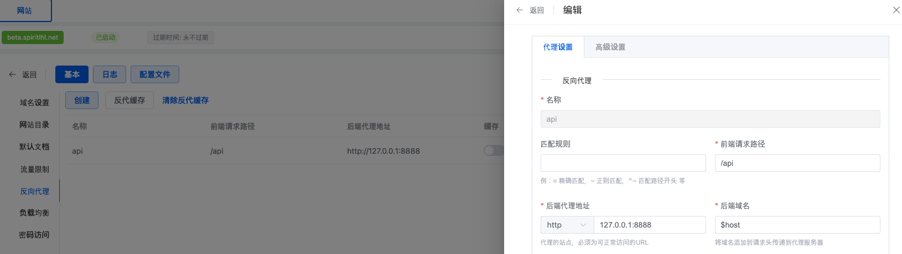
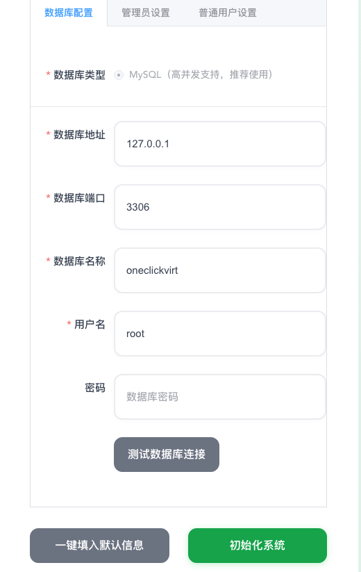
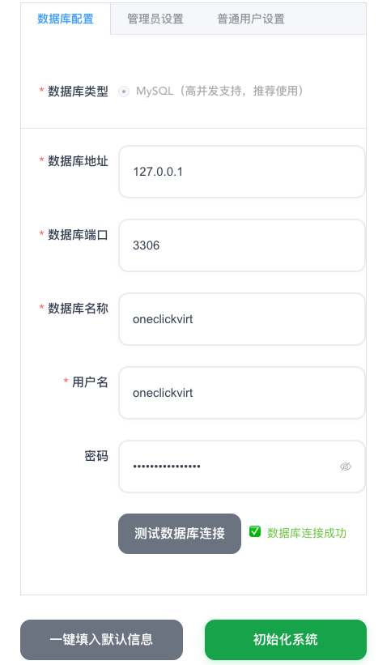

# OneClickVirt

Distinguish between the panel side and the controlled side. The controlled side needs to have the corresponding virtualization environment installed in advance. You can use the main installation of other virtualization in one-click virtualization for environment installation. The control side is actually just a panel, with no virtualization environment requirements.

## Controlled Side

Perform environment installation according to the main installation instructions elsewhere in this documentation. This won't be elaborated on here. The tutorial has corresponding installation commands for the four mainstream virtualization technologies. Please refer to them yourself.

The controlled side only needs to have the virtualization environment installed, and does not need to install an agent for control. Just ensure that SSH login is available (the SSH login address can be either public or private network, as long as connectivity is not an issue).

## Panel Side

Hardware requirements include at least 1G of free memory and 2G of free disk space. Installation can be completed through any of the following methods.

| Installation Method | Applicable Scenario | Advantages | Disadvantages |
|---------|---------|------|------|
| Frontend-Backend Separated Deployment | High performance, minimal resource usage | Best performance, flexible configuration | Complex configuration, requires reverse proxy setup |
| All-in-One Deployment | Works with or without public IPv4 address | Simple deployment, no reverse proxy needed | Relatively poor performance |
| Docker Deployment (Pre-built Image) | Quick deployment, larger resource usage | One-click installation, data persistence | Requires Docker environment, large image download |
| Docker Compose Deployment | Suitable for source code updates and maintenance | Highly customizable | Requires Docker environment, lengthy compilation time |
| Dockerfile Self-Compilation | Suitable for source code updates and maintenance | Highly customizable | Requires Docker environment, lengthy compilation time |

### Installation via Pre-compiled Binary Files

Two methods are distinguished here:
- Frontend-backend separated deployment (backend and frontend are compiled separately into corresponding files for deployment), better performance
- All-in-one deployment (frontend and backend combined into one file for deployment), relatively poorer performance

#### Frontend-Backend Separated Deployment

##### Linux

###### Download Script

International

```shell
curl -L https://raw.githubusercontent.com/oneclickvirt/oneclickvirt/refs/heads/main/install.sh -o install.sh && chmod +x install.sh
```

###### Environment Installation

Interactive environment installation

```
./install.sh env
```

Non-interactive environment installation

```
noninteractive=true ./install.sh env
```

###### Main Installation

```
./install.sh install
```

Installation directory: ```/opt/oneclickvirt```

After successful installation, you need to manually start the service:

```shell
systemctl start oneclickvirt
```

Other usage methods:

Stop service:

```shell
systemctl stop oneclickvirt
```

Enable auto-start on boot:

```shell
systemctl enable oneclickvirt
```

Check status:

```shell
systemctl status oneclickvirt
```

View logs:

```shell
journalctl -u oneclickvirt -f
```

Restart service:

```shell
systemctl restart oneclickvirt
```

###### Upgrade Frontend and Backend

```
./install.sh upgrade
```

Except for configuration files, both backend and frontend files will be upgraded

During the upgrade process, you will be prompted whether you need to customize the frontend file path. If you choose not to customize, it will be extracted to ```/opt/oneclickvirt/web/``` by default

This setting is mainly to accommodate the issue that 1panel cannot customize the frontend file path. The 1panel file path is similar to ```/opt/1panel/www/sites/beta/index/web```, where ```beta``` is the name of the website you set up

###### Deploy Frontend

The previous installation script will extract the static files to (when not customized)

```shell
cd /opt/oneclickvirt/web/
```

This path

Use ```nginx``` or ```caddy``` to establish a static website with this path. Whether you need to bind a domain name is your choice

After the static files are deployed, you need to reverse proxy the backend address for frontend use. Here is a specific example using ```OpenResty```:



You need to reverse proxy the path ```/api``` to the backend ```http://127.0.0.1:8888``` address. If you are using ```1panel```, you only need to fill in these, and the default backend domain name uses the default ```$host``` without modification.

If you are using ```nginx``` or ```caddy```, please refer to the proxy source code below and modify it yourself for proxying

```shell
location /api {
    proxy_pass http://127.0.0.1:8888; 
    proxy_set_header Host $host; 
    proxy_set_header X-Real-IP $remote_addr; 
    proxy_set_header X-Forwarded-For $proxy_add_x_forwarded_for; 
    proxy_set_header REMOTE-HOST $remote_addr; 
    proxy_set_header X-Forwarded-Proto $scheme; 
    proxy_set_header X-Forwarded-Port $server_port; 
    
    # WebSocket support
    proxy_set_header Upgrade $http_upgrade;
    proxy_set_header Connection "upgrade";
    
    proxy_http_version 1.1; 
    
    # SSL settings
    proxy_ssl_server_name off; 
    proxy_ssl_name $proxy_host;
    
    # Timeout settings
    proxy_connect_timeout 60s;
    proxy_send_timeout 600s;
    proxy_read_timeout 600s;
    
    # Cache and buffering
    proxy_buffering off;
    add_header X-Cache $upstream_cache_status;
    add_header Cache-Control no-cache;
}
```

##### Windows

View

https://github.com/oneclickvirt/oneclickvirt/releases/latest

Download the latest compressed file for the corresponding architecture, extract it, and execute it in the background.

In the same directory as the binary file being executed, download

https://raw.githubusercontent.com/oneclickvirt/oneclickvirt/refs/heads/main/server/config.yaml

This is the configuration file that will be needed later.

After downloading the ```web-dist.zip``` file, extract it and use the corresponding program to establish a static website, similar to Linux, set up the reverse proxy accordingly.

#### All-in-One Deployment

Here we no longer distinguish between frontend and backend concepts. From

https://github.com/oneclickvirt/oneclickvirt/releases/latest

Find the compressed package with the ```allinone``` tag for download. Note the distinction between ```amd64``` and ```arm64``` architectures, as well as the corresponding systems.

In Linux, use the ```tar -zxvf``` command to extract the ```tar.gz``` compressed package. In Windows, use the corresponding extraction tool to extract the ```zip``` compressed package, and copy and paste the binary file to the location where you need to deploy the project.

It's best to move it to a dedicated folder, as structured log files will be generated during operation.

(The following instructions will use the amd64 architecture Linux system file as an example)

In Linux, grant executable permissions to the file, such as

```shell
chmod 777 server-allinone-linux-amd64
```

Then download

https://github.com/oneclickvirt/oneclickvirt/blob/main/server/config.yaml

File to the same folder.

In Linux, use the ```screen``` or ```tmux``` or ```nohup``` command to execute the binary file in the background, such as

```shell
./server-allinone-linux-amd64
```

Then open port 8888 of the corresponding IP address to see the frontend for use, such as

```
http://your-IP-address:8888
```

If you are on a Windows system, you need to start the exe file with administrator privileges, and ensure that the ```config.yaml``` configuration file exists in the same folder as the exe file before starting, otherwise a white screen or connectivity issues will occur upon startup. As for how to execute it in the background, explore it yourself. It's also fine to just leave the cmd interface running.

The all-in-one deployment mode is suitable for situations where the local machine does not have a public IP. Your IP address can be ```localhost``` or ```127.0.0.1```, or it can be the corresponding public IPv4 address. Test it yourself in the specific deployment environment.

### Installation via Docker

:::tip
Since the database is started together when starting, do not operate immediately when the container just starts. You need to wait at least 12 seconds.
:::

Available image tags can be queried at

https://hub.docker.com/r/spiritlhl/oneclickvirt

https://github.com/oneclickvirt/oneclickvirt/pkgs/container/oneclickvirt

#### Method 1: Deploy Using Pre-built Image

**Image Tag Description**

| Image Tag | Description | Applicable Scenario |
|---------|------|---------|
| `spiritlhl/oneclickvirt:latest` | All-in-one version (built-in database) latest | Quick deployment |
| `spiritlhl/oneclickvirt:20251209` | All-in-one version specific date version | Need fixed version |
| `spiritlhl/oneclickvirt:no-db` | Independent database version latest | No built-in database |
| `spiritlhl/oneclickvirt:no-db-20251209` | Independent database version specific date | No built-in database |

All images support both `linux/amd64` and `linux/arm64` architectures.

##### Fresh Deployment

Using pre-built ```amd64``` or ```arm64``` images, the corresponding version will be automatically downloaded based on the current system architecture:

Without domain configuration:

```bash
docker run -d \
  --name oneclickvirt \
  -p 80:80 \
  -v oneclickvirt-data:/var/lib/mysql \
  -v oneclickvirt-storage:/app/storage \
  --restart unless-stopped \
  spiritlhl/oneclickvirt:latest
```

With domain access configuration:

If you need to configure a domain name, you need to set the `FRONTEND_URL` environment variable:

```bash
docker run -d \
  --name oneclickvirt \
  -p 80:80 \
  -e FRONTEND_URL="https://your-domain.com" \
  -v oneclickvirt-data:/var/lib/mysql \
  -v oneclickvirt-storage:/app/storage \
  --restart unless-stopped \
  spiritlhl/oneclickvirt:latest
```

The above methods are only for new installations

##### Upgrade Only in Old Environment

First backup the configuration file to the current path:

```shell
docker cp oneclickvirt:/app/config.yaml .
```

Delete only the container itself without deleting the mount volumes:

```shell
docker rm -f oneclickvirt
```

Then delete the original image:

```shell
docker image rm -f spiritlhl/oneclickvirt:latest
```

Pull the container image again:

```shell
docker pull spiritlhl/oneclickvirt:latest
```

Then follow the steps for fresh environment deployment. Note that after waiting 12 seconds to open the frontend, you will find it has automatically skipped the initialization interface because the data has been persisted and imported.

Then overwrite the original configuration file:

```shell
docker cp config.yaml oneclickvirt:/app/config.yaml
```

##### Fresh Deployment in Old Environment

This will completely delete the original data before deployment. Not only do you need to delete the container but also the corresponding mount points:

```shell
docker rm -f oneclickvirt
docker volume rm oneclickvirt-data oneclickvirt-storage
```

Then delete the original image:

```shell
docker image rm -f spiritlhl/oneclickvirt:latest
```

Pull the container image again:

```shell
docker pull spiritlhl/oneclickvirt:latest
```

Then follow the steps for fresh environment deployment. This will prompt for reinitialization, and all original data has been deleted.

#### Method 2: Self-Compile Deployment via Docker Compose

Using Docker Compose allows one-click deployment of a complete development environment, adopting a **separate container deployment** architecture, including independent frontend container, backend container, and database container:

```bash
git clone https://github.com/oneclickvirt/oneclickvirt.git
cd oneclickvirt
docker-compose up -d --build || docker compose up -d --build
```

**Default Configuration Description:**

- Frontend service: `http://localhost:8888`
- Backend API: Accessed through frontend proxy
- MySQL database: Port 3306, database name `oneclickvirt`, no password
- Data persistence:
  - Database data: `./data/mysql`
  - Application storage: `./data/app/`

**Initialization Configuration:**

When accessing for the first time, you will enter the initialization interface. Please fill in the database configuration:
- Database address: `mysql` (container name, not 127.0.0.1)
- Database port: `3306`
- Database name: `oneclickvirt`
- Database user: `root`
- Database password: Leave blank (no password)

**Custom Port (Optional):**

If you need to modify the frontend access port, edit the ports configuration in the `docker-compose.yaml` file:

```yaml
services:
  web:
    ports:
      - "your-port:80"  # For example "80:80" or "8080:80"
```

**Stop Service:**

```bash
docker-compose down
```

**View Logs:**

```bash
docker-compose logs -f
```

**Clean Data:**

```bash
docker-compose down
rm -rf ./data
```

#### Method 3: Self-Compile Deployment via Dockerfile

This method is suitable for modifying source code and custom builds:

##### All-in-One Version (Built-in Database)

```bash
git clone https://github.com/oneclickvirt/oneclickvirt.git
cd oneclickvirt
docker build -t oneclickvirt .
docker run -d \
  --name oneclickvirt \
  -p 80:80 \
  -v oneclickvirt-data:/var/lib/mysql \
  -v oneclickvirt-storage:/app/storage \
  --restart unless-stopped \
  oneclickvirt
```

##### Independent Database Version (No Built-in Database)

```bash
git clone https://github.com/oneclickvirt/oneclickvirt.git
cd oneclickvirt
docker build -f Dockerfile.no-db -t oneclickvirt:no-db .
docker run -d \
  --name oneclickvirt \
  -p 80:80 \
  -e FRONTEND_URL="https://your-domain.com" \
  -e DB_HOST="your-mysql-host" \
  -e DB_PORT="3306" \
  -e DB_NAME="oneclickvirt" \
  -e DB_USER="root" \
  -e DB_PASSWORD="your-password" \
  -v oneclickvirt-storage:/app/storage \
  --restart unless-stopped \
  oneclickvirt:no-db
```

## Database Initialization

After installing and starting ```mysql```, create an empty database ```oneclickvirt``` with type ```utf8mb4```. It's best to make it accessible only locally at ```127.0.0.1```. Save the corresponding username and password. (If you are using the all-in-one Docker deployment container, it comes with a built-in database and you don't need to create an empty database yourself. The corresponding database is already started and available in the container by default)

After opening the corresponding frontend page, it will automatically redirect to the initialization interface.



Fill in the database information and related user information. If the database connection test is successful, you can click Initialize System.



After completing initialization, it will automatically redirect to the homepage, and you can explore and use it yourself.


If the default user information is used for initialization, the default account is:

Administrator account name and password are respectively:

```
admin
```

```
Admin123!@#
```

During the initialization process, all image seed data is loaded into the database by default, but by default only ```debian``` and ```alpine``` related version images are enabled. This is to avoid user selection difficulties caused by too many enabled images.

If you need additional types of images, you need to search by type, architecture, and version in the system image management interface under administrator privileges and enable them.

After initialization, please immediately change the default administrator username and password, and disable or delete the default enabled test user ```testuser```. This can be done in the administrator's user management page.