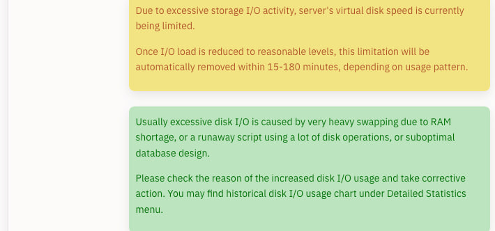

# Please Report Issues to the Corresponding Repository

## What to Do If You Forgot the Administrator Password

You need to forcibly change the password through database operations

1. Generate Password Hash

```bash
# Generate using Python (replace NewPassword123! with your new password)
python3 -c "import bcrypt; print(bcrypt.hashpw(b'NewPassword123!', bcrypt.gensalt()).decode('utf-8'))"
```

Example output: `$2b$12$xxxxxxxxxxxxxxxxxxxxxxxxxxxxxxxxxxxxxxxxxxxx`

2. Enter the Database

**Docker Deployment (All-in-One Version):**
```bash
docker exec -it oneclickvirt mysql -u root oneclickvirt
```

**Standalone Database Deployment:**
```bash
mysql -h 127.0.0.1 -P 3306 -u root -p oneclickvirt
```

3. Update Password

```sql
-- View administrator account
SELECT id, username, user_type FROM users WHERE user_type = 'admin';

-- Update password (replace with the hash value generated in step 1)
UPDATE users 
SET password = '$2b$12$xxxxxxxxxxxxxxxxxxxxxxxxxxxxxxxxxxxxxxxxxxxx' 
WHERE username = 'admin';

-- Exit
EXIT;
```

4. Login Test

Log in to the system with the new password to verify.

**Notes**

- The hash value must start with `$2a$`, `$2b$`, or `$2y$`
- The default administrator username is `admin`, which can be confirmed through a query
- It is recommended to use a strong password (≥8 characters, containing uppercase and lowercase letters, numbers, and special characters)
- It is recommended to backup the database before modification:
  ```bash
  docker exec oneclickvirt mysqldump -u root oneclickvirt > backup.sql
  ```

## How to Delete Persistent Database and Storage Volumes in Docker

After deleting the corresponding container

Execute

```shell
docker volume rm oneclickvirt-data oneclickvirt-storage oneclickvirt-config
```

to delete

## Excessive Instance Creation Causes Node Abnormalities

A prominent symptom is extremely slow operation execution, with commands taking several minutes to complete.

This commonly occurs when a node has poor I/O performance and is over-allocated with SWAP memory.
For example, in an LXD environment, executing ```lxc list``` may result in an error:

```shell
internal error, please report: running “lxd.lxc” failed: cannot create transient scope: DBus error “org.freedesktop.DBus.Error.TimedOut”: [Failed to activate service ‘org.freedesktop.systemd1’: timed out (service_start_timeout=25000ms)]
```

The root cause is setting too many instances while the provider imposes strict I/O restrictions.



At this point, only one solution remains: force-reboot the node server.

Immediately after reboot, log into SSH and use the corresponding script to clear swap usage, then delete some instances to free resources.

Since containers take time to restart individually after reboot, this window may not delete many instances, but each reboot clears some.

Ultimately, when limiting instance counts, carefully assess node performance. Avoid overloading weaker nodes or those with strict constraints.

## Issues Arising from Self-Compilation

Commonly encountered in source code deployment, Dockerfile, and Docker Compose deployment methods

Frequently observed in frontend compilation errors on ARM architectures

Directly deploy using pre-compiled Docker container images or binary files (most reliable approach)