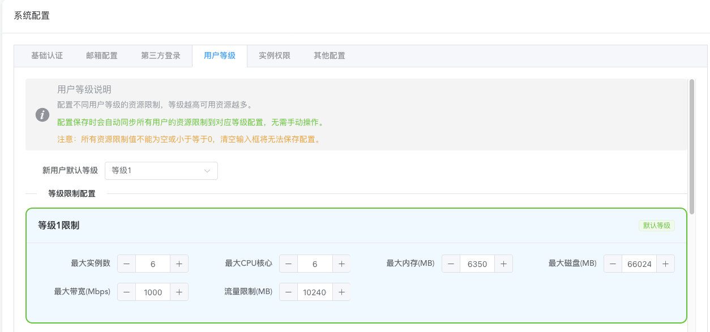

# Usage Guide

This document provides detailed instructions on how to use this panel. If you have any questions, please join the group for assistance from administrators: https://t.me/oneclickvirt

## User Management

After logging into the administrator interface, open the user management page and you must click reset password to ensure the admin account password is a strong password, preventing malicious brute force attacks. If you defined your own password during initialization, you may skip resetting the password.


Resetting the password will automatically generate a strong password, which is displayed only once. Be sure to copy and save it to avoid forgetting it.


If you need to change a user's type, click on the corresponding user to edit. The edit popup supports changing the user type.


Administrators can click on the avatar in the upper right corner, where the dropdown menu has a button to switch between administrator and regular user views. If you need to test any features, you can directly use the administrator user for testing. (Regular users do not have this view switching button)

## Managing Nodes

First, you need to ensure that the node to be managed has one of the four major virtualization technologies installed.

Ping the node's IP from the machine where this panel is deployed. Ideally, the latency should be within 300ms and the packet loss rate should not be too high, otherwise connection failures may occur, resulting in missed command execution in control.

Below are the steps for setting up nodes. Required and mandatory steps must be followed, while optional steps depend on your needs.

### Basic Information (Required)


The server name should preferably use only English letters and numbers, avoid special characters, and ideally be within 6 characters. When creating containers or virtual machines later, this server name will be automatically added as a prefix.

Select the virtualization technology name you actually installed for the server type. Docker can only create containers by default, while other virtualization technologies can create virtual machines.

For SSH address, fill in the node's public IPv4 address or internal SSH connection address. This address will be used for SSH connections and API connections.

NAT port mapping prioritizes using the port IP for mapping. If no specific port IP is provided, the SSH address IP will be used for mapping. Neither needs to be a public IPv4 address.

In the port field, fill in the port for SSH connection to the node.

Description can note some information about the current node, visible only to administrators.

Status is enabled by default, allowing regular users to apply and claim instances after health checks.

Architecture is the node's own architecture. Currently supports managing amd64 and arm64 architecture nodes, select accordingly.

(Nodes with existing instances are temporarily not supported for management. The feature to synchronize and manage existing instances has not yet been developed)

### Connection Configuration (Required)


Username is recommended to be root user, as automatic API configuration later requires downloading some dependencies. Non-root users may encounter permission issues.

Password is the password used for SSH login. Of course, if you don't use a password and use key-based login, that's also acceptable.

SSH timeout configuration is designed to test connectivity and optimize fault tolerance, and can also be used to check connectivity.


After filling in the previous information, click test and corresponding prompt values will appear. Click apply to proceed. Of course, not applying is also fine, with higher fault tolerance.

The latency here is the latency of actually executing commands on the corresponding node via ping, so it's generally around 2s or more, which is normal latency.

This design is to accommodate nodes with extremely poor connectivity to the panel machine. Increasing these parameter values means higher fault tolerance.

Execution timeout generally doesn't need modification unless your node's performance is particularly weak and command execution takes a long time.

### Location Information (Optional)


Directly enter a specific country and click to select. Most countries already have presets with corresponding flag icons.

After setting the location, regular users will be able to see the corresponding flag and region in the application interface, along with the automatically matched continent.

You can optionally fill in the corresponding city. Not filling it in is fine and doesn't affect usage.

### Instance Type and Quantity Limits (Required)


For docker type nodes, only containers can be created. Other virtualization types support creating both containers and virtual machines (provided the node itself supports it; forced creation on unsupported nodes will automatically fail).

If you don't need to create virtual machines, be sure to uncheck the virtual machine option.

If the quantity limit maintains the default parameter of 0, it means no node-level quantity limit for this type of instance.

For container type, it's recommended to set the quantity according to the following formula:

Node free storage disk size / Minimum disk size of instances to be distributed = Maximum number of instances

For virtual machine type:

Node free memory size (including virtual memory) / Minimum memory size of instances to be distributed = Number of instances

The reason for this calculation is that containers generally don't limit total CPU quantity and memory size, but limit disk size, while memory is usually the bottleneck for the number of virtual machines that can be created.

If you need to overcommit, the values obtained from the above calculation rules can be appropriately increased, and the following configuration should be set up.

### Resource Overcommitment Configuration (Optional)

Overcommitment resource configuration means whether to strictly limit corresponding resources. Removing limits means no checks will be performed and forced creation may occur, which may lead to creation task failures.


By default, container type doesn't limit total CPU and memory pre-allocation, but limits total pre-allocated disk capacity to achieve optimal resource sharing and maximum number of instances. Generally doesn't need modification.


By default, virtual machine type limits all resources, with the maximum total pre-allocated resources not exceeding actual resource size.

For ProxmoxVE, there's also a storage pool name setting for the disk to be created. If it's a multi-disk PVE, you need to set which storage pool to create on.

Other types of virtualization environments have asked about the specific storage pool creation location during installation, so there's no need to set it.

In general, if you need to limit which resources cannot be overcommitted, click limit. After limiting, corresponding resources cannot be overcommitted; without limiting, corresponding resources can be overcommitted.

The limit here is for the total resource usage of this type of instance on this node, used to calculate available resources and limit instance creation.

Not recommended to modify unless you know what this setting does.

### IP Mapping Configuration (Optional)


Generally doesn't need modification. Here you can set the number of port mappings, range, network configuration method, and port mapping method for each instance.

By default, instances are created with NAT-mapped public IPv4 ports. The priority of mapped IPs is: Port IP > SSH connection IP (used when port IP is not set)

If the node itself has an IPv6 subnet greater than or equal to /80 in size, change the network configuration to create instances with independent public IPv6 addresses.

Extremely, you can also create instances with only independent IPv6 addresses. Make your own choice.

Not recommended to modify the mapping method unless you know what this setting does. The default configuration is already the best configuration.

### Bandwidth and Traffic Configuration (Required)


Literal meaning: set the maximum bandwidth and total available traffic calculated by natural month for instances created on the node. Traffic monitoring and traffic statistics are not automatically enabled by default.

Starting traffic monitoring will have a corresponding memory burden because traffic statistics data needs to be cached. Even after extreme optimization by this project, it will still increase with bandwidth. Don't enable traffic statistics if you don't have enough memory.

If traffic statistics are enabled, pay attention to the statistics mode. The default statistics mode is the most universal. If your local performance is good enough (mainly enough memory), you can choose higher collection frequency and collection quantity. If performance is very poor, it's recommended to choose the last tier. Custom parameters are also supported, but not recommended for beginners to modify; the preset modes are sufficient.

If traffic statistics are enabled, note that the allocated bandwidth for levels should not be too large. Monitoring will dynamically generate configuration files according to the allocated bandwidth for monitoring. The larger the bandwidth, the more memory monitoring occupies.

| Level | Instance Bandwidth | `plugin_pipe_size` | `sql_cache_entries` | Base Usage | Burst Usage |
|---:|:---:|:---:|:---:|:---:|:---|
| Low | ≤50 Mbps | 2 MB | 32 | 5~8 MB | 8~12 MB |
| Medium-Low | 51~100 Mbps | 10 MB | 64 | 10~15 MB | 15~30 MB |
| Medium | 101~200 Mbps | 25 MB | 128 | 15~20 MB | 30~50 MB |
| Medium-High | 201~500 Mbps | 50 MB | 256 | 20~30 MB | 50~80 MB |
| High | 501~1000 Mbps | 128 MB | 512 | 30~50 MB | 80~150 MB |
| Very High | 1001~2000 Mbps | 256 MB | 768 | 50~80 MB | 150~300 MB |
| Extremely High | >2000 Mbps | 512 MB | 1024 | 80~120 MB | 300~600 MB |

Traffic statistics error margin is about 0.1G deviation per 10G. NAT mapping and instances with independent IPv6 IPs are automatically handled, no manual management needed.

However, if traffic statistics were previously enabled and need to be disabled and monitoring uninstalled later, you need to delete the monitoring in the following place first before disabling traffic statistics. This ensures complete uninstallation, otherwise it will still collect statistics in the background.


Only after enabling traffic control will the traffic monitoring management button appear here. After entering, three buttons are visible, mainly for manually synchronizing monitoring situations. Generally, if traffic monitoring is not enabled after some instances are created, manual management is not needed. If needed, just click detect traffic monitoring, which will batch detect the monitoring situation of all instances under the current instance.


### Level Restrictions (Required)


Five levels are preset here, and users will be filtered through this restriction configuration when applying and claiming.

During the actual instance creation process, the node-level level restrictions will be compared with the global user level resource restrictions, taking the minimum value as the user's available resource limit on the current node.

This setting is to specialize the configuration limits of instances that users of corresponding levels can create on the current node, avoiding situations where global limits are not suitable for the current node. Global limits can be set in system configuration and are generally used for user account-level resource usage restrictions.

### Advanced Settings (Optional)


Expiration time:

Prevents users from continuing to operate expired nodes. Expired nodes will be automatically frozen, at which time corresponding instances will not allow any operations but will not be automatically deleted. If a node is frozen, please clean and delete it in time.

Task concurrency control:

Default is single-threaded serial execution. At the same time, only one add/delete/modify task (corresponding to instance creation, deletion, and reset operations) will exist.

Can be changed to multi-threaded concurrent execution, where multiple add/delete/modify tasks can exist at the same time. Only when concurrent execution is used does the concurrency number setting make sense.

Serial execution is suitable for situations where the node itself has weak performance or the platform has few users. Concurrent operation is suitable for situations where the node itself has strong performance or there are many users. Please choose the mode yourself.

Personally recommend using default settings. Concurrent execution may have boundary conditions that have not been fully tested and may have bugs.

Task polling settings:

Controls whether to enable task execution and the interval for polling to check status. Generally keep default.

Operation execution rules:

Node operation mode supports API only, SSH only, and automatic switching. By default, automatic switching mode is used. Generally, there's no need to modify unless there are special requirements.

If you need to enable API operation mode, after successfully saving the node settings, click the auto-configure API button outside to execute background tasks to automatically interface with the virtualization platform API, no manual configuration required. After waiting for about 15-20 seconds, it should have been configured successfully. Click the button to see the configuration history tasks and corresponding logs. After successful configuration, click health check again to ensure the API status is green online status, and you've successfully configured and enabled the API.


### Hardware Configuration (Optional)


Only lxd and incus support setting default instance parameter configurations. Generally use the defaults unless you need to manually limit certain special hardware resources; otherwise, generally no modification is needed.

If you need to set the maximum percentage of CPU usage or similar parameters, the settings here can meet your requirements.

### Health Check (Required)


Click the operation button


After saving the node, after completing the health check, regular users can see the corresponding server and can apply for creation. If health check is not performed, users cannot apply for creation and claiming.

After health check, it will display whether the corresponding type of connection status is online and will automatically detect the actual total resources of the entire machine. This total resource amount is the total resource limit for non-overcommitted creation set above.

Whether the API is available does not affect specific usage. Auto-configuring the API is not mandatory.

## System Images


By default, seed data will include all available images for all virtualization environments. By default, only alpine and debian images are enabled to avoid too many available images for users.

If you need images for any system, any virtualization environment, any architecture, please search and enable them yourself, otherwise users cannot select the corresponding images.

Custom image addresses are temporarily not supported. The current frontend entry function is not available. Do not manually enter images.

## System Configuration

General options here won't be elaborated on. There are two configurations that need special explanation.

### User Level Configuration (Required)



This limits the total account available resources for regular user levels.

When creating instances on corresponding nodes, this global configuration will work together with the node's own level configuration to filter and provide users with configurations that meet both conditions.

### Instance Permission Configuration (Required)


Here you can control the minimum level required for users to perform sensitive operations. You can control the minimum user level required for instance creation, instance deletion, and instance system reset.

## Configuration File

The default system configuration is already sufficient for light usage. If advanced customization is needed, you need to modify the configuration file or modify it in the administrator interface after initialization.

https://github.com/oneclickvirt/oneclickvirt/blob/main/server/config.yaml

This is the complete initialization configuration file. Below we will explain the specific configuration items:

### auth Authentication Configuration

```yaml
auth:
    email-password: ""
    email-smtp-host: ""
    email-smtp-port: "3306"
    email-username: root
    enable-email: false
    enable-oauth2: false
    enable-public-registration: false
    enable-qq: false
    enable-telegram: false
    qq-app-id: ""
    qq-app-key: ""
    telegram-bot-token: ""
    frontend-url: ""
```

Authentication module configuration items, used to control user login and registration methods and third-party login integration.

- `email-password`: Email service authentication password, used for authentication when sending emails via SMTP
- `email-smtp-host`: SMTP server address, such as `smtp.gmail.com`
- `email-smtp-port`: SMTP server port, common ports are `25`, `465` (SSL), `587` (TLS)
- `email-username`: SMTP server login username, usually the complete email address
- `enable-email`: Whether to enable email login functionality
- `enable-oauth2`: Whether to enable OAuth2 third-party login functionality
- `enable-public-registration`: Whether to allow public registration. When disabled, only administrators can create accounts
- `enable-qq`: Whether to enable QQ login
- `enable-telegram`: Whether to enable Telegram login
- `qq-app-id`: App ID applied for on QQ Connect platform
- `qq-app-key`: App Key applied for on QQ Connect platform
- `telegram-bot-token`: Telegram Bot's API Token
- `frontend-url`: Frontend access address, needs to include protocol header (`http://` or `https://`), trailing slash is optional. OAuth2 callback address depends on this configuration

### captcha Verification Code Configuration

```yaml
captcha:
    enabled: true
    expire-time: 300
    height: 40
    length: 4
    width: 120
```

Graphic verification code generation and verification configuration, used for security verification on frontend login and registration pages.

- `enabled`: Whether to enable verification code functionality
- `expire-time`: Verification code expiration time in seconds
- `height`: Verification code image height in pixels
- `length`: Verification code character length
- `width`: Verification code image width in pixels

### cdn Content Delivery Network Configuration

```yaml
cdn:
    base-endpoint: https://cdn.spiritlhl.net/
    endpoints:
        - https://cdn0.spiritlhl.top/
        - http://cdn3.spiritlhl.net/
        - http://cdn1.spiritlhl.net/
        - http://cdn2.spiritlhl.net/
```

CDN acceleration node configuration used when downloading system images.

- `base-endpoint`: Primary CDN node address, used first
- `endpoints`: Backup CDN node list, retried in order. The system will automatically select available nodes for image download

Generally, this configuration doesn't need modification. Preloaded system images are all hosted in this organization's repository, and default CDN nodes can already provide good download acceleration.

### mysql Database Configuration

```yaml
mysql:
    auto-create: true
    config: charset=utf8mb4&parseTime=True&loc=Local
    db-name: oneclickvirt
    engine: InnoDB
    log-mode: error
    log-zap: false
    max-idle-conns: 10
    max-lifetime: 3600
    max-open-conns: 100
    password: ""
    path: ""
    port: ""
    prefix: ""
    singular: false
    username: root
```

MySQL database connection and behavior configuration. Initialization judgment logic: when both `path` and `port` are empty, the system considers initialization is needed, and at this time the target database must be an empty database.

- `auto-create`: Whether to automatically create the database (if it doesn't exist)
- `config`: Database connection parameters, including character set, time parsing, etc.
- `db-name`: Database name
- `engine`: Database storage engine, InnoDB is recommended
- `log-mode`: Database log mode, options are `silent`, `error`, `warn`, `info`
- `log-zap`: Whether to use zap log library to record database logs
- `max-idle-conns`: Maximum number of idle connections
- `max-lifetime`: Connection maximum lifetime in seconds
- `max-open-conns`: Maximum number of open connections
- `password`: Database password
- `path`: Database server address
- `port`: Database server port
- `prefix`: Database table name prefix
- `singular`: Whether to use singular table names (default is plural)
- `username`: Database username

### quota Quota Limit Configuration

```yaml
quota:
    default-level: 1
    level-limits:
        "1":
            max-instances: 1
            max-resources:
                bandwidth: 100
                cpu: 1
                disk: 1025
                memory: 350
            max-traffic: 102400
        "2":
            max-instances: 3
            max-resources:
                bandwidth: 200
                cpu: 2
                disk: 20480
                memory: 1024
            max-traffic: 204800
        "3":
            max-instances: 5
            max-resources:
                bandwidth: 500
                cpu: 4
                disk: 40960
                memory: 2048
            max-traffic: 307200
        "4":
            max-instances: 10
            max-resources:
                bandwidth: 1000
                cpu: 8
                disk: 81920
                memory: 4096
            max-traffic: 409600
        "5":
            max-instances: 20
            max-resources:
                bandwidth: 2000
                cpu: 16
                disk: 163840
                memory: 8192
            max-traffic: 512000
```

User level and resource quota control configuration. The default unit for memory, disk, and traffic is MB.

#### Global Configuration

- `default-level`: Default level for newly registered users

#### instance-type-permissions Instance Type Permissions

Controls what operation types users of different levels can perform.

- `min-level-for-container`: Minimum user level required to create container instances
- `min-level-for-delete`: Minimum level required to perform delete operations on the regular user side
- `min-level-for-vm`: Minimum user level required to create virtual machine instances

#### level-limits Level Quota Limits

Defines the resource quota upper limits corresponding to each user level, with keys being level numbers.

Each level contains the following configurations:

- `max-instances`: Maximum number of instances this level user can create
- `max-resources`: Maximum resource limits for a single instance
  - `bandwidth`: Maximum bandwidth in Mbps
  - `cpu`: Maximum CPU cores
  - `disk`: Maximum disk space in MB
  - `memory`: Maximum memory in MB
- `max-traffic`: Maximum total traffic for this level user in MB

### zap Log Configuration

```yaml
zap:
    compress-logs: true
    director: storage/logs
    encode-level: LowercaseLevelEncoder
    format: console
    level: info
    log-in-console: false
    max-array-elements: 5
    max-backups: 15
    max-file-size: 5
    max-log-length: 2000
    max-string-length: 1000
    prefix: '[oneclickvirt]'
    retention-day: 3
    show-line: false
    stacktrace-key: stacktrace
```

Detailed configuration for system log recording, based on the zap log library.

- `compress-logs`: Whether to compress archived log files
- `director`: Log file storage directory
- `encode-level`: Log level encoding method, options are `LowercaseLevelEncoder` (lowercase), `CapitalLevelEncoder` (uppercase)
- `format`: Log output format, options are `console` (console format), `json` (JSON format)
- `level`: Log level, options are `debug`, `info`, `warn`, `error`. It's recommended to use `debug` during development and debugging, and `info` or `warn` in production environments
- `log-in-console`: Whether to output logs to console simultaneously
- `max-array-elements`: Maximum number of elements to record for array type fields
- `max-backups`: Maximum number of historical log files to retain
- `max-file-size`: Maximum size of a single log file in MB
- `max-log-length`: Maximum length of a single log entry, excess will be truncated
- `max-string-length`: Maximum recording length for string fields
- `prefix`: Log prefix identifier
- `retention-day`: Log file retention days, automatically deleted after expiration
- `show-line`: Whether to display the filename and line number of log calls
- `stacktrace-key`: Key name for stack trace information

Note: When debugging issues, `level` should be set to `debug` to obtain detailed log information.