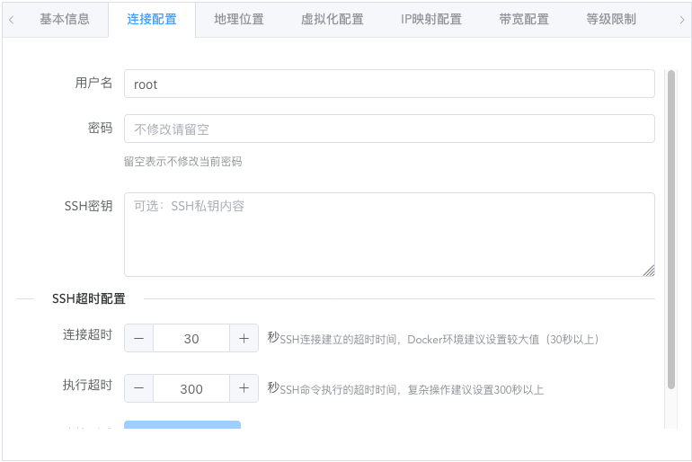
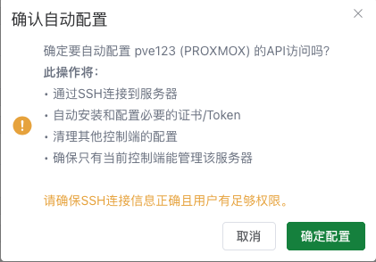

# Usage Guide

This document provides detailed instructions on how to use this panel. If you have any questions, please join the group for help from administrators or group members: https://t.me/oneclickvirt

## User Management

After logging into the administrator interface, open the user management page and you must click reset password to ensure that the admin account password is a strong password, ensuring it won't be maliciously brute-forced. If you used a custom password during initialization, then resetting the password is optional.


Resetting the password will automatically generate a strong password, displayed only once. Make sure to copy and save it to avoid forgetting it.


If you need to change the user type, you need to click on the corresponding user to edit them. The edit popup supports changing the user type.


Administrators can click on the avatar in the upper right corner. The dropdown menu has buttons to switch between administrator and normal user views. If you need to test any features, you can directly use the administrator account for testing. (Normal users do not have this view switching button)

## Managing Nodes

First, you need to ensure that the node to be managed has one of the four major virtualization technologies installed.

Ping the node's IP from the machine where this panel is deployed. The latency should preferably be within 300ms and the packet loss rate should not be too high, otherwise connection issues may occur, resulting in missed command execution in control.

Here are the steps for setting up nodes:

### Basic Information (Required)


The server name should preferably only contain English letters and numbers, no special characters, and should ideally be within 6 characters. When creating containers or virtual machines later, this server name prefix will be automatically added.

Select the virtualization technology name you actually installed for the server type. Docker can only create containers by default, while other virtualization technologies can create virtual machines.

Fill in the node's public IPv4 address or internal SSH connection address for the SSH address. This address will be used for SSH connections and API connections.

NAT port mapping will prioritize using the port IP for mapping. If no specific port IP is provided, the SSH address IP will be used for mapping.

Fill in the SSH connection port for the port field.

The description can note some information about the current node, visible only to administrators.

The status is enabled by default, allowing normal users to apply and claim instances after the subsequent health check.

Architecture is the node's own architecture. Currently, managing amd64 and arm64 architecture nodes is supported. Select accordingly.

### Connection Configuration (Required)



It is recommended to use the root user for the username, as corresponding dependencies need to be downloaded when automatically configuring the API later.

The password is the one used for SSH login. Of course, if you don't use a password and use key login instead, that's also acceptable.

The SSH timeout configuration is designed to test connectivity and optimize fault tolerance.


After filling in the previous information, click test, and corresponding prompt values will appear. Click apply to proceed. Of course, not applying is also fine, with higher fault tolerance.

This design is to accommodate nodes with extremely poor connectivity to the panel machine. Increasing these parameter values means higher fault tolerance.

The execution timeout generally does not need to be modified unless your node itself has particularly weak performance and command execution takes a long time.

### Location Information (Optional)


Directly enter a specific country and click to check it. Most countries already have presets with corresponding flag icons.

After setting the location, normal users will be able to see the corresponding flag and region in the application claim interface, along with the automatically matched continent.

### Instance Type and Quantity Limits (Required)


For docker type nodes, only containers can be created. Other virtualization types support creating both containers and virtual machines (provided the node itself supports it).

If you don't need to create virtual machines, be sure to uncheck the virtual machine option.

If the quantity limit maintains the default parameter of 0, it means there is no node-level instance quantity limit for this type.

For container types, it is recommended to set the quantity according to the following formula:

Node free storage disk size / Minimum disk size of instances to be distributed = Maximum instance quantity

For virtual machine types:

Node free memory size (including virtual memory) / Minimum memory size of instances to be distributed = Instance quantity

The reason for this calculation is that containers generally do not limit the total CPU quantity and memory size, but limit disk size, while virtual machines generally have memory as the bottleneck for the number of instances created.

### Resource Overcommit Configuration (Optional)


By default, container types do not limit the total amount of CPU and memory pre-allocation, but limit the total amount of pre-allocated disk, to achieve optimal resource sharing and maximum instance quantity.


By default, virtual machine types limit all resources, with the maximum total pre-allocated resources not exceeding the actual resource size.

For ProxmoxVE, there is also a storage pool name setting where the created disk will be located. If PVE has multiple disks, you need to set which storage pool to create on.

Other types of virtualization environments have already asked about the specific storage pool creation location during installation, so no setting is needed.

In general, if you need to limit which resource from being overcommitted, click to limit it. After limiting, the corresponding resource cannot be overcommitted. If not limited, the corresponding resource can be overcommitted.

The limitation here is the total resource usage of this type of instance on this node, used to calculate available resources and limit instance creation.

It is not recommended to modify unless you know what this setting does.

### IP Mapping Configuration (Optional)


Generally no modification is needed. Here you can set the port mapping quantity, range, network configuration method, and port mapping method for each instance.

By default, instances are created with NAT-mapped public IPv4 ports.

If the node itself has an IPv6 subnet greater than or equal to /80 in size, then by changing the network configuration, instances with independent public IPv6 addresses can be created.

To an extreme, instances with only independent IPv6 addresses can also be created. Choose for yourself.

It is not recommended to modify the mapping method unless you know what this setting does.

### Bandwidth and Traffic Configuration (Required)


Literal meaning. Set the maximum bandwidth and available traffic total calculated by natural month for instances created on the node. Traffic monitoring and traffic statistics are automatically enabled by default.

(Current traffic statistics are flawed, as they cannot distinguish between public and internal network traffic, leading to inflated and inaccurate figures. Do not enable.)

(and due to design flaws, may even be closed still in the statistics, at this time it is recommended to the user level of this node, the user level of the system, the node's traffic limit are set to 1000T traffic to avoid triggering automatic restrictions, temporarily have no time to fix the vicious BUG)

~~When instance traffic exceeds the node limit or user limit, the instance will be automatically stopped; when the node's total traffic is exceeded, all instances on the entire node will be stopped.~~

~~At the beginning of the month, statistics data will be reset, and all instances that were automatically stopped due to reaching traffic limits will be restarted.~~

### Level Restrictions (Required)


This preset has 5 levels, which will go through this restriction filtering configuration when users apply and claim.

During the actual instance creation process, the node-level level restrictions will be compared with the global user level resource restrictions, taking the minimum value as the resource limit available to the user on the current node.

This setting is to specialize the configuration limits of instances that can be created by users of corresponding levels on the current node, avoiding situations where global restrictions are not applicable to the current node. Global restrictions can be set in system configuration and are generally used for resource restrictions at the user's entire account level.

### Advanced Settings (Optional)


Expiration time:

Prevents users from continuing to operate expired nodes. Expired nodes will be automatically frozen. At this time, corresponding instances will not allow any operations, but will not be automatically deleted. If a node is frozen, please clean up and delete the node in time.

Task concurrency control:

By default, single-threaded serial execution is used. At the same time, only one add/delete/modify task will exist (corresponding to instance creation, deletion, and reset operations).

It can be changed to multi-threaded concurrent execution. At the same time, multiple add/delete/modify tasks can exist. Only when concurrent execution is used does the concurrency quantity setting make sense.

Serial execution is suitable for situations where the node itself has weak performance or the platform has few users. Concurrent operation is suitable for situations where the node itself has strong performance or there are many users. Please choose the mode yourself.

Personally, I recommend using the default settings. Concurrent execution may have boundary conditions that have not been fully tested and may have bugs.

Task polling settings:

Controls whether to enable task execution and the interval for polling to check status. Generally keep the default.

Operation execution rules:

Node operation mode supports API only, SSH only, and automatic switching. The automatic switching mode is used by default. Generally, there is no need to modify unless there are special needs.

If you need to enable API operation mode, after successfully saving the node settings, click the auto-configure API button outside. This will execute a background task to automatically interface with the virtualization platform's API without manual configuration. After waiting for about 15-20 seconds, it should have been configured successfully. Click the button to see the configuration history tasks and corresponding logs. After successful configuration, click health check again to ensure the API status is green and online, then the API has been successfully configured and enabled.




### Health Check (Required)


After saving the node, after clicking health check and completing it, normal users can see the corresponding server and can apply for creation. If no health check is performed, users cannot apply for creation and claiming.

After the health check, it will display whether the connection status of the corresponding type is online, and will automatically detect the actual total resources of the entire machine. This total resource amount is the limit for total resource amount that will not be overcommitted as set earlier.

## System Images


By default, seed data will record all available images for all virtualization environments. Only alpine and debian images are enabled by default to avoid too many available images for users.

If you need images for any system, any virtualization environment, and any architecture, please search and enable them yourself, otherwise users cannot select the corresponding images.

Custom image addresses are not currently supported. The front-end entry function is currently unavailable. Do not manually enter images.

## System Configuration

Most options here do not need much elaboration. There are two configurations that need special explanation.

### User Level Configuration (Required)


This limits the total available resource amount for the normal user level's corresponding total account.

When creating instances on corresponding nodes, this global configuration will be filtered together with the node's own level configuration to provide users with configurations that meet both conditions.

### Instance Permission Configuration (Required)


Here you can control the minimum level required for users' sensitive operations. You can control the minimum user level required for instance creation, instance deletion, and instance system reset.

## Configuration File

The default system configuration is sufficient for light use. If advanced customization is needed, you need to modify the configuration file or modify it in the administrator interface after initialization.

https://github.com/oneclickvirt/oneclickvirt/blob/main/server/config.yaml

Here is the complete initialized configuration file. The following will explain the specific configuration items:

### auth Authentication Configuration

```yaml
auth:
    email-password: ""
    email-smtp-host: ""
    email-smtp-port: "3306"
    email-username: root
    enable-email: false
    enable-oauth2: false
    enable-public-registration: false
    enable-qq: false
    enable-telegram: false
    qq-app-id: ""
    qq-app-key: ""
    telegram-bot-token: ""
    frontend-url: ""
```

Authentication module configuration items, used to control user login registration methods and third-party login integration.

- `email-password`: Email service authentication password, used for identity verification when sending emails via SMTP
- `email-smtp-host`: SMTP server address, such as `smtp.gmail.com`
- `email-smtp-port`: SMTP server port, commonly used ports are `25`, `465` (SSL), `587` (TLS)
- `email-username`: SMTP server login username, usually the complete email address
- `enable-email`: Whether to enable email login functionality
- `enable-oauth2`: Whether to enable OAuth2 third-party login functionality
- `enable-public-registration`: Whether to allow public registration. When closed, only administrators can create accounts
- `enable-qq`: Whether to enable QQ login
- `enable-telegram`: Whether to enable Telegram login
- `qq-app-id`: App ID applied for on QQ Connect platform
- `qq-app-key`: App Key applied for on QQ Connect platform
- `telegram-bot-token`: Telegram Bot's API Token
- `frontend-url`: Frontend access address, must include protocol header (`http://` or `https://`), trailing slash is optional. OAuth2 callback address depends on this configuration

### captcha Verification Code Configuration

```yaml
captcha:
    enabled: true
    expire-time: 300
    height: 40
    length: 4
    width: 120
```

Graphic verification code generation and verification configuration, used for security verification on frontend login registration pages.

- `enabled`: Whether to enable verification code functionality
- `expire-time`: Verification code expiration time, in seconds
- `height`: Verification code image height, in pixels
- `length`: Verification code character length
- `width`: Verification code image width, in pixels

### cdn Content Delivery Network Configuration

```yaml
cdn:
    base-endpoint: https://cdn.spiritlhl.net/
    endpoints:
        - https://cdn0.spiritlhl.top/
        - http://cdn3.spiritlhl.net/
        - http://cdn1.spiritlhl.net/
        - http://cdn2.spiritlhl.net/
```

CDN acceleration node configuration used when downloading system images.

- `base-endpoint`: Main CDN node address, used with priority
- `endpoints`: Backup CDN node list, retried in order. The system will automatically select available nodes for image downloads

Generally, there is no need to modify this configuration. Preloaded system images are all hosted in this organization's repository, and the default CDN nodes can already provide good download acceleration.

### mysql Database Configuration

```yaml
mysql:
    auto-create: true
    config: charset=utf8mb4&parseTime=True&loc=Local
    db-name: oneclickvirt
    engine: InnoDB
    log-mode: error
    log-zap: false
    max-idle-conns: 10
    max-lifetime: 3600
    max-open-conns: 100
    password: ""
    path: ""
    port: ""
    prefix: ""
    singular: false
    username: root
```

MySQL database connection and behavior configuration. Initialization judgment logic: When both `path` and `port` are empty, the system considers initialization is needed. At this time, the target database must be an empty database.

- `auto-create`: Whether to automatically create the database (if it doesn't exist)
- `config`: Database connection parameters, including character set, time parsing, etc.
- `db-name`: Database name
- `engine`: Database storage engine, InnoDB is recommended
- `log-mode`: Database log mode, optional values are `silent`, `error`, `warn`, `info`
- `log-zap`: Whether to use zap log library to record database logs
- `max-idle-conns`: Maximum number of idle connections
- `max-lifetime`: Maximum connection lifetime, in seconds
- `max-open-conns`: Maximum number of open connections
- `password`: Database password
- `path`: Database server address
- `port`: Database server port
- `prefix`: Database table name prefix
- `singular`: Whether to use singular table names (default is plural)
- `username`: Database username

### quota Quota Limit Configuration

```yaml
quota:
    default-level: 1
    instance-type-permissions:
        min-level-for-container: 1
        min-level-for-delete: 2
        min-level-for-vm: 1
    level-limits:
        1:
            max-instances: 1
            max-resources:
                bandwidth: 10
                cpu: 1
                disk: 1025
                memory: 350
            max-traffic: 102400
        2:
            max-instances: 3
            max-resources:
                bandwidth: 20
                cpu: 2
                disk: 20480
                memory: 1024
            max-traffic: 204800
        3:
            max-instances: 5
            max-resources:
                bandwidth: 50
                cpu: 4
                disk: 40960
                memory: 2048
            max-traffic: 307200
        4:
            max-instances: 10
            max-resources:
                bandwidth: 100
                cpu: 8
                disk: 81920
                memory: 4096
            max-traffic: 409600
        5:
            max-instances: 20
            max-resources:
                bandwidth: 200
                cpu: 16
                disk: 163840
                memory: 8192
            max-traffic: 512000
```

User level and resource quota control configuration. The default unit for memory, disk, and traffic is MB.

#### Global Configuration

- `default-level`: Default level for newly registered users

#### instance-type-permissions Instance Type Permissions

Controls the types of operations that users of different levels can perform.

- `min-level-for-container`: Minimum user level required to create container instances
- `min-level-for-delete`: Minimum level required to perform deletion operations on the normal user side
- `min-level-for-vm`: Minimum user level required to create virtual machine instances

#### level-limits Level Quota Limits

Defines the resource quota upper limits corresponding to each user level, with keys being level numbers.

Each level includes the following configuration:

- `max-instances`: Maximum number of instances that can be created by users of this level
- `max-resources`: Maximum resource limits for a single instance
  - `bandwidth`: Maximum bandwidth, in Mbps
  - `cpu`: Maximum CPU cores
  - `disk`: Maximum disk space, in MB
  - `memory`: Maximum memory, in MB
- `max-traffic`: Maximum total traffic for users of this level, in MB

### zap Log Configuration

```yaml
zap:
    compress-logs: true
    director: storage/logs
    encode-level: LowercaseLevelEncoder
    format: console
    level: info
    log-in-console: false
    max-array-elements: 5
    max-backups: 15
    max-file-size: 5
    max-log-length: 2000
    max-string-length: 1000
    prefix: '[oneclickvirt]'
    retention-day: 3
    show-line: false
    stacktrace-key: stacktrace
```

Detailed configuration for system log recording, based on the zap log library.

- `compress-logs`: Whether to compress archived log files
- `director`: Log file storage directory
- `encode-level`: Log level encoding method, options are `LowercaseLevelEncoder` (lowercase), `CapitalLevelEncoder` (uppercase)
- `format`: Log output format, options are `console` (console format), `json` (JSON format)
- `level`: Log level, options are `debug`, `info`, `warn`, `error`. It is recommended to use `debug` during development and debugging, and `info` or `warn` in production environments
- `log-in-console`: Whether to output logs to the console simultaneously
- `max-array-elements`: Maximum number of elements recorded for array type fields
- `max-backups`: Maximum number of historical log files to retain
- `max-file-size`: Maximum size of a single log file, in MB
- `max-log-length`: Maximum length of a single log entry, excess parts will be truncated
- `max-string-length`: Maximum recording length for string fields
- `prefix`: Log prefix identifier
- `retention-day`: Number of days to retain log files, automatically deleted when expired
- `show-line`: Whether to display the filename and line number of the log call
- `stacktrace-key`: Key name for stack trace information

Note: When debugging issues, `level` should be set to `debug` to obtain detailed log information.
