# Android Virtual Machine

## Android System Image Download

Download links for Android system version 9 and earlier:

International

https://www.fosshub.com/Android-x86.html

https://sourceforge.net/projects/android-x86/files/

Domestic (China)

https://mirrors.tuna.tsinghua.edu.cn/osdn/android-x86/

Download links for Android system version 10 and later:

https://blissos.org/index.html#download

https://sourceforge.net/projects/blissos-x86/files/Official/

## Virtual Machine Setup

### Setting up an Android Virtual Machine with version 9 and earlier images

This guide demonstrates using:

https://mirrors.tuna.tsinghua.edu.cn/osdn/android-x86/71931/android-x86_64-9.0-rc2.iso

as an example

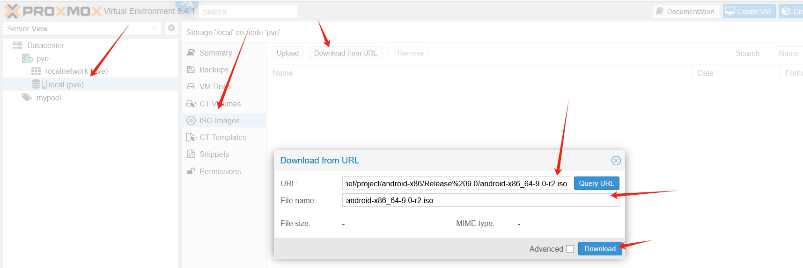

#### Template Configuration

Create a virtual machine with VMID ```100``` and select the corresponding storage disk

  

Select the Android image, then choose ```Linux``` for ```Type``` and choose an option with version 2.6 for ```Version```

  

Select ```Vmware compatible``` for ```Graphic card```, other options are default as shown

  

Choose ```SATA``` for disk format, allocate at least 30GB of disk space (size can be chosen based on your needs)

  

CPU count should be at least 2 cores

If your host machine supports nested virtualization, choose ```host``` for CPU type (verified to work)

If your host machine doesn't support nested virtualization, choose ```qemu64``` for CPU type, and after creating the template, go to ```Options``` and uncheck ```KVM hardware virtualization``` before starting the virtual machine (no guarantee that system initialization will work properly)

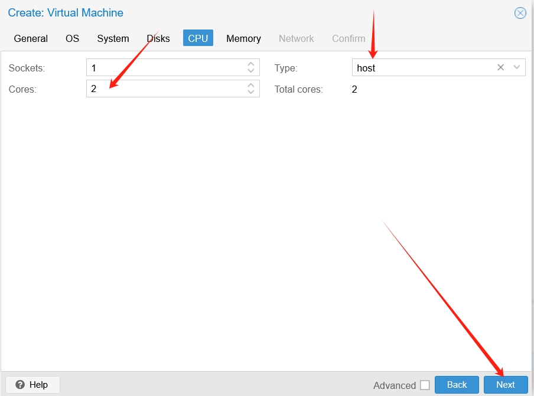  

Memory should be at least 4GB, enter at least ```4096```

  

Select ```vmbr1``` for the network bridge, choose ```VirtIO (paravirtualized)``` for ```Model```, and uncheck ```Firewall```

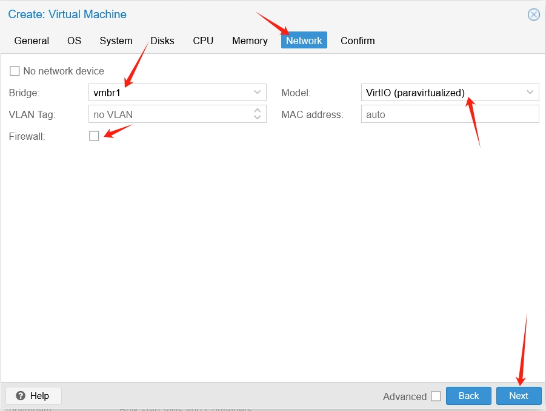  

After clicking the continue button, the template is successfully created. You need to manually start it and enter the VNC interface

  

#### System Installation

After entering the boot menu, select the option starting with ```Installation```

  

Then you need to create disk partitions. If you can't select it, press the keyboard button 'c' to select it

  

Choose not to use GPT format

  

When the empty disk is displayed, select ```New```

  

Select partition type ```Primary```

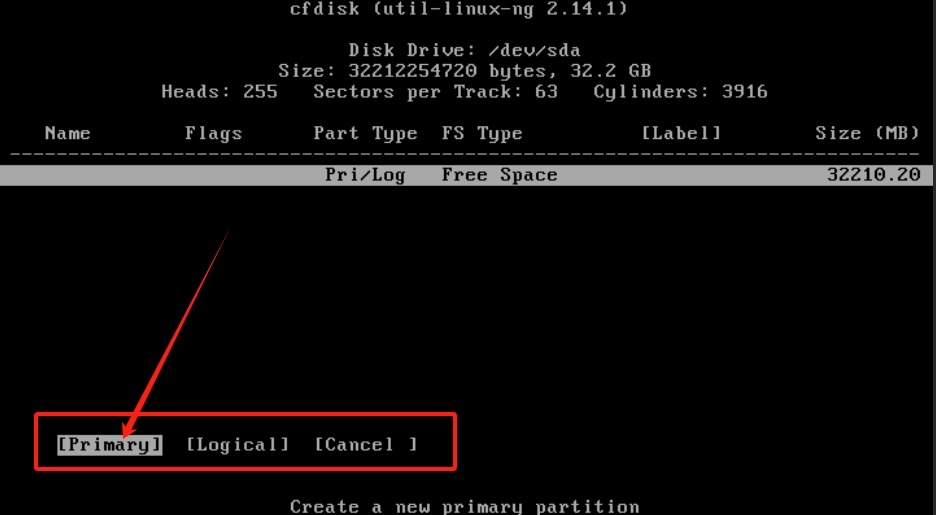  

Then you'll be prompted to specify the size of the space. Just press Enter to use all available space

  

Then select ```Flags```, move to ```Bootable```, press Enter until ```Boot``` appears under ```Flags```

  

Then move to ```Write``` and press Enter to write changes

  

You'll be asked to confirm whether to continue. Type ```yes``` and press Enter to continue

  

After a progress bar completes, you'll return to the initial menu. Select ```Quit``` to exit the menu, everything is now ready

  

Then you'll return to the UI interface. Use the previously initialized disk and select the ```OK``` button

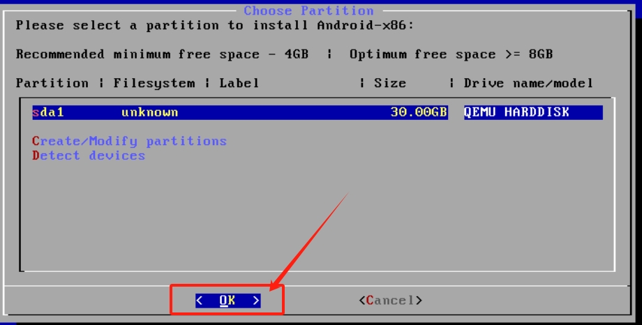  

Use the arrow keys to select ```ext4``` file system type, then select the ```OK``` button

  

Confirm formatting by selecting the ```Yes``` button

  

Confirm GRUB boot installation by selecting the ```OK``` button

  

Confirm the file system is readable and writable by selecting the ```OK``` button

  

After a progress bar runs for some time, it will show that installation was successful. Select ```Reboot``` and the ```OK``` button

  

After a while, you'll enter the Android logo screen

  

#### Removing the Image

Then there will be a black screen. If it's still black after 3-5 minutes, execute ```qm stop 100``` on the host machine, then start removing the image file.

Remove the installed ISO file by manually clicking on the corresponding ```CD``` in the ```Hardware``` section of the ProxmoxVE web interface and selecting ```Remove```

  

Then execute ```qm start 100``` on the host machine again, and you should enter the Android system initialization interface

#### System Initialization

In the initialization interface, select the language and click the confirm button

  

It will try to connect to WiFi. Since our PVE installation uses a completely static network configuration, just skip this and set it up later

  

Click the next button to confirm the time settings

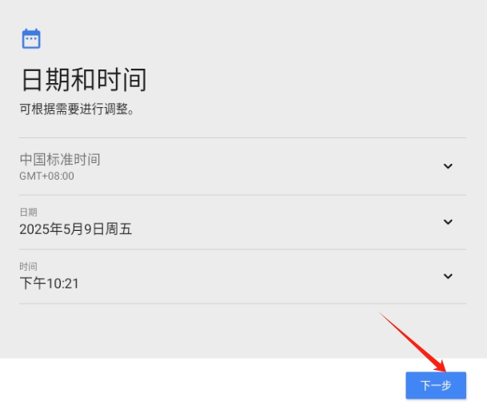  

Click to cancel screen protection, confirm to skip again

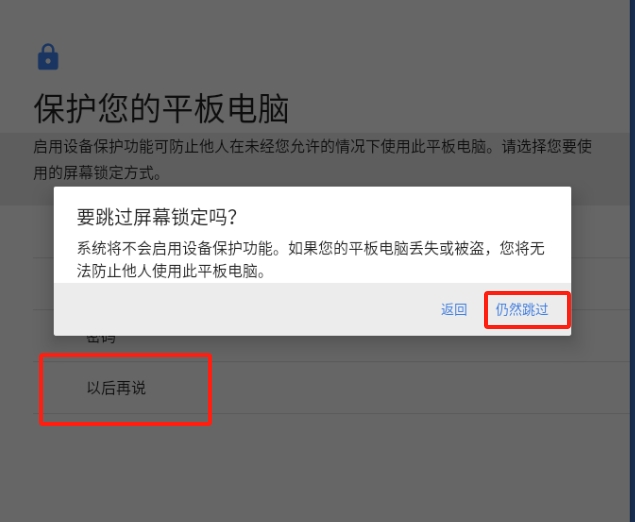  

After a period of black screen, the main screen application selection will appear. If this interface doesn't appear after waiting 3-5 minutes, restart the virtual machine as before, and it should display after entering VNC

Select ```Quickstep```


#### Network Settings

After entering the desktop, you need to set up the network. Click the settings icon in the upper left corner

  

A dropdown appears, click and hold to pull down

  

Click the gear button

  

Enter ```Network & Internet``` settings

  

Double-click ```WIFI``` with the left mouse button

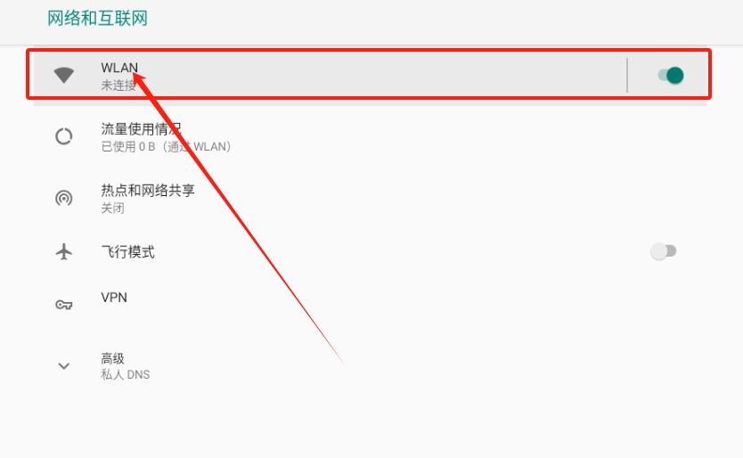  

Modify the detected ```VirtWIFI```. Right-click to bring up the selection box, then click ```Modify network```

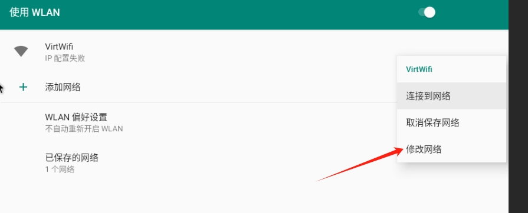  

Advanced options appear, click to open hidden options

  

Configure the network settings as shown

IP address ```172.16.1.xxx``` (replace xxx with your desired IP, I used 100 because my vmid is 100 for convenience)

Subnet mask ```24```

Default gateway ```172.16.1.1```

DNS ```8.8.8.8``` or ```144.144.144.144```

Then click the save button

  

At this point, the settings may still not be applied. Turn off WiFi and then turn it back on, it should then show as connected

  

Then exit to the main interface, click on Google Chrome, and try to open a webpage

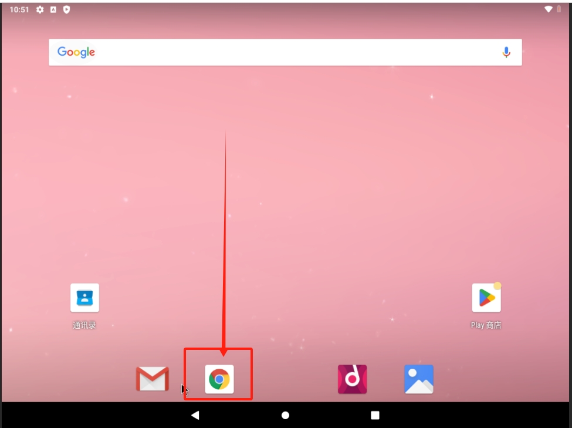  

You can see that opening this guide's URL works without problems, proving that the network is connected

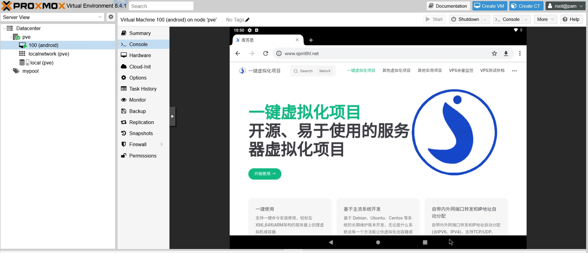

### Setting up an Android Virtual Machine with version 10 and later images

This guide demonstrates using:

https://psychz.dl.sourceforge.net/project/blissos-x86/Official/BlissOS15/Gapps/Generic/Bliss-v15.9.2-x86_64-OFFICIAL-gapps-20241012.iso?viasf=1

as an example

  

#### Template Configuration

The host machine needs to execute the following command to install graphics environment dependencies

```shell
apt install libgl1 libegl1 -y
```

Then start creating the virtual machine by clicking the ```Create VM``` button in the upper right corner. Fill in ```VMID```, ```Name```, ```Resource Pool```
  
  

Select the Android image, then choose ```Linux``` for ```Type``` and an option with version 2.6 for ```Version```

  

If the host machine has a GPU, select ```VirGL GPU``` for ```Graphic card```.

If the host machine doesn't have a GPU, select ```VirtIO``` or ```Vmware compatible``` for ```Graphic card```.

Select ```q35``` for ```Machine```, select ```OVMF (UEFI)``` for ```BIOS```, and select ```local``` for ```EFI Storage```.

  

Choose ```SATA``` for disk format. How much disk space to allocate is up to you, but at least 30GB is recommended

  

CPU count should be at least 2 cores

If your host machine supports nested virtualization, choose ```host``` for CPU type (verified to work)

If your host machine doesn't support nested virtualization, choose ```qemu64``` for CPU type, and after creating the template, go to ```Options``` and uncheck ```KVM hardware virtualization``` before starting the virtual machine (no guarantee that system initialization will work properly)

  

Memory should be at least 4GB, enter at least ```4096```

  

Select ```vmbr1``` for the network bridge, choose ```VirtIO (paravirtualized)``` for ```Model```, and uncheck ```Firewall```

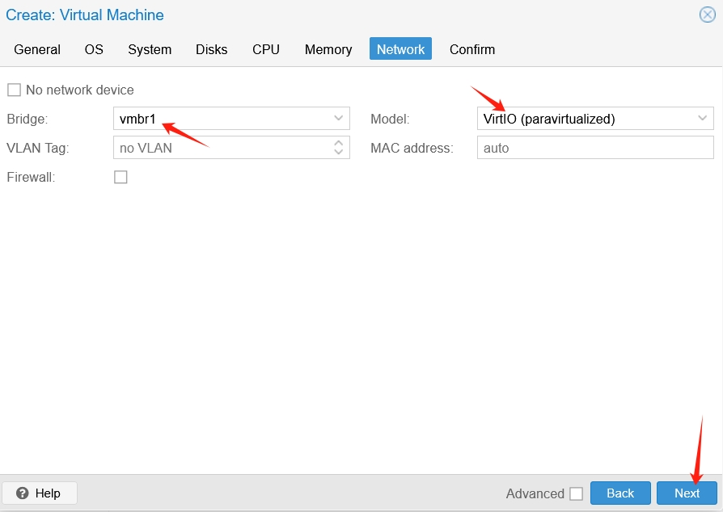  

After clicking the continue button, the template is successfully created. You need to manually start it and enter the VNC interface.

#### System Installation

After entering the boot menu, select the option ending with ```Installation```


Then you need to create disk partitions. If you can't select it, press the keyboard button 'c' to select it.

  

Choose not to use GPT format, continue using cfdisk format.

  

When the format selection box appears, select ```gpt```.

   

When the empty disk is displayed, select ```New```.

 

Because you need to create an EFI partition, you need to change the size rather than using the default. Change the number to 1 to allocate 1GB of disk space, then press Enter.

  

Then you'll return to the menu bar. Use the arrow keys to select ```Type```, then press Enter to choose the format type for the partition

  

Use the arrow keys to select the first option ```EFI System```, then press Enter

  

Now you're back at the menu bar. In the upper half of the page, you can see the specific partition size and format

  

Then press the down arrow key to select the next empty partition line

  

Select ```New``` from the menu bar, then press Enter

  

Here you need to fill in the partition size. Match it with the empty partition size shown in the upper right corner, then press Enter.

  

Return to the menu bar, select ```Write```, press Enter to write the partition.


You'll be prompted to enter ```yes``` to confirm. Enter it and press Enter.

  

After a progress bar runs, you should return to the menu bar. Select ```Quit``` to exit the menu, everything is now ready

  

Then you'll return to the UI interface. Use the previously initialized 1GB disk and select the ```OK``` button

  

Use the arrow keys to select ```fat32``` file system type, then select the ```OK``` button

  

Confirm not to modify the name by selecting the ```OK``` button

  

Confirm formatting by selecting the ```Yes``` button

  

Then you'll return to the initial UI bar. Select the second partition that is not 1GB in size and select the ```OK``` button

  

Use the arrow keys to select ```ext4``` file system type, then select the ```OK``` button

  

Confirm not to modify the name by selecting the ```OK``` button

  

Confirm formatting by selecting the ```Yes``` button

  

Choose not to use extra space for updates by selecting the ```No``` button

  

Confirm ```GRUB2 EFI BootLoader``` by selecting the ```OK``` button

  

After a progress bar runs for some time, it will show that installation was successful. Select ```Reboot``` and the ```OK``` button.

  

#### System Initialization

After a while, you'll enter the logo screen.

  

After some more time, you should enter the initial Android interface. You'll see a popup and the time. Hold the left mouse button and swipe up

  

The main screen application selection will appear. Select ```Quickstep```

If this interface doesn't appear after waiting 3-5 minutes, restart the virtual machine, and it should display after entering VNC

  

#### Removing the Image

After the Android interface appears, execute ```qm stop 100``` on the host machine, then start removing the image file.

Remove the installed ISO file by manually clicking on the corresponding ```CD``` in the ```Hardware``` section of the ProxmoxVE web interface and selecting ```Remove```

  

Then execute ```qm start 100``` on the host machine again, and you should enter the system's initial interface.

#### Network Settings

After entering the desktop, you need to set up the network. Hold the left mouse button in the indicated position and swipe up

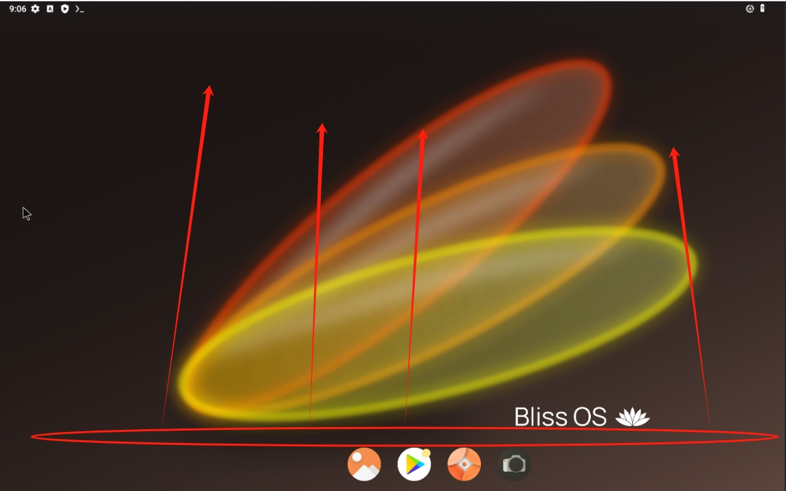  

A bunch of applications will pop up. Find the one called ```Bliss Ethernet Manager``` and click to open it

  

Click to open ```IP Assignment```, select ```Static``` type, click the OK button to confirm

  

Click to open ```IP Address```, enter ```172.16.1.xxx/24``` (I used 100 for xxx because my virtual machine VMID is 100 for easy identification), click the OK button to confirm

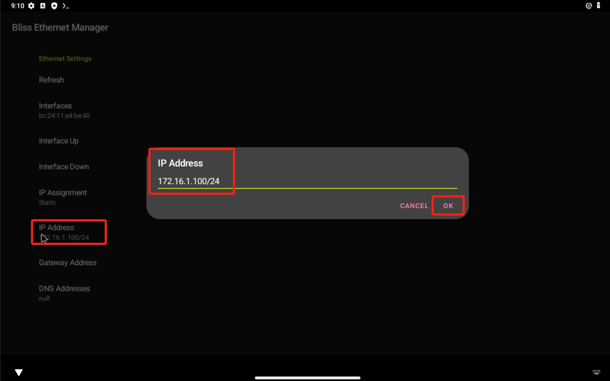  

Click to open ```Gateway Address```, enter ```172.16.1.1```, click the OK button to confirm

  

Click to open ```DNS Address```, enter ```8.8.8.8```, click the OK button to confirm

  

Then in the application interface, click ```Interface Up``` and ```Refresh```, then press the ```exit``` key on the keyboard to exit the program

  

Open the browser in the main interface to verify that the network is working properly

  

You can see that opening this guide works without problems, the network is functioning


