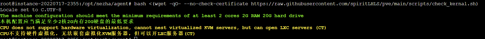
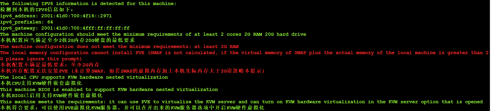
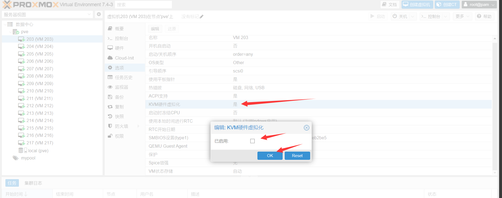

# Preface

This page describes the standard (non-customized) workflow. Custom workflows are documented separately.

If your provider or machine is not yet supported, contact [@spiritlhl_bot](https://t.me/spiritlhl_bot); support may be added in a future update.

:::warning
This process modifies host networking. Ensure the host can be reinstalled/recovered at any time and avoid running on hosts with critical data.
:::

Feel free to give the project a ```Star``` for free support!-->[https://github.com/oneclickvirt/pve](https://github.com/oneclickvirt/pve)

## Various requirements

Use the latest stable Debian release whenever possible.

**Warning: This project only supports servers with a dedicated public IPv4 address**

This project relies on a fixed IPv4 address for network allocation and does not support the following scenarios:

* Environments with dynamic IPv4 (e.g., servers whose IP address changes after reboot)
* Environments without a dedicated public IPv4 address (e.g., accessing the internet via home router NAT and requiring DHCP to obtain an address)

If your server does not have a publicly routable static IPv4 address, please do not use this project.

The one-click installation script currently targets Debian systems only. Non-Debian systems are not supported through the APT workflow in this project. For other systems, use ISO installation or the manual/custom methods described in the FAQ section.

- System requirements: Debian 8+

:::tip
Debian 11 was historically the most conservative choice for this workflow. If your environment supports it, newer stable Debian releases can also be used.
:::

- Hardware requirements: >= 2 CPU cores, >= 2 GB RAM, >= 20 GB disk on ``x86_64`` or ``arm`` architecture
- Hardware requirements for KVM: VM-X or AMD-V support (some VPS and all Dedicated servers support).
- If hardware or system requirements are not met, you can use ```incus``` to batch open LXC containers [Jump](https://github.com/oneclickvirt/incus)

If you use IPv6 tunnels for IPv6 subnet attachment on the host, be sure to add the contents in the corresponding file when PVE is successfully installed but the gateway is not automatically set, and do not add IPv6 tunnels at the very beginning (without installing PVE).

**Warning: If your dedicated server has no IPMI or other remote rescue channel, and you cannot reinstall the system yourself, do not use this script. Ask your provider/technician to perform a manual ISO installation of PVE. Otherwise, you may lose connectivity on hosts that do not support safe hot network changes.**

## Setting up virtual memory (SWAP) (optional, not required)

:::tip
If your host has limited memory and enough free disk, adding swap can reduce OOM risk.
:::

Unit conversion: Enter 1024 to generate 1G SWAP-virtual memory, virtual memory occupies hard disk space.

When the actual memory is not enough, the virtual memory will be automatically used for memory usage, but it will bring high IO usage and CPU performance.

For swap sizing reference, see [this guide](https://github.com/oneclickvirt/ecs/blob/master/README_NEW_USER.md).

| Physical Memory Size | Recommended SWAP Size |
| -------------------- | --------------------- |
| ≤ 2G                | 2x memory size        |
| 2G < memory ≤ 8G    | Equal to physical memory |
| ≥ 8G                | About 8G is sufficient |
| Hibernation needed  | At least equal to physical memory |

The above values are only recommended settings, the actual value according to their own needs, do not blindly copy the value!

Command:

```shell
curl -L https://raw.githubusercontent.com/spiritLHLS/addswap/main/addswap.sh -o addswap.sh && chmod +x addswap.sh && bash addswap.sh
```

## Detecting the environment

- This pre-check must be run before other related scripts. If prerequisites are not met, later PVE scripts may fail.
- Detects local IPv6 network status (informational; install itself does not require IPv6)
- Verifies whether hardware meets minimum requirements
- Detects whether the hardware supports nested KVM virtualization. If KVM is unavailable, VMs can still run with QEMU TCG emulation, but performance will be poor.
- Detects whether the current system environment is suitable for nested KVM usage.
- If nested KVM is unavailable, PVE is usually not recommended; [incus](https://github.com/oneclickvirt/incus) is often a better fit for performance and stability.

Command:

```bash
bash <(curl -sSLk https://raw.githubusercontent.com/oneclickvirt/pve/main/scripts/check_kernal.sh)
```

If you need to update the IPv6 information before querying, then execute the following command before querying

```bash
rm -rf /usr/local/bin/pve_ipv6*
rm -rf /usr/local/bin/pve_check_ipv6*
rm -rf /usr/local/bin/pve_last_ipv6*
```

**Commands to set up the testing environment for executing this project are as follows:**



To perform the above-mentioned query, you only need to use the one-click script below to automatically create a virtual machine. There is no need to manually modify settings on the web interface.



After creating the virtual machines using the subsequent script as mentioned above, it **may** be necessary to manually modify the settings on the web interface. You will need to disable hardware nested virtualization for each respective virtual machine, as shown in the following diagram.



Stop the virtual machine before making modifications. After the modifications are done, you can start the machine to use NOVNC. Failure to close it **may** result in bugs that render this virtual machine unusable.

If you forcibly install PVE to enable KVM, even if the startup fails, you can also disable this option and try to start the virtual machine to see if it works.

The reason for these issues is what was stated above, the host does not support nested virtualized KVMs for acceleration.

:::tip
Please use the "screen" command to suspend execution before launching the virtual machine, in order to avoid prolonged startup times. Unstable SSH connections could lead to interruptions during the intermediate execution.
:::

<br/>
<br/>

