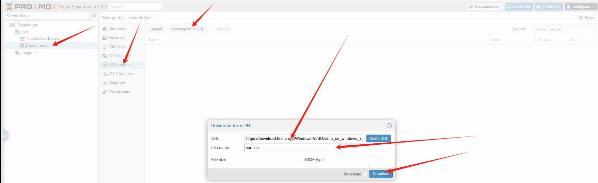
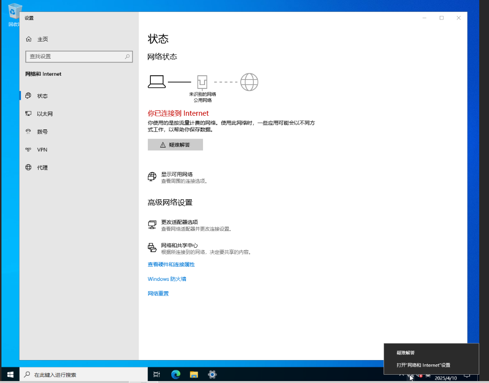
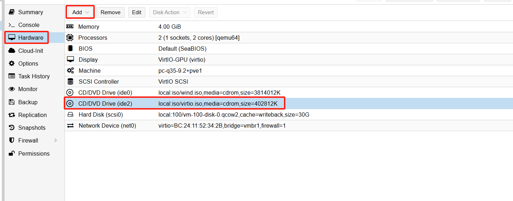
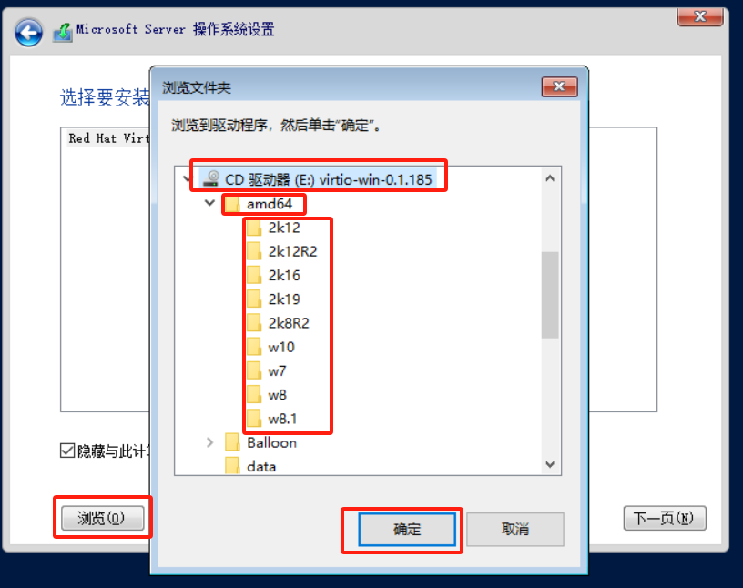
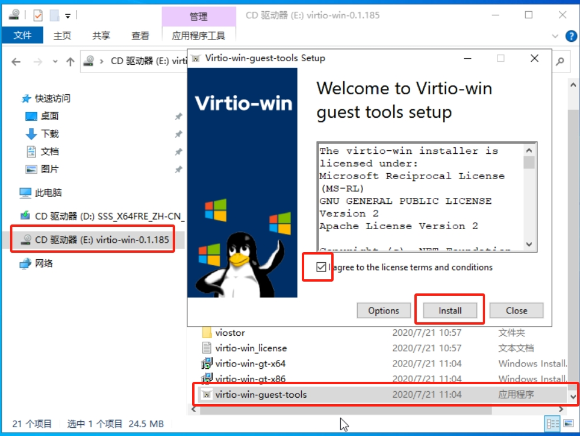

# Setting Up Windows Visual Machine

## Choose KVM virtualization or QEMU's TCG emulation at startup

The host itself, if it supports nested virtualization, can use ```host``` or ```kvm64``` or ```qemu64``` type CPUs

In terms of performance, ```host``` > ```kvm64``` > ```qemu64```

The ```qemu``` type of virtualization has a lot of performance loss

If you don't support nested virtualization, you can only use ```qemu64``` type CPU, and you need to change ```KVM hardware virtualization``` in ```Options``` before you start the VM

Set it to ```no``` to uncheck ```Enabled[enabled]```.

If you're really not sure if your machine supports nested virtualization, then check System and Hardware Configuration Requirements --> Detecting the Environment Detecting to ensure it's available (with attempts to enable the feature)

The main logic for this is in the

<https://raw.githubusercontent.com/oneclickvirt/pve/main/scripts/check_kernal.sh>

It is recommended to use PVE's System and Hardware Requirements --> Environment Detection in this tutorial for one-click detection, or the following detection logic:

```egrep -c '(vmx|svm)' /proc/cpuinfo``` if it is 1

```cat /sys/module/kvm_intel/parameters/nested``` if it exists and is 1

```lsmod | grep -q kvm```  if it is loaded.

If all of these are supported, choose the ```host``` type to be 100% problem-free, in other cases there may be unknown errors try it yourself.

## Using ISO Image with VirtIO for VM Setup

### 1. Download the Image
Before installation, you need to download the image file via `local(pve) --> ISO images --> Download from URL`

For the download link (`URL:`), you can use files from:
https://github.com/ILLKX/Windows-VirtIO

Enter `win.iso` as the `File Name:`



Click `Download`. After downloading is complete, you can see the file size of `win.iso` on the current page, confirming it's in ISO format.


### 2. Setting Up the Template
Click `Create VM` in the top right corner of the page.

In the `General` window, select `mypool` for `Resource Pool:`, enter `win` for `Name`, then click `Next`.


In the `OS` window, select `win.iso` for `ISO image`. For `Guest OS`, select `Microsoft Windows` as the `Type` and choose the appropriate `Version` for your ISO. For example, if you downloaded Windows 2022, select `11/2022`, then click `Next`.


In the `System` window, select `VirtIO-GPU` for `Graphic card`, `q35` for `Machine`, `VirtIO SCSI` for `SCSI Controller`, and `Default (SeaBIOS)` for `BIOS`, then click `Next`.


In the `Disk` window, select `Write Back` for `Cache`, enter your desired disk size in `Disk size (GiB)` (generally not less than `20`), and choose the storage location in `Storage`. In this example, only the system disk `local` is available, so `local` is selected. Then click `Next`.


In the `CPU` window, enter the number of cores needed in `Cores`, then click `Next`.


In the `Memory` window, enter the desired memory size in `Memory (MiB)`, then click `Next`.


In the `Network` window, select `vmbr1` for `Bridge`, `VirtIO (paravirtualized)` for `Model`, uncheck `Firewall`, then click `Next`.


In the `Confirm` window, click `Finish`.


### 3. Graphical Installation Configuration
Click on the template you've set up on the left, click `Start` in the upper right corner to start the virtual machine, then click `Console` to enter the `VNC` interface and wait for the operating system to boot.


In the VNC, click `Next`, then `Install now`, then `I don't have a product key`, check `Accept license`, click `Next`, and then select `Custom installation`.


If the image comes with VirtIO drivers, you should be able to see the available system storage disk and its size. Select it and click `Next`.


Wait for the system to install. It may restart automatically several times and could take more than 10 minutes.


After installation is complete, you'll be asked to set a password during first login.


Once setup is complete, there's a pop-up box on the left side of the NOVNC page. Click the first button, then follow the login prompt by pressing `Ctrl`+`Alt`+last button to enter the login page.

### 4. Network Initialization
Since the PVE is set up with a static network through this project, you need to manually modify the bound IP address after logging in, rather than using DHCP.

Right-click in the bottom right corner of the desktop and select `Open Network and Internet settings`. In the settings page that appears, click `Change adapter options`.


In the `Network Connections`, select `Ethernet` and click `Change settings of this connection`.


In the popup window, select `Internet Protocol Version 4 (TCP/IPv4)` and click `Properties`.


In the new dialog box, select `Use the following IP address` and enter:
IP address(I): `172.16.1.xxx` (replace xxx with your desired IP, I used 100 for convenience as my vmid is 100)
Subnet mask(U): `255.255.255.0`
Default gateway(D): `172.16.1.1`

Then select `Use the following DNS server addresses` and enter:
```
8.8.8.8
144.144.144.144
```

Click OK in the bottom right corner, and make sure `Validate settings upon exit` is NOT checked.


Click `OK` and `Yes` for any other dialog boxes, and your virtual machine will now have network connectivity.

### 5. Unmounting the CD Drive

Manually click on the corresponding ```CD``` in the ```Hardware``` on the web side of ProxmoxVE and select ```Remove```, then restart the VM and you can use it directly.


## Using ISO Images without VirtIO for VM Installation

### 1. Download Images

For Windows images without VirtIO, you can use:

<https://github.com/ILLKX/Windows>

For VirtIO ISO images, you can use:

<https://fedorapeople.org/groups/virt/virtio-win/direct-downloads/archive-virtio/>

Alternatively, you can download just the MSI package, package it into an ISO format locally, and then upload it to ProxmoxVE.

This way, the package is smaller. The official package contains support for all Windows images and is about 500MB, while a self-packaged one is around 5MB.

### 2. VirtIO Import

Note that in ProxmoxVE version 8.x and later, you can select VirtIO boot loading by default in the OS section, as shown in the image:


In lower versions of ProxmoxVE, such as 7.x and 6.x, you cannot select VirtIO boot loading by default in the OS section:


You need to manually add `CD/DVD Drive` by clicking `Add` in the `Hardware` section and selecting the downloaded `VirtIO` `ISO` file:



Then proceed as usual until you reach:


At this point, you can't find the hard disk. You need to select `Load Driver`:


Then select the `VirtIO` as your driver disk, click open, and import the corresponding system driver from the `amd64` directory:



I'm using a `Windows Server 2019` image, so I imported the `2k19` driver. After importing, select the imported driver and click `Next`:


Now you should be able to see the hard disk. Select it and continue with the installation steps as in the previous tutorial until the system installation is complete and you reach the desktop.

### 3. Installing Drivers via virtio-win-guest-tools

Once successfully installed and at the desktop, you still need to manually install the drivers.

Open the `VirtIO` driver's `CD` drive directory. At the bottom, there's a `virtio-win-guest-tools` program that will install the required VirtIO drivers, including the VirtIO network card driver:




After clicking install, the network card driver will be installed. For subsequent network settings, refer to the network initialization tutorial mentioned earlier.

### 4. Installing Network Card Driver (Alternative)

After successful installation and reaching the desktop, you may still need to manually install the network card driver to connect to the network:

1. Open **Control Panel** → **Device Manager**
2. Find the **Ethernet Controller**, right-click and select **Update Driver**
3. Select **Browse my computer for driver software (R)**
4. Browse to the `VirtIO` driver's `CD` drive directory
5. Open the **NetKVM** folder
6. Select the driver folder corresponding to your current system version (like the above operation, I would choose the 2k19 folder with amd64 drivers)
7. Confirm the installation, and after completion, the `VirtIO` network card driver will be successfully loaded


For subsequent network settings, refer to the network initialization tutorial mentioned earlier.

### 5. Unmounting the CD Drive

In the ProxmoxVE web interface, manually click on the corresponding `CD` in the `Hardware` section, select `Remove`, and then restart the virtual machine. This way, you can use it directly:


