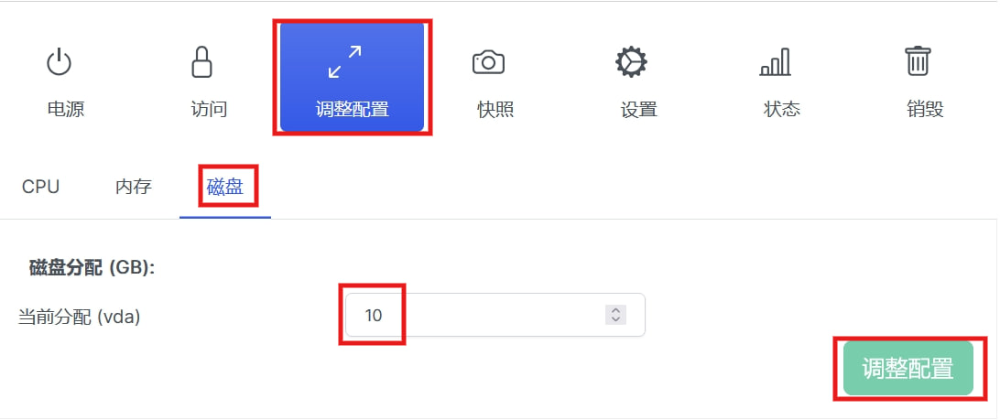

## WebVirtCloud Installation Guide

[](https://hits.spiritlhl.net)

Repository: <https://github.com/oneclickvirt/webvirtcloud>

Origin Repository:：<https://github.com/oneclickvirt/webvirtcloud_retspen>

## Controller Node and Computer Node Installation

- Supported Systems: Debian10+, Ubuntu18.04+, Centos8+, AlmaLinux8+, RockyLinux8+
- Recommended system: Debian12+, Ubuntu22.04+.
- Lower versions of the system will automatically compile the new version of python installation package before deployment, so it is recommended to use a new system without compiling directly installed!

```bash
curl -slk https://raw.githubusercontent.com/oneclickvirt/webvirtcloud/main/scripts/install_webvirt_cloud_retspen.sh -o install_webvirt_cloud_retspen.sh \
&& chmod +x install_webvirt_cloud_retspen.sh \
&& bash install_webvirt_cloud_retspen.sh
```

After installation is complete, open the public IP address to access the login page.

The default login username and password are both `admin`. Make sure to change them after logging in.

## Creating a Linux Virtual Machine

After entering the control panel and changing the admin password, you need to manually configure a compute node.


Select the type as `Local`, and name it `local`.


After creation, click the eye icon to enter the view.


Under the `Storage` section, add a storage entry. Choose the type `Dir` and name it `local`. If you need to use an ISO for system boot, you’ll need to create a storage of type `ISO`. If not, just follow this guide and create only the `Dir` type.


After creation, download the appropriate qcow2 image for the system using the repository below:

https://github.com/oneclickvirt/pve_kvm_images/releases/tag/images

In the example, a Debian 12 qcow2 image is used:

```shell
cd /var/lib/libvirt/images
wget https://github.com/oneclickvirt/pve_kvm_images/releases/download/images/debian12.qcow2
chmod 777 debian12.qcow2
```

Return to the instance page to create a new instance.


Select `local` as the compute node.


The default chipset is fine; changing it is optional.


You can use predefined sizes for the virtual machine or customize it, depending on your preference.


Note: the instance name must not duplicate the system name. For example, you cannot use `debian12` as the instance name in this case.


After successful creation, **do not** power it on immediately.


You need to modify the disk settings first.


Change the disk file to `debian12.qcow2`, which matches the qcow2 image you previously downloaded.


After the modification is confirmed you will see a redundant disk in the ```local``` volume of the original compute node's storage, such as ```test.qcow2``` here, which is best deleted to avoid hogging the disk

  

Once confirmed and configured correctly, return to the power page and turn on the VM.


The default login for the image is:

- **Username**: `root`  
- **Password**: `password` or `oneclickvirt`


After booting, you will find that the hard disk is only the size of the original image, at this time you need to adjust the size of the hard disk, you need to shut down the computer again, at this time, you can see the buttons on the following page is available and the size of the hard disk is also recognized.

Without the first boot, the size of the hard disk is not recognized, recognition can not be modified, so the first switch is necessary.



After the modification and restart the virtual machine, you will find that there is new disk space unallocated, at this time you need to follow the following method resize disk.

Check the disk path and remaining blank space unallocated:

```shell
lsblk
```

Then use the following command to resizeen the disk

```shell
fdisk /dev/vda
```

Do this in the following order:

Type ```d``` to delete the old partition (yes, you need to delete the old vda1, no data will be lost as it will not be formatted later).

Type ```n``` and enter to create a new partition.

Select primary for type (default p) and just enter.

Partition number is also ```1```.

The start position must be the same as the old partition (default is right), just press enter.

Show if you want to erase fingerprints, type ```Y``` and enter.

Press enter at the end position to use all the remaining space.

Type ```w``` to save and exit.

At this point, use ```lsblk``` to confirm that the new free disk has been successfully allocated.

## Disadvantages

Networking is not auto-configured — not as smart as the previous project — you still need to configure it manually. 

You need to be in the VNC of the opened VM, logged in and execute

```shell
systemctl enable cloud-init
reboot
```

Manually enable the configuration to self-start after reboot, then reboot the server and you have internet.
