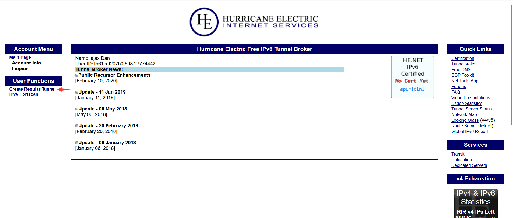
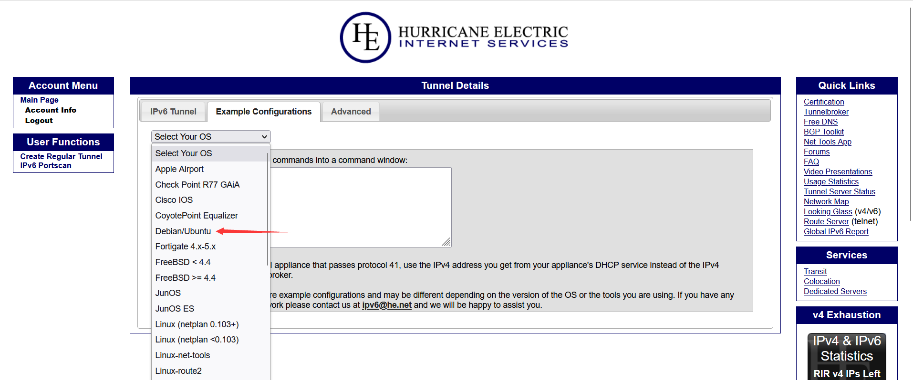
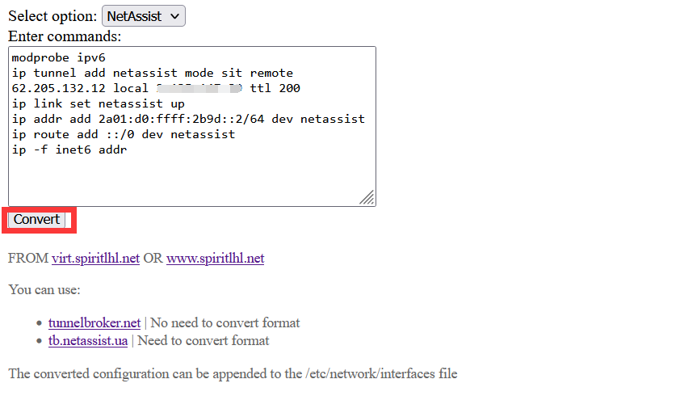
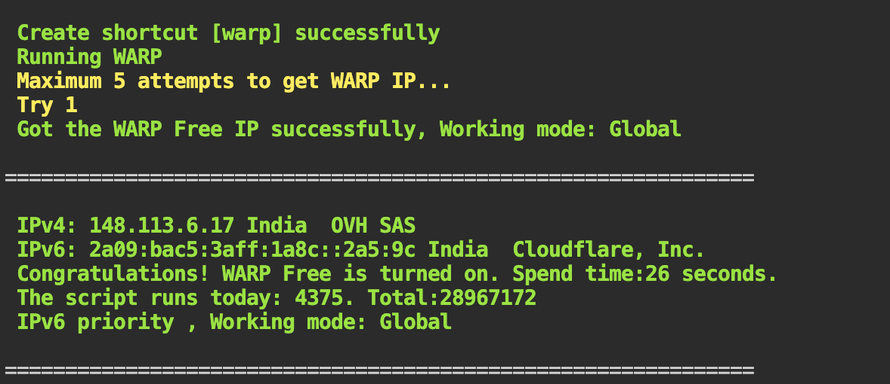

# 自定义

## 给lxd启用官方的web面板

见 [给机房的Ubuntu22.04安装LXD共享GPU资源-配置web](https://www.spiritysdx.top/20240513/#%E9%85%8D%E7%BD%AEweb) 部分的内容

## 添加自定义的镜像源

https://lxdimages.spiritlhl.net/

本镜像源是本人通过每日修补得到的，每日会进行更新，具体进行了什么修补在 https://github.com/oneclickvirt/lxd_images 可见详细说明。

```shell
lxc remote remove spiritlhl
lxc remote add spiritlhl https://lxdimages.spiritlhl.net --protocol simplestreams --public
lxc image list spiritlhl:debian
```

## 给宿主机附加免费的IPV6地址段

有的机器本身没有IPV6的/64子网，这里给出一个方法免费附加IPV6的子网。

这里是使用6in4方法解决宿主机本身没有IPV6地址的问题。

:::tip
本页面的操作务必在原始系统上操作，保证未使用本项目的其他脚本安装环境(除了PVE，PVE需要先安装好)，否则可能导致环境冲突
:::

以下是2023年目前还在运行的免费提供IPV6子网的平台

| 支持的平台                       | 对应需要的安装包             | 协议             | 通道/子网数量           |
|---------------------------|----------------|----------------|----------------|
| tunnelbroker.net              | ifupdown 或 ifupdown2        | v4tunnel 或 sit           | 3✖/64 或 5✖/64            |
| tunnelbroker.ch              | ifupdown 或 ifupdown2           | v4tunnel 或 sit         | 3✖/64          |
| ip4market.ru                | ifupdown 或 ifupdown2         | v4tunnel 或 sit           | 1✖/64          |
| netassist.ua                | ifupdown 或 ifupdown2          | v4tunnel 或 sit           | 1✖/64          |
| https://github.com/oneclickvirt/6in4               | ifupdown2          | sit、gre、ipip           | 自定义          |

免费的平台只解决IPV6有没有的问题，不提供优质的IPV6带宽。

如需优质的带宽，请自建隧道，当ifupdown和ifupdown2都可时，先尝试ifupdown是否可安装成功，否则就安装ifupdown2.

安装完毕后，安装了哪个包后面就选择哪个包进行格式转换。

### 初始环境修改

执行

```
touch /etc/cloud/cloud-init.disabled
```

关闭cloud-init的自动化覆写先，然后查看本机使用什么管理网络，执行

```
systemctl is-active systemd-networkd
```

和

```
systemctl is-active networking
```

看看属于哪种情况，如果是前者active，后者inactive，你需要重装/DD一个不是这样配置的系统，或者切换本机使用ifupdown/ifupdown2管理网络

```
# 是否需要禁用原网络管理自行评判
# systemctl stop systemd-networkd
# systemctl disable systemd-networkd
# systemctl stop systemd-networkd.socket
# systemctl disable systemd-networkd.socket
```

如果需要安装的是```ifupdown```控制网络，这个工具一般的主流linux系统都有

```
apt-get install ifupdown -y
```

如果需要安装的是```ifupdown2```进行网络管理，而这个工具一般只在debian系上可安装使用

```
apt-get install ifupdown2 -y
```

安装完毕后，安装了哪个包后面就选择哪个包进行格式转换。

```
systemctl start networking
systemctl enable networking
```

然后重启服务器，检验机器的网络是否会因为修改出现重启失联的情况，且执行```uptime```观察启动已超过1分钟后，再进行后续步骤

如果是是前者inactive，后者active，则不需要切换网络管理程序，直接进行后续操作即可。

由于部分服务器存在默认的内网IPV6路由会与隧道冲突，此时可使用以下命令删除默认的IPV6路由

```
default_route=$(ip -6 route show | awk '/default via/{print $3}') && [ -n "$default_route" ] && ip -6 route del default via $default_route dev eth0
```

这里假设了你的客户端的服务器的默认网卡是```eth0```，你可以使用```ip -6 route```查看默认的路由并替换它，默认路由以```default via```开头，使用```dev```指定默认网卡，你只需要按照这个规则找到它即可

### 目前收集且支持的平台

#### tunnelbroker_net

结合一键开设带IPV6地址的容器的脚本，就能给每个容器附加来自he的IPV6地址了

缺点是地址比较黑/脏，cloudflare的cdn极有可能套不上，自行测试

1. 在 [https://tunnelbroker.net/](https://tunnelbroker.net/) 注册账户，并点击左边的 ```Create Regular Tunnel```



2. 红框处填写你的服务器的IPV4地址，选择物理距离近的连接点，比如机器在美国洛杉矶，就选美国西海岸的连接点，然后显示绿框提示，点```Create Tunnel```创建即可


3. 等待出以下界面，点击```Example Configurations```然后选择对应的系统，比如LXD的宿主机那肯定就是Debian/Ubuntu了




4. 框住的部分就是要修改的文件和需要复制的内容了


复制的时候不要带空行

5. 转换格式后给你的网络配置文件附加IPV6的设置

然后打开 [https://ipv6tunnel.spiritlhl.top/](https://ipv6tunnel.spiritlhl.top/) 选择```Option```为```TunnelBrokerNet```，另一个下拉选择框选择你之前安装成功的包名，然后在输入框内粘贴你复制的内容

然后点击```Covert```转换格式，等待页面刷新显示转换格式后的配置文件内容

然后用vim或者vi命令修改```/etc/network/interfaces```文件增加内容，或者修改以下命令新增

```
tee -a /etc/network/interfaces <<EOF
# 这里修改复制粘贴一下转换格式后的配置文件内容，然后执行此命令
EOF
```

然后你可以使用```cat /etc/network/interfaces```查看配置文件是否正常写入了

6. 如果上面都没问题，就需要启用网络接口即可

```
apt-get install net-tools iproute2 -y
systemctl restart networking
```

7. 然后你就可以测试IPV6网络是否已附加

执行```ifconfig```命令，这时应该有一个 he-ipv6 接口，类似下面这样：


或者执行：

```
curl ipv6.ip.sb
```

回传你绑定IPV6地址

8. NAT VPS 的额外设置

IPv4 NAT VPS 除了前面提到的替换 IP 操作以外，可能还需要一些额外的设置，否则可能还是无法访问 IPv6 网络。

```
apt-get install ufw -y
ufw allow 41
```

添加相关的路由规则

```
route -A inet6 add ::/0 dev he-ipv6
```

9. 如果不需要该IPV6网络了，想要删除

删除 he-ipv6 网络接口配置（若没有删除重启后会自动启用），记得修改```/etc/network/interfaces```文件，删除之前红框添加的内容

然后重启服务器，就删除了

#### tunnelbroker_ch

类似上述的操作，先在 [https://www.tunnelbroker.ch/](https://www.tunnelbroker.ch/) 注册一个账户先，注册后点击激活的邮件

然后就是填写你的服务器IPV4地址


创建后需要进入Config页面而不是详情页面


见到以下页面千万别使用，先刷新一下本页面，不要弹那个浅蓝色框后再停止刷新


记录以下页面的最后一个红框的内容，准备修改宿主机配置文件


页面的最后一个红框框住的部分复制下来，不要带空行

然后打开 [https://ipv6tunnel.spiritlhl.top/](https://ipv6tunnel.spiritlhl.top/) 选择```Option```为```TunnelBrokerCh```，另一个下拉选择框选择你之前安装成功的包名，然后在输入框内粘贴你复制的内容

然后点击```Covert```转换格式，等待页面刷新显示转换格式后的配置文件内容

然后用vim或者vi命令修改```/etc/network/interfaces```文件增加内容，或者修改以下命令新增

```
tee -a /etc/network/interfaces <<EOF
# 这里修改一下
EOF
```

然后你就需要重启一下系统，或者执行

```
apt-get install net-tools iproute2 -y
systemctl restart networking
```

保证环境无问题再进行别的操作了

#### ip4market_ru

类似上述的操作，先在 [https://tb.ip4market.ru](https://tb.ip4market.ru/) 注册一个账户先，注册邮箱得是非常见邮箱，电话可随便写不验证的，IP填上你要附加的宿主机的IPV4地址


然后就是过Recaptcha的人机验证，点击注册

邮箱会收到激活邮件，里面附带有你的密码，记住它

然后在首页进行登录


然后就会进入这个页面


按住右键，然后复制红框框住的四行内容，也就是

```
Server IPv4:
Client IPv4
Server IPv6
Client IPv6
```

这四行内容，按ctrl+c复制或者右键复制


然后打开 [https://ipv6tunnel.spiritlhl.top/](https://ipv6tunnel.spiritlhl.top/) 选择```Option```为```ip4market```，另一个下拉选择框选择你之前安装成功的包名，然后在输入框内粘贴你复制的内容

然后点击```Covert```转换格式


然后就会自动刷新页面出现需要自己用vim或者vi命令修改```/etc/network/interfaces```文件增加的内容了，或者修改以下命令新增

```
tee -a /etc/network/interfaces <<EOF
# 这里修改一下
EOF
```

然后你就需要重启一下系统，或者执行

```
apt-get install net-tools iproute2 -y
systemctl restart networking
```

保证环境无问题再进行别的操作了

#### netassist_ua

这个平台你在切换网络管理时务必使用```ifupdown2```而不是```ifupdown2```安装包，该平台使用sit协议，而sit协议需要在```ifupdown2```控制的环境中使用

类似上述的操作，先在 [https://tb.netassist.ua/](https://tb.netassist.ua/) 注册一个账户先，注册后点击激活的邮件，激活页面会有密码显示，记得记录

然后就是填写你的服务器IPV4地址，这个后面可以自己修改，先随便填一个都没问题

然后就到了这个页面了


第一个红框是你宿主机的IPV4地址需要填写的位置，要修改就修改那里，然后点change保存

第二个下拉红框选择```Linux```，然后点击show


会出现上面的内容，全选框住的部分复制下来，不要带空行

然后打开 [https://ipv6tunnel.spiritlhl.top/](https://ipv6tunnel.spiritlhl.top/) 选择```Option```为```NetAssist```，另一个下拉选择框选择你之前安装成功的包名，然后在输入框内粘贴你复制的内容

然后点击```Covert```转换格式



然后就会自动刷新页面出现需要自己用vim或者vi命令修改```/etc/network/interfaces```文件增加的内容了，或者修改以下命令新增

```
tee -a /etc/network/interfaces <<EOF
# 这里修改一下
EOF
```

然后你就需要重启一下系统，或者执行

```
apt-get install net-tools iproute2 -y
systemctl restart networking
```

保证环境无问题再进行别的操作了

## 转移不同服务器之间的IPV6子网

相关仓库：[https://github.com/oneclickvirt/6in4](https://github.com/oneclickvirt/6in4)

该方法将提供一种方式，将A上的IPV6网段拆分一个子ipv6网段的出来，附加到B上使用

你需要在B所在的服务器上使用本套脚本给容器一键配置IPV6地址

### 功能

- 自建sit/gre/ipip协议的IPv6隧道
- 支持自定义要切分出来的IPV6子网大小，将自动计算出合适的CIDR格式的IPV6子网信息
- 自动识别服务端的IPV6子网大小
- 将自动设置隧道服务端并打印客户端需要执行的命令
- 设置IPV6隧道的方法简单易懂，易于删除

### 环境准备

| VPS(A) | VPS(B) |
|--------|--------|
| 一个IPV4地址(server_ipv4) | 一个IPV4地址(clinet_ipv4) |
| 一个IPV6子网 | 无IPV6地址 |
| 以下称之为服务端 | 以下称之为客户端 |

### 使用方法

下载脚本

```
curl -L https://raw.githubusercontent.com/oneclickvirt/6in4/main/6in4.sh -o 6in4.sh && chmod +x 6in4.sh
```

执行命令

```
./6in4.sh client_ipv4 <mode_type> <subnet_size> 
```

| 选项 | 可选的选项1 | 可选的选项2 | 可选的选项3 |
|--------|--------|--------|--------|
| <mode_type> | gre | sit | ipip |
| <subnet_size> | 64 | 80 | 112 |

```<mode_type>```暂时只支持那三种协议，越靠前的越推荐，不填则默认为```sit```协议

```<subnet_size>```只要比原系统子网掩码大就行，且是8的倍数，不填则默认为```80```

记得```client_ipv4```替换为需要附加IPV6的机器的IPV4地址，执行完毕后会回传你需要在客户端执行的命令，详见执行后的说明即可

为防止忘记复制命令，命令本身也将写入到当前路径下的```6in4.log```文件中，可使用```cat 6in4.log```查询客户端需要执行的命令

复制下来的命令，务必在 [https://ipv6tunnel.spiritlhl.top/](https://ipv6tunnel.spiritlhl.top/) 中选择选项```6in4```后进行转换

然后就会自动刷新页面出现需要自己用vim或者vi命令修改```/etc/network/interfaces```文件增加的内容了，或者修改以下命令新增

```
tee -a /etc/network/interfaces <<EOF
# 这里修改一下
EOF
```

然后你就需要重启一下系统，或者执行

```
apt-get install net-tools iproute2 -y
systemctl restart networking
```

保证环境无问题再进行别的操作了

### 检测服务端

```
systemctl status ndpresponder
```

```
ip addr show
```

### 检测客户端

```
ip addr show
```

```
curl ipv6.ip.sb
```

### 删除隧道

服务端

```
ip link set server-ipv6 down
ip tunnel del server-ipv6
```

客户端

```
ip link set user-ipv6 down
ip tunnel del user-ipv6
```

以上删除的方式只是临时删除，永久删除务必修改删除```/etc/network/interfaces```文件中你之前增加的内容

### 后言

实际上 [https://tunnelbroker.net/](https://tunnelbroker.net/) 支持申请```/48```大小的IPV6子网，只需要在


这里进行申请，然后转换格式的时候将原先```/64```的IPV6地址改成```/48```的IPV6地址，你就能获得一个更大的IPV6子网了

## 使用WARP给宿主机添加IP出口(IPv4/IPv6)

### 好处

* 宿主机安装，能使所有开启的机器都能够享受 Warp 的优势，而无需为每台机器单独进行设置，从而节省资源和简化管理。
* 宿主机使用内核态 WireGuard，相比于用户态的 WireGuard-Go，实现能够提供更高效的 WireGuard 运行。

### 手动安装

#### 1.安装WireGuard依赖
* Debian 和 Ubuntu 系统
```
# 更新依赖库
apt update -y

# 安装 WireGuard 运行依赖
apt install -y --no-install-recommends net-tools openresolv dnsutils

# 安装 WireGuard 协议兼容的工具集合
apt install -y --no-install-recommends wireguard-tools
```

* CentOS 系
```
# 更新依赖库
yum update -y

# 安装额外包组件
yum install -y epel-release 

# 安装 WireGuard 运行依赖
yum install -y net-tools

# 安装 WireGuard 协议兼容的工具集合
yum install -y wireguard-tools
```

#### 2.获取warp账户信息

访问 [https://warp.cloudflare.now.cc/?run=register&format=yaml](https://warp.cloudflare.now.cc/?run=register&format=yaml)，记录下 private_key, v6 2个值


#### 3.修改配置文件

* 创建并编辑 /etc/wireguard/warp.conf 文件，包含<>(尖括号)的部分一起替换掉，这只是为了看起来明显。

* 针对 IPv4 only 的宿主机，Warp 只接管 IPv6 出口
```
[Interface]
PrivateKey = <替换 PrivateKey>
Address = 172.16.0.2/32
Address = <替换 Address v6 地址>/128
DNS = 1.1.1.1, 1.0.0.1, 2606:4700:4700::1111, 2606:4700:4700::1001
MTU = 1280

[Peer]
PublicKey = bmXOC+F1FxEMF9dyiK2H5/1SUtzH0JuVo51h2wPfgyo=
AllowedIPs = ::/0
Endpoint = 162.159.193.10:2408
```

* 针对 IPv6 only 的宿主机，Warp 只接管 IPv4 出口

```
[Interface]
PrivateKey = <替换 PrivateKey>
Address = 172.16.0.2/32
Address = <替换 Address v6 地址>/128
DNS = 2606:4700:4700::1111, 2606:4700:4700::1001, 1.1.1.1, 1.0.0.1
MTU = 1280

[Peer]
PublicKey = bmXOC+F1FxEMF9dyiK2H5/1SUtzH0JuVo51h2wPfgyo=
AllowedIPs = 0.0.0.0/0
Endpoint = [2606:4700:d0::a29f:c101]:2408
```

* 针对双栈没有必要，毕竟原生的网络出口都会比通过 Warp 中转要好

#### 4.设置地址解析优先级

* 针对 IPv4 only 的宿主机，Warp 只接管 IPv6 出口，设置优先使用原生网络的 IPv4 出口
```
# IPv4 优先
grep -qE '^[ ]*precedence[ ]*::ffff:0:0/96[ ]*100' /etc/gai.conf || echo 'precedence ::ffff:0:0/96  100' >> /etc/gai.conf
```

* 针对 IPv6 only 的宿主机，Warp 只接管 IPv4 出口，设置优先使用原生网络的 IPv6 出口
```
# IPv6 优先，默认即为 IPv6 优先
sed -i '/^precedence \:\:ffff\:0\:0/d;/^label 2002\:\:\/16/d' /etc/gai.conf
```

#### 5.连接 Warp，并设置 systemd 进程守护
```
# 运行 wireguard 连接 Warp。如果这步卡死导致失联，后台重启宿主机即可解决
wg-quick up warp

# 查看 IPv4
curl -A a https://api-ipv4.ip.sb/geoip

# 查看 IPv6
curl -A a https://api-ipv6.ip.sb/geoip

# 测试成功后断开 Warp 连接
wg-quick down warp

# 重新连接并设置进程守护，以便重启后自动生效
systemctl enable --now wg-quick@warp
```

### 自动安装和运行(fscarmen的一键脚本)

最后，介绍 fscarmen 的一键脚本。提到该脚本是一个方便的工具，可以简化配置过程。并自动处理最优 MTU, 最优 Endpoint 等进阶参数。

项目介绍: https://github.com/fscarmen/warp-sh

```
# 运动脚本
wget -N https://gitlab.com/fscarmen/warp/-/raw/main/menu.sh && bash menu.sh
```

