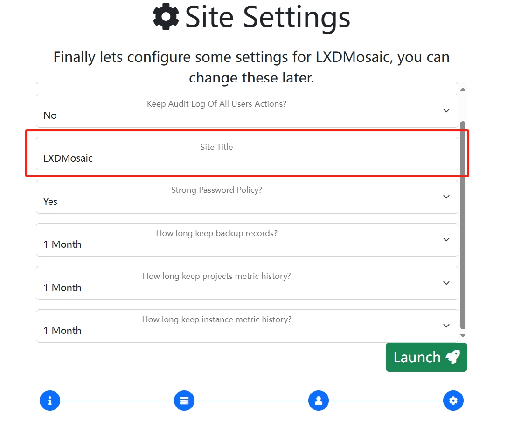

# LXD

如果你的宿主机本身没有IPV6的子网又想给容器分配IPV6地址，那么请先查看```LXD```模块中的```自定义```分区中的```给宿主机附加免费的IPV6地址段```的内容，给宿主机附加上IPV6子网后再进行环境安装

## 开设虚拟内存(SWAP)(非必须的可选项)

:::tip
内存开点swap免得机器炸了，如果你的宿主机内存不够用硬盘又很多空闲的话
:::

单位换算：输入 1024 产生 1G SWAP-虚拟内存，虚拟内存占用硬盘空间。

当实际内存不够用时将自动使用虚拟内存做内存使用，但随之带来IO高占用以及CPU性能占用。

参考本组织相关项目的说明 [跳转](https://github.com/oneclickvirt/ecs/blob/master/README_NEW_USER.md) 这块开设虚拟内存的大小

| 物理内存大小        | 推荐 SWAP 大小 |
| ------------------ | ---------- |
| ≤ 2G               | 内存的 2 倍    |
| 2G < 内存 ≤ 8G       | 等于物理内存大小   |
| ≥ 8G               | 约 8G 即可    |
| 需要休眠 (hibernation) | 至少等于物理内存大小 |

国际

```shell
curl -L https://raw.githubusercontent.com/spiritLHLS/addswap/main/addswap.sh -o addswap.sh && chmod +x addswap.sh && bash addswap.sh
```

国内

```shell
curl -L https://cdn.spiritlhl.net/https://raw.githubusercontent.com/spiritLHLS/addswap/main/addswap.sh -o addswap.sh && chmod +x addswap.sh && bash addswap.sh
```

## LXD主体安装

:::warning
如果是全新的服务器，务必保证```apt update```和```apt install curl```都无问题再执行本脚本。
:::

- 环境要求：Ubuntu 18+(推荐22.04以上)，Debian 8+(推荐11以上)，Alpine(自行安装bash后)，Arch
- 安装过程中会提示输入存储池创建路径以及大小，你所有要开的虚拟机或容器最终占用的空间是在存储池中
- 环境安装过程后需要重启服务器以加载一些默认配置
- 默认启用lxd的lxcfs相关配置，使得容器内查询容器信息变更为容器本身的信息而不是宿主机信息
- 实测本安装程序在物理机器或非物理机器上都可使用

国际

```shell
curl -L https://raw.githubusercontent.com/oneclickvirt/lxd/main/scripts/lxdinstall.sh -o lxdinstall.sh && chmod +x lxdinstall.sh && bash lxdinstall.sh
```

国内

```shell
curl -L https://cdn.spiritlhl.net/https://raw.githubusercontent.com/oneclickvirt/lxd/main/scripts/lxdinstall.sh -o lxdinstall.sh && chmod +x lxdinstall.sh && bash lxdinstall.sh
```

或

```shell
bash lxdinstall.sh
```

初始化配置的例子：

如果不需要指定非系统盘的路径做默认存储池，那么选择是否自定义存储池路径时直接回车或输入```n```即可，不需要指定路径。

如果需要指定非系统盘的路径做默认的存储池，那么需要选择```y```，然后输入对应的路径(你挂载的盘的实际的绝对路径)。

如果对应的盘除去已占用空间还有18G硬盘空余，想要开设15G的存储池，按照命令行的提示则输入```15```。

:::warning
如果你需要在一台服务器上开启超过200个LXD容器，那么不推荐你使用本项目，可能会出现lxcfs访问漂移的问题，产生IO占用无法释放。(系lxc原生问题无法修复)
:::

## 安装WEB控制面板

自定义 教程中有关于官方面板怎么启用的教程，但这里不选择使用官方的面板，因为官方面板为了安全性，牺牲了很多用户体验，这块使用

https://github.com/turtle0x1/LxdMosaic

的第三方面板

```shell
sudo snap install lxdmosaic
```

直接进行一键安装，然后打开当前宿主机的```https://<公网IP地址>/```，强制访问，就能进入设置页面


这块如果你需要设置网站名字可以改改



聊胜于无只能说，没有RBAC权限控制进行分用户隔离

## 手动安装(备选)

不推荐，只是为了一些奇葩环境一键脚本跑不动的时候进行安装，或则你想要了解最基础的LXD安装流程。

### 关闭防火墙

```bash
apt update
apt install curl wget sudo dos2unix ufw jq -y
ufw disable
```

### 开设虚拟内存SWAP

内存看你开多少服务器，这里如果要开8个，换算需要2G内存，实际内存如果是512MB内存，还需要开1.5G，保守点开2G虚拟内存即可

执行下面命令，输入1，再输入2048，代表开2G虚拟内存

国际

```shell
curl -L https://raw.githubusercontent.com/oneclickvirt/lxd/main/scripts/swap.sh -o swap.sh && chmod +x swap.sh && bash swap.sh
```

国内

```shell
curl -L https://cdn.spiritlhl.net/https://raw.githubusercontent.com/oneclickvirt/lxd/main/scripts/swap.sh -o swap.sh && chmod +x swap.sh && bash swap.sh
```

### 安装LXD

实际swap开的虚拟内存应该是实际内存的2倍，也就是开1G是合理的，上面我描述的情况属于超开了

```
apt install snapd -y
snap install lxd
/snap/bin/lxd init
```

如果上面的命令中出现下面的错误

(snap "lxd" assumes unsupported features: snapd2.39 (try to update snapd and refresh the core snap))

使用命令修补后再进行lxd的安装

```
snap install core
```

如果无异常，上面三行命令执行结果如下


一般的选项回车默认即可

选择配置物理盘大小(提示默认最小1GB那个选项)，一般我填空闲磁盘大小减去内存大小后乘以0.95并向下取整，这里我填了10GB

提示带auto的更新image的选项记得选no，避免更新占用系统

测试lxc有没有软连接上

```
lxc -h
```

如果报错则执行以下命令软连接lxc命令

```bash
! lxc -h >/dev/null 2>&1 && echo 'alias lxc="/snap/bin/lxc"' >> /root/.bashrc && source /root/.bashrc
export PATH=$PATH:/snap/bin
```

连接后再测试lxc命令是否有报错找不到


