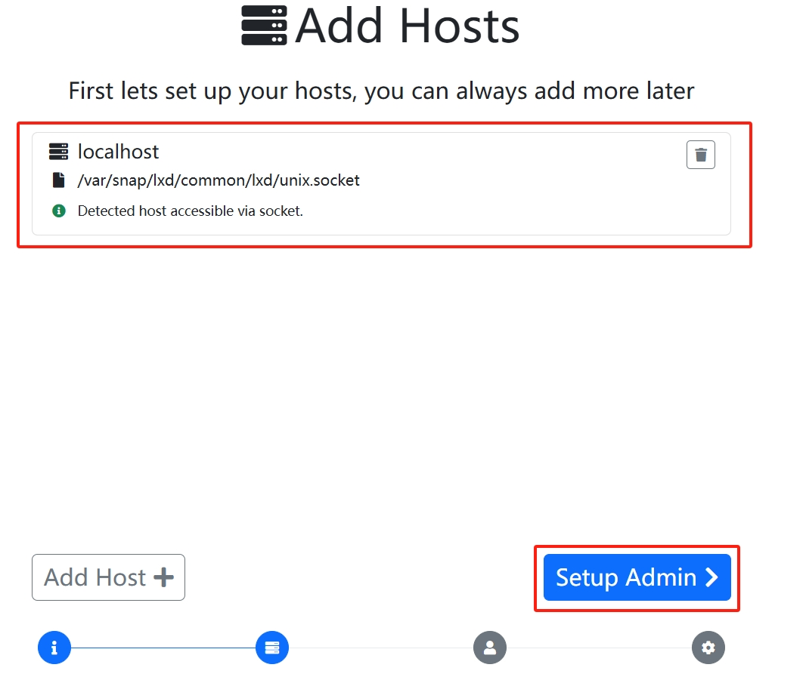
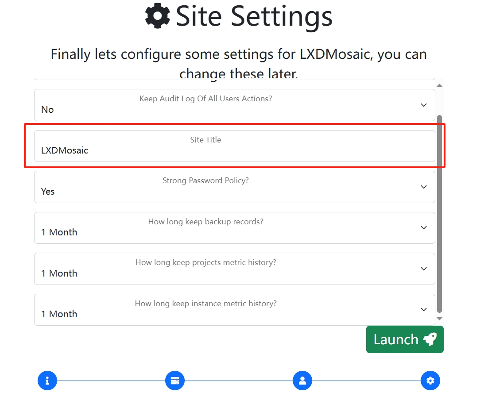

# LXD

配置查询必须返回且只返回一个合法 JSON 对象；空输出、仅空白、多段 JSON、错误响应以及字段类型不匹配都会终止当前初始化步骤，不会被当成缺少配置后写入默认值。该检查兼容 Debian 12 的 jq 1.6。有效的自定义 DNS、`ipv4.nat=false` 和 `ipv6.address=none` 会保留；若查询失败，请先检查 daemon 状态与日志，再重新执行初始化。

安装器和面板初始化通过 JSON 查询存储池与网桥，兼容不支持列表 `-c` 参数的 LTS 客户端。查询失败或返回无效数据会报错，不应视为空环境。首次安装 btrfs/LVM/ZFS 工具后，若内核支持已可用或模块加载成功，会继续初始化；仅在模块确实不可用时保留重试标记并尝试其他后端，不会仅因刚安装软件包而要求重启。

nftables 持久化同样按发行版选择服务读取的主配置：Debian/Ubuntu/Arch 为 `/etc/nftables.conf`，CentOS/Fedora 为 `/etc/sysconfig/nftables.conf`，Alpine 为 `/etc/nftables.nft`。保存自有快照及 include 后才启用启动服务，启用失败会报错，不主动启动或重载全局规则；卸载清理这三个标准路径中的自有配置。自定义服务覆盖配置或自定义 rules_file 不在标准路径自动识别范围内，需核对实际启动配置。

创建脚本会为每次创建写入独立标记，回滚前核对该标记和实例 UUID。Incus/LXD 的创建与批量脚本共用一把锁，避免覆盖彼此的日志和辅助文件；子脚本沿用父脚本的锁。创建期间不要从面板或其他 CLI 删除、重建相同名称：运行时不支持按 UUID 条件删除，外部工具不受该锁约束。无法确认归属时会保留实例并报错，需核对后手动处理。

统一的 `noninteractive=true` 开关、旧变量兼容、交互入口及网络检查方法见[节点环境的交互与自动化](../oneclickvirt/environment_modes)。

安装器的 nftables/iptables 补充 NAT 只处理 `lxdbr0` 的 IPv4 流量，并保留 `ipv4.nat=false` 的选择。IPv6 路由和 NAT 由 LXD 网桥配置控制，独立 IPv6 不再被安装器的全局双栈伪装规则改写。公网 IPv6 仍需宿主机上游路由以及独立外部 SSH、HTTP 访问验证。

从 iptables 切换到 nftables 时，安装器会同时清理 iptables-nft、iptables-legacy 中带有本项目精确标记的旧 NAT，以及持久化文件中的对应规则；保留其他规则、文件权限和符号链接。无法确定归属的旧全局 MASQUERADE 不会自动删除，应检查后按实际用途处理。

使用 firewalld 回退时，自有 IPv4 NAT 同时登记到运行态和永久配置，重复执行、关闭 NAT、切换到 nftables 或卸载时仅处理精确归属规则；不会重载整个 firewalld。保留网桥已有区域，未分配区域的网桥才加入 trusted；卸载仅在网桥已不存在时清理 trusted 引用，保留自定义区域。旧版本添加的 public 全局 masquerade 无法确认归属，不会自动关闭，需核对其他网络的依赖。

没有 firewalld 时，iptables 持久化使用发行版标准路径及对应启动服务：Debian/Ubuntu 为 `/etc/iptables/rules.v4`，CentOS/Fedora 为 `/etc/sysconfig/iptables`，Arch 为 `/etc/iptables/iptables.rules`，Alpine 为 `/etc/iptables/rules-save`。相关软件包或启动服务启用失败会报错。Incus/LXD 的安装器 NAT 配置和卸载防火墙阶段共用进程锁，防止这两个脚本同时覆盖防火墙状态；它不协调管理员或其他服务的独立修改。

iptables 回退路径只保存本次相关的 IPv4 运行态快照：先在同一目录写入临时文件，全部成功后再原子替换。保存失败会保留旧文件并报错；已有权限、属主和符号链接保持，新文件权限为 600，IPv6 持久化文件不会被连带覆盖。

如果宿主机没有 IPv6 子网但你希望给容器分配 IPv6 地址，请先查看 ```LXD``` 模块 ```自定义``` 分区中的 ```给宿主机附加免费的IPv6地址段```，先给宿主机附加 IPv6 子网后再进行环境安装。

## 开设虚拟内存(SWAP)(非必须的可选项)

:::tip
如果宿主机内存不足且硬盘空间充足，建议增加 swap 以降低 OOM 风险。
:::

单位换算：输入 1024 产生 1G SWAP-虚拟内存，虚拟内存占用硬盘空间。

当实际内存不够用时将自动使用虚拟内存做内存使用，但随之带来IO高占用以及CPU性能占用。

虚拟内存大小可参考 [该说明](https://github.com/oneclickvirt/ecs/blob/master/README_NEW_USER.md)。

| 物理内存大小        | 推荐 SWAP 大小 |
| ------------------ | ---------- |
| ≤ 2G               | 内存的 2 倍    |
| 2G < 内存 ≤ 8G       | 等于物理内存大小   |
| ≥ 8G               | 约 8G 即可    |
| 需要休眠 (hibernation) | 至少等于物理内存大小 |

以上数值仅为推荐设置，实际数值请按照自身需求来，不要盲目照抄数值

国际

```shell
curl -L https://raw.githubusercontent.com/spiritLHLS/addswap/main/addswap.sh -o addswap.sh && chmod +x addswap.sh && bash addswap.sh
```

国内

```shell
curl -L https://cdn.spiritlhl.net/https://raw.githubusercontent.com/spiritLHLS/addswap/main/addswap.sh -o addswap.sh && chmod +x addswap.sh && bash addswap.sh
```

## LXD主体安装

:::warning
如果是全新的服务器，务必保证```apt update```和```apt install curl```都无问题再执行本脚本。
:::

- 环境要求：Ubuntu 18+(推荐)，Debian 8+(更推荐Incus)
- 安装过程中会提示输入存储池创建路径以及大小，你所有要开的虚拟机或容器最终占用的空间是在存储池中
- 环境安装过程后需要重启服务器以加载一些默认配置
- 默认启用lxd的lxcfs相关配置，使得容器内查询容器信息变更为容器本身的信息而不是宿主机信息
- 实测本安装程序在物理机器或非物理机器上都可使用
- 如需无交互安装，统一使用 `export noninteractive=true` 指定无交互模式，脚本会按默认策略处理可选项

国际

```shell
curl -L https://raw.githubusercontent.com/oneclickvirt/lxd/main/scripts/lxdinstall.sh -o lxdinstall.sh && chmod +x lxdinstall.sh && bash lxdinstall.sh
```

国内

```shell
curl -L https://cdn.spiritlhl.net/https://raw.githubusercontent.com/oneclickvirt/lxd/main/scripts/lxdinstall.sh -o lxdinstall.sh && chmod +x lxdinstall.sh && bash lxdinstall.sh
```

如果脚本已下载到当前目录，也可以执行：

```shell
bash lxdinstall.sh
```

脚本下载完成后，无交互安装命令如下：

```shell
export noninteractive=true && bash lxdinstall.sh
```

初始化配置示例：

如果不需要指定非系统盘的路径做默认存储池，那么选择是否自定义存储池路径时直接回车或输入```n```即可，不需要指定路径。

如果需要指定非系统盘的路径做默认的存储池，那么需要选择```y```，然后输入对应的路径(你挂载的盘的实际的绝对路径)。

如果对应的盘除去已占用空间还有18G硬盘空余，想要开设15G的存储池，按照命令行的提示则输入```15```。

:::warning
如果你需要在一台服务器上开启超过200个LXD容器，那么不推荐你使用本项目，可能会出现lxcfs访问漂移的问题，产生IO占用无法释放。(系lxc原生问题无法修复)
:::

## 卸载 LXD 环境

卸载器先检查本机项目；存在非 `default` 项目时会在删除实例前停止，请先迁移或清理这些项目。卸载默认项目时，先解除 profile 对存储和网络的引用，再删除受 LXD 管理的网络；查询、解绑或删除失败会停止后续 snap 卸载，避免残留挂载和网桥被掩盖。

iptables 清理只删除带有本脚本归属标记的 IPv4 NAT。旧版本没有标记的宿主机全局 MASQUERADE、端口 DROP 规则可能被其他服务共用，因此保留；需要清理时应先核对其归属和其他网络的依赖。

一键卸载 LXD 全套环境，包括所有容器、虚拟机、镜像、存储池、网络配置、systemd 服务、软件包及相关配置文件：

卸载仅清理 LXD 自身的持久化防火墙规则和已记录的存储挂载，保留其他程序的规则、include 和 btrfs 挂载。宿主机 IPv4 转发可能被其他运行时或路由服务共用，因此不会在卸载时全局关闭。LXD snap 删除失败会中止后续清理，修复错误后可重试。

国际

```shell
curl -L https://raw.githubusercontent.com/oneclickvirt/lxd/main/scripts/lxduninstall.sh -o lxduninstall.sh && chmod +x lxduninstall.sh && bash lxduninstall.sh
```

国内

```shell
curl -L https://cdn.spiritlhl.net/https://raw.githubusercontent.com/oneclickvirt/lxd/main/scripts/lxduninstall.sh -o lxduninstall.sh && chmod +x lxduninstall.sh && bash lxduninstall.sh
```


## 安装WEB控制面板

自定义 教程中有关于官方面板怎么启用的教程，但这里不选择使用官方的面板，因为官方面板为了安全性，牺牲了很多用户体验，这块使用

https://github.com/turtle0x1/LxdMosaic

的第三方面板

```shell
sudo snap install lxdmosaic
```

直接进行一键安装，然后打开当前宿主机的```https://<公网IP地址>/```，强制访问，就能进入设置页面





这块如果你需要设置网站名字可以改改



该面板可满足基础管理需求，但不提供完整的 RBAC 子用户隔离能力。

## 手动安装(备选)

不推荐常规使用，仅用于一键脚本无法运行的环境，或用于学习最基础的 LXD 安装流程。

### 关闭防火墙

```bash
apt update
apt install curl wget sudo dos2unix ufw jq -y
ufw disable
```

### 开设虚拟内存SWAP

内存看你开多少服务器，这里如果要开8个，换算需要2G内存，实际内存如果是512MB内存，还需要开1.5G，保守点开2G虚拟内存即可

执行下面命令，输入1，再输入2048，代表开2G虚拟内存

国际

```shell
curl -L https://raw.githubusercontent.com/oneclickvirt/lxd/main/scripts/swap.sh -o swap.sh && chmod +x swap.sh && bash swap.sh
```

国内

```shell
curl -L https://cdn.spiritlhl.net/https://raw.githubusercontent.com/oneclickvirt/lxd/main/scripts/swap.sh -o swap.sh && chmod +x swap.sh && bash swap.sh
```

### 安装LXD

执行下述命令进行安装和初始化

```
apt install snapd -y
snap install lxd
/snap/bin/lxd init
```

如果上面的命令中出现下面的错误

(snap "lxd" assumes unsupported features: snapd2.39 (try to update snapd and refresh the core snap))

使用命令修补后再进行lxd的安装

```
snap install core
```

如果无异常，上面三行命令执行结果如下


一般的选项回车默认即可

选择配置物理盘大小(提示默认最小1GB那个选项)，一般我填空闲磁盘大小减去内存大小后乘以0.95并向下取整，这里我填了10GB

提示带auto的更新image的选项记得选no，避免更新占用系统

测试lxc有没有软连接上

```
lxc -h
```

如果报错则执行以下命令软连接lxc命令

```bash
! lxc -h >/dev/null 2>&1 && echo 'alias lxc="/snap/bin/lxc"' >> /root/.bashrc && source /root/.bashrc
export PATH=$PATH:/snap/bin
```

连接后再测试lxc命令是否有报错找不到


