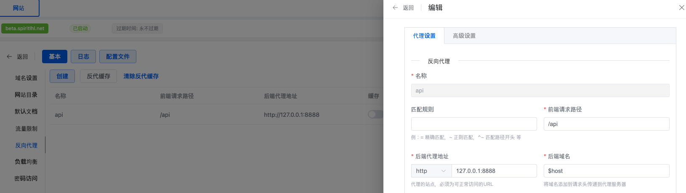
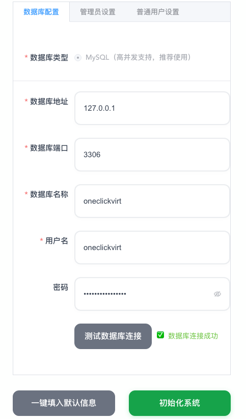
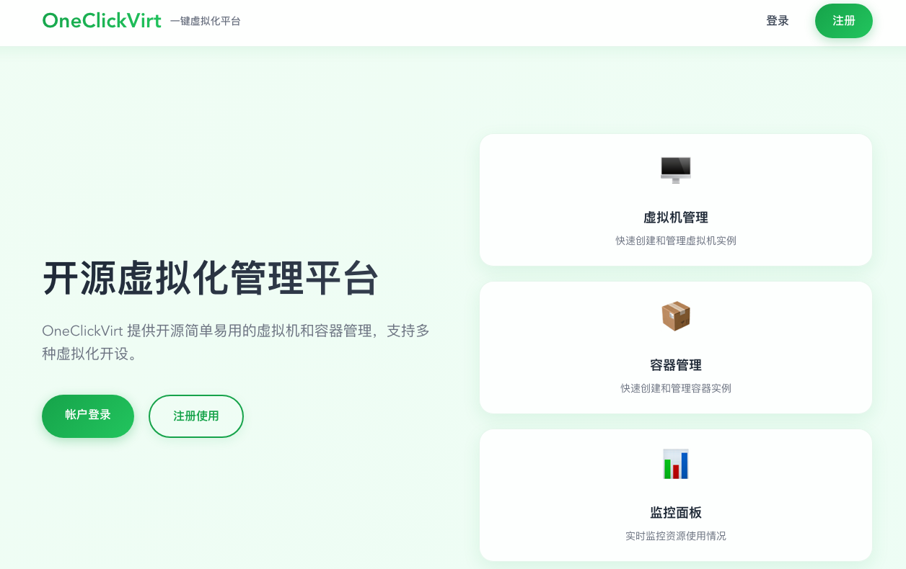

# OneClickVirt 高级安装

:::tip 安装页面二选一
本页和[基础安装](./oneclickvirt_install)只需要选择其中一页阅读，并从所选页面的表格中选择一种安装方式。不同安装方式不要重复执行。
:::

高级安装适合已经使用 1Panel、需要外部数据库或反向代理、希望自行管理二进制文件，或者需要从源码构建的用户。受控端要求与基础安装相同，开始前请先阅读[系统和硬件配置要求](./oneclickvirt_precheck)。

## 本页安装方式

下表只列出本页支持的安装方式，并按操作难度从简单到困难排列。

| 难度 | 安装方式 | 适用场景 | 主要要求 |
| --- | --- | --- | --- |
| 简单 | 1Panel 第三方应用商店 | 已经使用 1Panel | 导入第三方应用商店后在面板中管理 |
| 较简单 | 预编译一体化二进制 | 希望手动管理单个程序文件 | 需要自行准备数据库并管理进程 |
| 中等 | 预编译前后端分离部署 | 需要更高性能或自定义前端路径 | 需要数据库和反向代理 |
| 中等 | Docker 独立数据库镜像 | 已有外部 MySQL/MariaDB | 需要 Docker 和外部数据库 |
| 较难 | Docker Compose 源码构建 | 需要修改源码并采用多容器部署 | 需要 Git、Docker Compose 和构建时间 |
| 较难 | Dockerfile 源码构建 | 需要完全控制镜像构建和运行参数 | 需要自行维护镜像、容器和数据卷 |

## 1Panel 第三方应用商店

[okxlin/appstore](https://github.com/okxlin/appstore/tree/localApps) 已收录 OneClickVirt。该仓库是适配 1Panel 2.0 的非官方应用配置合集，具体导入步骤应以其 `localApps` 分支 README 为准。

默认 1Panel 安装在 `/opt/1panel` 时，可以在终端或 1Panel 的 Shell 计划任务中执行上游提供的同步命令：

```bash
git clone -b localApps https://github.com/okxlin/appstore /opt/1panel/resource/apps/local/appstore-localApps
cp -rf /opt/1panel/resource/apps/local/appstore-localApps/apps/* /opt/1panel/resource/apps/local/
rm -rf /opt/1panel/resource/apps/local/appstore-localApps
```

执行后刷新 1Panel 本地应用商店，搜索 `oneclickvirt` 并按表单提示安装。如果 1Panel 不在 `/opt/1panel`，请按实际安装目录修改命令。

### 升级

先重新执行上游应用商店同步命令并刷新本地应用列表，再进入 1Panel 的“已安装应用”页面，对 OneClickVirt 执行升级。升级前请使用 1Panel 的备份功能备份应用数据。

### 查看日志

在 1Panel 的“已安装应用”中打开 OneClickVirt 的容器日志。也可以进入该应用的 Compose 目录，执行：

```bash
docker compose logs -f --tail 200
```

### 卸载

在 1Panel 的“已安装应用”中卸载 OneClickVirt。是否同时删除持久化数据取决于卸载对话框中的数据删除选项；需要保留数据以便恢复时，不要勾选删除应用数据。

:::warning
1Panel 不同版本的按钮名称可能略有差异。卸载前应先创建可恢复的应用备份，并确认数据目录是否会随应用一起删除。
:::

## 预编译二进制安装

这里区分两种方式：
- 前后端分离部署(后端前端分开编译出对应文件进行部署)，性能更好
- 一体化部署(前后端合二为一只需要部署一个文件)，性能较差

#### 前后端分离部署

##### Linux

###### 下载脚本

国际

```shell
curl -L https://raw.githubusercontent.com/oneclickvirt/oneclickvirt/refs/heads/main/scripts/install.sh -o install.sh && chmod +x install.sh
```

国内

```shell
curl -L https://cdn.spiritlhl.net/https://raw.githubusercontent.com/oneclickvirt/oneclickvirt/refs/heads/main/scripts/install.sh -o install.sh && chmod +x install.sh
```

###### 环境安装

有交互地安装环境

```
./install.sh env
```

无交互地安装环境（统一使用 `export noninteractive=true` 指定无交互模式）

```
export noninteractive=true && ./install.sh env
```

###### 本体安装

```
./install.sh install
```

安装目录: ```/opt/oneclickvirt```

安装成功后，需要手动启动服务: 

```shell
systemctl start oneclickvirt
```

其他使用方法：

停止服务: 

```shell
systemctl stop oneclickvirt
```

开机自启: 

```shell
systemctl enable oneclickvirt
```

查看状态: 

```shell
systemctl status oneclickvirt
```

查看日志: 

```shell
journalctl -u oneclickvirt -f
```

重启服务：

```shell
systemctl restart oneclickvirt
```

###### 升级前后端

```
./install.sh upgrade
```

除了配置文件，后端和前端文件都会升级

升级过程中会提示是否需要自定义前端文件路径，若选择不自定义，则默认解压到```/opt/oneclickvirt/web/```中

这个设置主要是为了适配1panel不可自定义前端文件路径的问题，1panel的文件路径类似```/opt/1panel/www/sites/beta/index/web```，其中```beta```是你设置的网站的名字

###### 部署前端

前面安装脚本会将静态文件解压到(未自定义时)

```shell
cd /opt/oneclickvirt/web/
```

这个路径下

使用`nginx`或`caddy`以这个路径建立静态网站即可，是否需要域名绑定自行选择（有域名推荐绑定，方便使用 HTTPS）

* `nginx`：包括 `OpenResty`、`1panel` 内置 nginx 等，配置方式基本一致
* `caddy`：配置更简单，**默认自动申请 HTTPS 证书（需要域名解析到服务器）**

静态文件部署完毕后，需要反代后端地址给前端使用，这里具体以`1panel`的内置`OpenResty`为例：



需要反代路径`/api`到后端的`http://127.0.0.1:8888`地址上，如果你使用的的是`1panel`，那么就只需要填写这些即可，默认的后端域名使用默认的`$host`不需要修改。

如果你使用的是`nginx`或`OpenResty`，在站点的反代配置源码中覆写如下内容：

```nginx
location /api/v1/ws/ {
    proxy_pass http://127.0.0.1:8888;
    proxy_http_version 1.1;
    proxy_set_header Upgrade $http_upgrade;
    proxy_set_header Connection "upgrade";
    proxy_buffering off;
    proxy_read_timeout 3600s;
    proxy_send_timeout 3600s;
}

location /api {
    proxy_pass http://127.0.0.1:8888; 
    proxy_set_header Host $host; 
    proxy_set_header X-Real-IP $remote_addr; 
    proxy_set_header X-Forwarded-For $proxy_add_x_forwarded_for; 
    proxy_set_header REMOTE-HOST $remote_addr; 
    proxy_set_header X-Forwarded-Proto $scheme; 
    proxy_set_header X-Forwarded-Port $server_port; 
    
    # WebSocket support
    proxy_set_header Upgrade $http_upgrade;
    proxy_set_header Connection "upgrade";
    
    proxy_http_version 1.1; 
    
    # SSL settings
    proxy_ssl_server_name off; 
    proxy_ssl_name $proxy_host;
    
    # Timeout settings
    proxy_connect_timeout 60s;
    proxy_send_timeout 600s;
    proxy_read_timeout 600s;
    
    # Cache and buffering
    proxy_buffering off;
    add_header X-Cache $upstream_cache_status;
    add_header Cache-Control no-cache;
}
```

如果你使用的是`caddy`，那么无域名的配置文件应该类似：

```text
:80 {

    root * /opt/oneclickvirt/web
    file_server

    # WebSocket
    @ws path /api/v1/ws/*
    reverse_proxy @ws 127.0.0.1:8888 {
        header_up Host {host}
        header_up X-Real-IP {remote_host}
        header_up X-Forwarded-For {remote_host}
        header_up X-Forwarded-Proto {scheme}
        header_up X-Forwarded-Port {server_port}

        transport http {
            read_timeout 3600s
            write_timeout 3600s
        }
    }

    # Normal API
    @api path /api/*
    reverse_proxy @api 127.0.0.1:8888 {
        header_up Host {host}
        header_up X-Real-IP {remote_host}
        header_up X-Forwarded-For {remote_host}
        header_up X-Forwarded-Proto {scheme}
        header_up X-Forwarded-Port {server_port}

        transport http {
            read_timeout 600s
            write_timeout 600s
        }
    }
}
```

有域名则将 `:80` 换成 `example.com` 就行， `example.com` 替换为你的实际域名，域名需提前解析到服务器 IP，`caddy` 会自动申请 HTTPS 证书并开启 443（无需手动配置 SSL）

###### 查看状态和日志

安装脚本提供统一的运维命令：

```bash
./install.sh status
./install.sh logs --lines 200
./install.sh logs --follow
```

###### 卸载

默认卸载服务、程序和默认 Web 文件，保留 `config.yaml` 与 `storage`：

```bash
./install.sh uninstall
```

确认不再需要应用配置和存储后，可完全删除应用目录：

```bash
./install.sh uninstall --purge
```

无交互执行时需额外指定 `--yes`。数据库、反向代理和 TLS 证书可能被其他服务共用，不会被脚本删除；自定义 Web 路径也需自行确认后清理。

##### Windows

查看

https://github.com/oneclickvirt/oneclickvirt/releases/latest

下载最新的对应架构的压缩文件，解压后挂起执行。

执行的二进制文件的同级目录下，下载

https://cdn.spiritlhl.net/https://raw.githubusercontent.com/oneclickvirt/oneclickvirt/refs/heads/main/server/config.yaml

文件，这是后续需要使用的配置文件。

下载```web-dist.zip```文件后，解压并使用对应的程序建立静态网站，类似Linux那样设置好反向代理即可。

###### 状态、升级、日志与卸载

- 查看状态：使用 Windows 任务管理器确认 OneClickVirt 进程是否正在运行。
- 升级：停止 OneClickVirt 进程，备份 `config.yaml` 和 `storage` 目录，使用最新 Release 中同架构的后端文件与 `web-dist.zip` 替换旧文件，再重新启动。
- 查看日志：查看程序控制台输出以及运行目录下的 `storage/logs`。
- 卸载：停止进程后删除程序和 Web 文件；需要保留数据时先移走 `config.yaml` 与 `storage`。数据库和反向代理需单独确认后处理。

#### 一体化部署

这里不再区分前后端的概念，从

https://github.com/oneclickvirt/oneclickvirt/releases/latest

中找到带```allinone```标签的压缩包进行下载，注意区分```amd64```和```arm64```架构，以及对应的系统。

Linux中使用```tar -zxvf```命令解压```tar.gz```压缩包，Windows中使用对应解压工具解压```zip```压缩包，将其中的二进制文件复制粘贴到你需要部署项目的位置。

最好移动到一个专门的文件夹中，因为运行过程中将产生结构化的日志文件。

(以下说明将以amd64架构的linux系统的文件进行示例)

Linux 中赋予文件可执行权限：

```shell
chmod +x server-allinone-linux-amd64
```

然后下载

https://github.com/oneclickvirt/oneclickvirt/blob/main/server/config.yaml

文件到同一个文件夹中。

Linux 中可使用 `nohup` 启动，并记录进程号：

```shell
nohup ./server-allinone-linux-amd64 > oneclickvirt-console.log 2>&1 &
echo $! > oneclickvirt.pid
```

然后打开对应的IP地址的8888端口即可看到前端进行使用了，如

```
http://你的IP地址:8888
```

如果你是Windows系统，那么需要使用管理员权限启动exe文件，同时确保启动前exe文件同一个文件夹中存在```config.yaml```配置文件，否则启动将出现白屏或不通的情况。至于怎么挂起执行，自行探索吧，直接挂着cmd界面运行也行。

一体化部署的模式适合本机没有公网IP的情况，你的IP地址可以是```localhost```或者```127.0.0.1```，也可以是对应的公网IPV4地址，具体部署环境下自测。

##### 升级

先停止进程并备份配置与存储：

```bash
kill "$(cat oneclickvirt.pid)"
cp -a config.yaml config.yaml.bak
cp -a storage storage.bak
```

从最新 Release 下载相同系统和架构的 `allinone` 压缩包，只替换二进制文件，保留 `config.yaml` 与 `storage`，然后按上方命令重新启动。

##### 查看状态和日志

```bash
kill -0 "$(cat oneclickvirt.pid)" && echo "OneClickVirt 正在运行"
```

```bash
tail -f oneclickvirt-console.log
```

结构化应用日志位于运行目录下的 `storage/logs`。

##### 卸载

```bash
kill "$(cat oneclickvirt.pid)" 2>/dev/null || true
```

确认进程已经停止后，备份所需的 `config.yaml` 和 `storage`，再删除整个运行目录。此方式使用的外部数据库不会自动删除，需要单独处理。

## Docker 独立数据库镜像

:::warning
此方式不内置数据库。开始前必须准备可连接的 MySQL 或 MariaDB，并创建 `oneclickvirt` 数据库和专用账户。
:::

镜像版本可在以下页面查询：

https://hub.docker.com/r/oneclickvirt/oneclickvirt

https://github.com/oneclickvirt/oneclickvirt/pkgs/container/oneclickvirt

使用 `oneclickvirt/oneclickvirt:no-db` 获取最新版；日期后缀标签用于固定版本。镜像支持 `linux/amd64` 和 `linux/arm64`。

##### 全新部署

将示例中的地址和凭据替换为实际外部数据库信息：

```bash
docker run -d \
  --name oneclickvirt \
  -p 80:80 \
  -e FRONTEND_URL="https://your-domain.com" \
  -e DB_HOST="your-mysql-host" \
  -e DB_PORT="3306" \
  -e DB_NAME="oneclickvirt" \
  -e DB_USER="oneclickvirt" \
  -e DB_PASSWORD="your-password" \
  -v oneclickvirt-storage:/app/storage \
  --restart unless-stopped \
  oneclickvirt/oneclickvirt:no-db
```

`FRONTEND_URL` 必须与实际访问地址一致。运行时配置保存在 `oneclickvirt-storage` 卷内的 `/app/storage/config.yaml`；重建容器时必须继续挂载同一个卷并传入同一组数据库环境变量。

##### 旧环境下仅升级

先备份运行时配置：

```shell
docker cp oneclickvirt:/app/storage/config.yaml ./config.yaml
```

不需要删除挂载盘仅删除容器本身：

```shell
docker rm -f oneclickvirt
```

然后删除原始的镜像：

```shell
docker image rm -f oneclickvirt/oneclickvirt:no-db
```

重新拉取容器镜像：

```shell
docker pull oneclickvirt/oneclickvirt:no-db
```

按“全新部署”的命令重新创建容器，并继续挂载 `oneclickvirt-storage`。数据库数据保存在外部数据库中，不由此容器升级命令处理。

##### 旧环境下新部署

仅删除容器和本地运行时配置卷：

```shell
docker rm -f oneclickvirt
docker volume rm oneclickvirt-storage
```

然后删除原始的镜像：

```shell
docker image rm -f oneclickvirt/oneclickvirt:no-db
```

重新拉取容器镜像：

```shell
docker pull oneclickvirt/oneclickvirt:no-db
```

外部数据库不会被以上命令删除。如果需要彻底清除数据，必须在确认备份与依赖后单独删除外部数据库。

##### 查看状态和日志

```bash
docker ps --filter name=oneclickvirt
```

```bash
docker logs -f --tail 200 oneclickvirt
```

##### 卸载

保留运行时配置卷：

```bash
docker rm -f oneclickvirt
docker image rm oneclickvirt/oneclickvirt:no-db
```

彻底删除本地运行时配置时，再执行 `docker volume rm oneclickvirt-storage`。外部数据库始终需要单独处理。

## Docker Compose 源码构建

使用 Docker Compose 可以一键部署完整的开发环境，采用**分容器部署**架构，包括独立的前端容器、后端容器和数据库容器：

```bash
git clone https://github.com/oneclickvirt/oneclickvirt.git
cd oneclickvirt
cat > .env << 'EOF'
MYSQL_ROOT_PASSWORD=change-this-root-password
MYSQL_PASSWORD=change-this-app-password
EOF
docker compose up -d --build
```

**默认配置说明：**

- 前端服务：`http://localhost:8888`
- 后端 API：通过前端代理访问
- MariaDB 数据库：端口 3306，数据库名 `oneclickvirt`
- 数据库凭据：来自 `.env` 中的 `MYSQL_ROOT_PASSWORD` 和 `MYSQL_PASSWORD`
- 数据持久化：
  - 数据库数据：Docker 数据卷 `mysql_data`
  - 应用存储：`./data/app/`

**初始化配置：**

首次访问时会进入初始化界面，数据库配置请填写：
- 数据库地址：`mysql`（容器名称，不是 127.0.0.1）
- 数据库端口：`3306`
- 数据库名称：`oneclickvirt`
- 数据库用户：`oneclickvirt`
- 数据库密码：`.env` 中的 `MYSQL_PASSWORD`

**自定义端口（可选）：**

如果需要修改前端访问端口，编辑 `docker-compose.yaml` 文件中的 ports 配置：

```yaml
services:
  web:
    ports:
      - "你的端口:80"  # 例如 "80:80" 或 "8080:80"
```

### 升级

```bash
git pull --ff-only
docker compose up -d --build
```

### 查看状态和日志

```bash
docker compose ps
```

```bash
docker compose logs -f --tail 200
```

### 卸载

停止并删除容器、保留数据卷和 `./data/app`：

```bash
docker compose down
```

确认不再需要数据后，执行彻底清理：

```bash
docker compose down -v
rm -rf ./data/app
```

保留 `.env`、`server/config.yaml` 和源码目录可便于以后恢复；删除前请先备份。

## Dockerfile 源码构建

这种方式适合自行修改源码与自定义构建：

##### 一体化版本（内置数据库）

```bash
git clone https://github.com/oneclickvirt/oneclickvirt.git
cd oneclickvirt
docker build -t oneclickvirt .
docker run -d \
  --name oneclickvirt \
  -p 80:80 \
  -v oneclickvirt-data:/var/lib/mysql \
  -v oneclickvirt-storage:/app/storage \
  --restart unless-stopped \
  oneclickvirt
```

##### 独立数据库版本（不内置数据库）

```bash
git clone https://github.com/oneclickvirt/oneclickvirt.git
cd oneclickvirt
docker build -f Dockerfile.no-db -t oneclickvirt:no-db .
docker run -d \
  --name oneclickvirt \
  -p 80:80 \
  -e FRONTEND_URL="https://your-domain.com" \
  -e DB_HOST="your-mysql-host" \
  -e DB_PORT="3306" \
  -e DB_NAME="oneclickvirt" \
  -e DB_USER="root" \
  -e DB_PASSWORD="your-password" \
  -v oneclickvirt-storage:/app/storage \
  --restart unless-stopped \
  oneclickvirt:no-db
```

`no-db` 镜像会将运行时配置保存到 `oneclickvirt-storage` 卷内的 `/app/storage/config.yaml`。更新镜像或重建容器时必须继续挂载同一个存储卷，初始化页面写入的数据库配置和系统级配置会随卷保留，无需重新初始化数据库。非空的 `DB_*` 环境变量优先于配置文件；显式挂载 `/app/config.yaml` 的部署仍优先使用该文件。

### 升级

在源码目录中拉取更新，按原来选择的 Dockerfile 重新构建镜像：

```bash
git pull --ff-only
docker build -t oneclickvirt .
# 独立数据库版本改用：docker build -f Dockerfile.no-db -t oneclickvirt:no-db .
```

删除旧容器后，重新执行与原安装类型相同的 `docker run` 命令，并继续挂载原数据卷。

### 查看状态和日志

```bash
docker ps --filter name=oneclickvirt
```

```bash
docker logs -f --tail 200 oneclickvirt
```

### 卸载

```bash
docker rm -f oneclickvirt
docker image rm oneclickvirt 2>/dev/null || true
docker image rm oneclickvirt:no-db 2>/dev/null || true
```

以上命令保留数据卷。彻底删除一体化版本数据时，再删除 `oneclickvirt-data` 和 `oneclickvirt-storage`；独立数据库版本只在本地使用 `oneclickvirt-storage`，外部数据库必须单独处理。

## 高级安装后的初始化

除 Docker Compose 和 Dockerfile 一体化版本外，本页方式通常需要先准备 MySQL 或 MariaDB。请创建字符集为 `utf8mb4` 的空数据库 `oneclickvirt` 和专用账户，并限制数据库的网络访问范围。

打开前端对应的页面后，将自动跳转到初始化界面。


填写数据库信息和相关用户信息，测试数据库链接无问题，则可点击初始化系统。



完成初始化后会自动跳转到首页，可以自行探索并使用了。



初始化表单会创建管理员账户。请使用随机强密码，并在提交前保存账户信息。

初始化过程中，默认加载了所有的镜像种子数据到数据库中，但是默认仅启用了```debian```和```alpine```相关版本的镜像，这是为了避免过多镜像启用导致用户选择困难。

如果你需要额外类型的镜像，需要在管理员权限下，在系统镜像管理界面按照类型、架构、版本搜索并进行启用。Windows、Android、macOS 等非 Linux/BSD 镜像也会作为预设种子导入，但默认不启用，并且设置了更高的 CPU、内存和硬盘要求，避免用户在低配置节点上误开设。启用这些镜像前，请先确认对应节点已满足嵌套虚拟化、磁盘空间、KVM 或 Docker 特殊运行环境要求。

初始化后请立即修改默认的管理员的用户名密码，并禁用或删除默认启用的测试用户```testuser```，这一部分可在管理员的用户管理页面进行操作。
