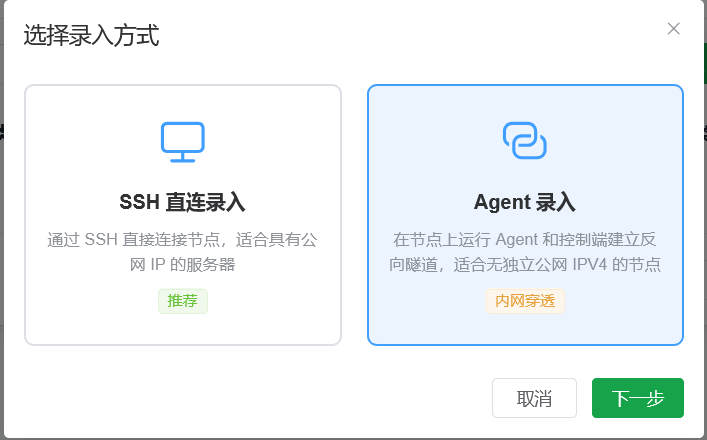
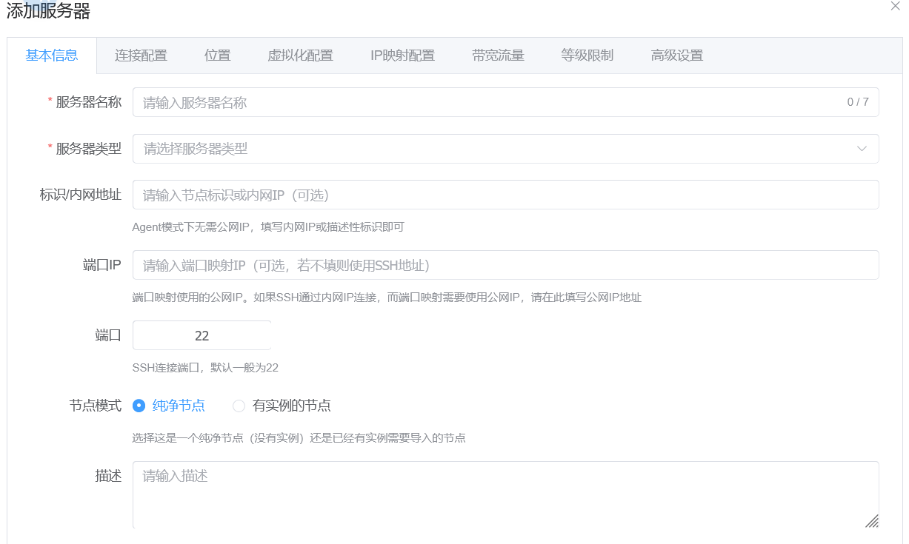
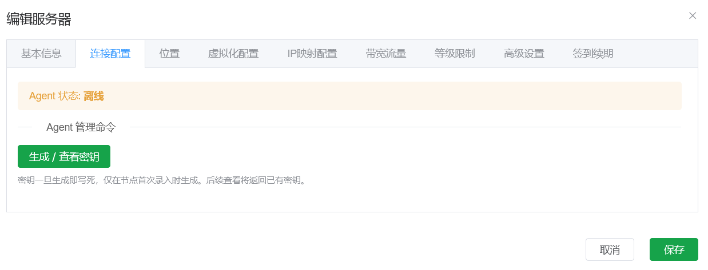
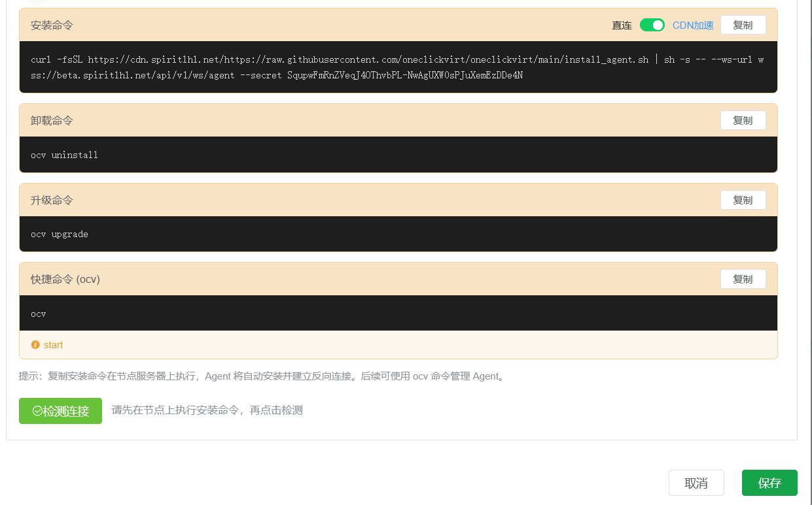

# 自定义

## 使用agent模式纳管无独立公网IPV4地址的节点

对于一些本地设备，节点虽然有IPV4公网访问权限，但是没有固定/动态的独立IPV4地址，无法直接使用标准模式通过SSH纳管节点，这里提供一种新的方式进行纳管----agent模式。



新增节点点击对应的模式后，进入基础信息页面



和常规的标注模式录入不一样，IP地址和端口不再是必填项，如果不填写也可以纳管。对于本地节点，不要填写这两个框；对于云服务器等有固定的IPV4的节点，可以填写。不填写留空的仅支持后续的```网络模式```选择```无端口映射模式```，而填写不留空的```网络模式```和正常标注模式一样可以选择所有的类型。



点击保存后，可以在```连接配置```这块看到具体的生成命令的按钮，一经保存该节点token会写死，如果需要更新token，需要删除节点后重新新增节点，一切配置都得重新填写了，所以不要泄露token，否则很麻烦。


点击生成后如图，直接复制对应的命令到本地的节点服务器上执行即可纳管，执行安装完毕后，可在当前页面下方的检测按钮上进行检测。




点击检测成功后，后续的相关配置页面按照原先的标准模式的说明来即可，没有什么不同。


只有这块对于本地节点有所不同，需要选择```无端口映射```类型，方便后续手动通过管理员的```端口管理```页面进行```手动添加端口```操作，内穿端口到主控的IPV4地址上进行使用。


手动添加端口映射时选择```控制端转发（内网穿透）```即可，非必要填写的项目可以留空不填，自动会筛选主控的端口进行映射的。

但这样有一个限制，务必要确保```主控面板```的部署方式是```脚本部署```或者本地编译部署的，不支持docker或docker compose部署方式，不支持非```Linux系统```的部署，因为主控部署的时候需要确保拥有对于主控部署的服务器的防火墙的操控权，所以也```需要root环境```下部署。

```内穿端口```这项功能```仅限使用agent模式```纳管的节点，通过wss转发代理的方式进行，所以部署的时候，务必确保反代端口时按照说明有反代ws/wss协议，不要自行反代忘记了这点。

同时如果主控有更新了版本，务必确保节点侧也进行对应的更新，点击编辑节点后进入```连接配置```页面点击重新生成命令，重新安装一遍就行了。

## 使用LXD/INCUS开设共享GPU设备的容器

对于需要共享GPU设备的节点，务必确保纳管节点前节点本身已安装号对应的显卡驱动，且该显卡本身的命令执行无误，比如

```shell
nvidia-smi
```

要确保显示类似


```
root@a12-ThinkStation-P620:/root/sharefile# nvidia-smi
Sat May 16 20:23:07 2026       
+---------------------------------------------------------------------------------------+
| NVIDIA-SMI 535.171.04             Driver Version: 535.171.04   CUDA Version: 12.2     |
|-----------------------------------------+----------------------+----------------------+
| GPU  Name                 Persistence-M | Bus-Id        Disp.A | Volatile Uncorr. ECC |
| Fan  Temp   Perf          Pwr:Usage/Cap |         Memory-Usage | GPU-Util  Compute M. |
|                                         |                      |               MIG M. |
|=========================================+======================+======================|
|   0  NVIDIA RTX A6000               Off | 00000000:61:00.0 Off |                  Off |
| 30%   42C    P0              83W / 300W |      0MiB / 49140MiB |      1%      Default |
|                                         |                      |                  N/A |
+-----------------------------------------+----------------------+----------------------+
                                                                                         
+---------------------------------------------------------------------------------------+
| Processes:                                                                            |
|  GPU   GI   CI        PID   Type   Process name                            GPU Memory |
|        ID   ID                                                             Usage      |
|=======================================================================================|
|  No running processes found                                                           |
+---------------------------------------------------------------------------------------+
```

只有宿主机安装好了驱动才能进行容器化共享GPU资源。

然后需要通过本教程中的Incus/Lxd的教程，进行好本地环境的安装，安装完毕后，通过主控的agent模式纳管完毕且执行健康检测无误后，才进行后续的操作。

推荐开启节点仅兑换码兑换模式，通过管理员的兑换码页面选择GPU设备创建容器。


创建成功后，切换为管理员的普通用户视图兑换掉，然后回到管理员视图，去端口管理页面进行容器的端口内穿，方便直接通过web的ssh进行连接配置。


添加成功后，可以直接通过web的ssh进行连接操控本地的这个新容器了。

进入容器后，需要安装对应的和外部宿主机一样的驱动版本，只不过这次安装的时候，要确保不要加载进入内核，添加命令参数```--no-kernel-module```。

具体如何找驱动安装驱动，详见 https://www.spiritysdx.top/20240513/#%E5%AE%B9%E5%99%A8%E5%86%85%E5%AE%89%E8%A3%85gpu%E9%A9%B1%E5%8A%A8 如何进行的驱动安装。

安装完毕后，容器内也可以执行```nvidia-smi```得到输出，证明GPU已共享使用了。


那此时就可以停止这个容器，以此为母本，使用兑换码的批量开设容器的复制模式，设置此容器为源容器进行复制开设新容器了。