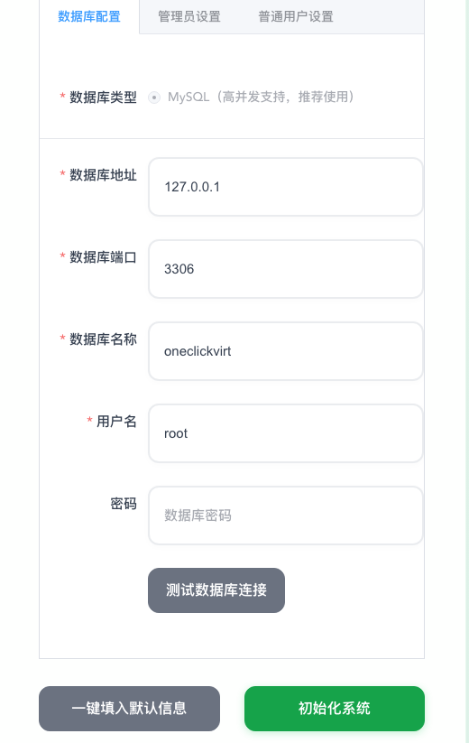

# OneClickVirt

区分面板端和受控端，受控端需要提前安装好对应虚拟化的环境，可使用本说明别的主体安装进行环境安装，主控端实际就是一个面板，没有虚拟化环境需求。

## 受控端

对应本说明别的主体安装进行环境安装，这里不过多赘述，四大主流的虚拟化技术的主体安装本教程都有对应的安装命令进行安装，自行查阅。

受控端只需要安装好虚拟化环境即可，不必额外安装agent进行控制，只要确保SSH能登录即可。

## 面板端

硬件上需要至少1G空闲内存和2G空闲硬盘，通过下面任一方式安装完成即可。

| 安装方式 | 适用场景 | 优点 | 缺点 |
|---------|---------|------|------|
| 前后端分离部署 | 高性能，占用最小 | 性能最佳、灵活配置 | 配置复杂，需配置反向代理 |
| 一体化部署 | 本地有无公网IPV4地址皆可 | 部署简单、无需反向代理 | 性能较差 |
| Docker部署(预构建镜像) | 快速部署，占用较大 | 一键安装、数据持久化 | 需要Docker环境，下载镜像较大  |
| Dockerfile自编译 | 适合二次开发源码发布 | 高度自定义 | 需要Docker环境，编译耗时长 |

### 通过预编译二进制文件安装

这里也区分两种方式：
- 前后端分离部署(后端前端分开编译出对应文件进行部署)，性能更好
- 一体化部署(前后端合二为一只需要部署一个文件)，性能较差

#### 前后端分离部署

##### Linux

###### 下载脚本

国际

```shell
curl -L https://raw.githubusercontent.com/oneclickvirt/oneclickvirt/refs/heads/main/install.sh -o install.sh && chmod +x install.sh
```

国内

```shell
curl -L https://cdn.spiritlhl.net/https://raw.githubusercontent.com/oneclickvirt/oneclickvirt/refs/heads/main/install.sh -o install.sh && chmod +x install.sh
```

###### 环境安装

有交互地安装环境

```
./install.sh env
```

无交互地安装环境

```
noninteractive=true ./install.sh env
```

###### 本体安装

```
./install.sh install
```

安装目录: ```/opt/oneclickvirt```

安装成功后，需要手动启动服务: 

```shell
systemctl start oneclickvirt
```

其他使用方法：

停止服务: 

```shell
systemctl stop oneclickvirt
```

开机自启: 

```shell
systemctl enable oneclickvirt
```

查看状态: 

```shell
systemctl status oneclickvirt
```

查看日志: 

```shell
journalctl -u oneclickvirt -f
```

重启服务：

停止服务: 

```shell
systemctl restart oneclickvirt
```

###### 升级前后端

```
./install.sh upgrade
```

除了配置文件，后端和前端文件都会升级

###### 部署前端

前面安装脚本会将静态文件解压到

```shell
cd /opt/oneclickvirt/web/
```

这个路径下

使用```nginx```或```caddy```以这个路径建立静态网站即可，是否需要域名绑定自行选择

静态文件部署完毕后，需要反代后端地址给前端使用，这里具体以```OpenResty```为例：


需要反代路径```/api```到后端的```http://127.0.0.1:8888```地址上，如果你使用的的是```1panel```，那么就只需要填写这些即可，默认的后端域名使用默认的```$host```不需要修改。

如果你使用的是```nginx```或```caddy```，请参考下方的代理源码自行修改进行代理

```shell
location /api {
    proxy_pass http://127.0.0.1:8888; 
    proxy_set_header Host $host; 
    proxy_set_header X-Real-IP $remote_addr; 
    proxy_set_header X-Forwarded-For $proxy_add_x_forwarded_for; 
    proxy_set_header REMOTE-HOST $remote_addr; 
    proxy_set_header X-Forwarded-Proto $scheme; 
    proxy_set_header X-Forwarded-Port $server_port; 
    
    # WebSocket support
    proxy_set_header Upgrade $http_upgrade;
    proxy_set_header Connection "upgrade";
    
    proxy_http_version 1.1; 
    
    # SSL settings
    proxy_ssl_server_name off; 
    proxy_ssl_name $proxy_host;
    
    # Timeout settings
    proxy_connect_timeout 60s;
    proxy_send_timeout 600s;
    proxy_read_timeout 600s;
    
    # Cache and buffering
    proxy_buffering off;
    add_header X-Cache $upstream_cache_status;
    add_header Cache-Control no-cache;
}
```

##### Windows

查看

https://github.com/oneclickvirt/oneclickvirt/releases/latest

下载最新的对应架构的压缩文件，解压后挂起执行。

执行的二进制文件的同级目录下，下载

https://cdn.spiritlhl.net/https://raw.githubusercontent.com/oneclickvirt/oneclickvirt/refs/heads/main/server/config.yaml

文件，这是后续需要使用的配置文件。

下载```web-dist.zip```文件后，解压并使用对应的程序建立静态网站，类似Linux那样设置好反向代理即可。

#### 一体化部署

这里不再区分前后端的概念，从

https://github.com/oneclickvirt/oneclickvirt/releases/latest

中找到带```allinone```标签的压缩包进行下载，注意区分```amd64```和```arm64```架构，以及对应的系统。

Linux中使用```tar -zxvf```命令解压```tar.gz```压缩包，Windows中使用对应解压工具解压```zip```压缩包，将其中的二进制文件复制粘贴到你需要部署项目的位置。

最好移动到一个专门的文件夹中，因为运行过程中将产生结构化的日志文件。

(以下说明将以amd64架构的linux系统的文件进行示例)

Linux中赋予文件可执行权限，如

```shell
chmod 777 server-allinone-linux-amd64
```

然后下载

https://github.com/oneclickvirt/oneclickvirt/blob/main/server/config.yaml

文件到同一个文件夹中。

Linux中，使用```screen```或```tmux```或```nohup```命令挂起执行二进制文件即可，如

```shell
./server-allinone-linux-amd64
```

然后打开对应的IP地址的8888端口即可看到前端进行使用了，如

```
http://你的IP地址:8888
```

如果你是Windows系统，那么需要使用管理员权限启动exe文件，同时确保启动前exe文件同一个文件夹中存在```config.yaml```配置文件，否则启动将出现白屏或不通的情况。至于怎么挂起执行，自行探索吧，直接挂着cmd界面运行也行。

一体化部署的模式适合本机没有公网IP的情况，你的IP地址可以是```localhost```或者```127.0.0.1```，也可以是对应的公网IPV4地址，具体部署环境下自测。

### 通过Docker安装

:::tip
由于启动的时候连带数据库一起启动，所以容器刚启动的时候不要立即操作，需要至少等待12秒。
:::

可使用的镜像tag可在 

https://hub.docker.com/r/spiritlhl/oneclickvirt

https://github.com/oneclickvirt/oneclickvirt/pkgs/container/oneclickvirt

中查询

#### 方式一：使用预构建镜像部署

**镜像标签说明**

| 镜像标签 | 说明 | 适用场景 |
|---------|------|---------|
| `spiritlhl/oneclickvirt:latest` | 一体化版本（内置数据库）最新版 | 快速部署 |
| `spiritlhl/oneclickvirt:20251209` | 一体化版本特定日期版本 | 需要固定版本 |
| `spiritlhl/oneclickvirt:no-db` | 独立数据库版本最新版 | 不内置数据库 |
| `spiritlhl/oneclickvirt:no-db-20251209` | 独立数据库版本特定日期 | 不内置数据库 |

所有镜像均支持 `linux/amd64` 和 `linux/arm64` 架构。

##### 全新部署

使用已构建好的```amd64```或```arm64```镜像，会自动根据当前系统架构下载对应版本：

不配置域名：

```bash
docker run -d \
  --name oneclickvirt \
  -p 80:80 \
  -v oneclickvirt-data:/var/lib/mysql \
  -v oneclickvirt-storage:/app/storage \
  --restart unless-stopped \
  spiritlhl/oneclickvirt:latest
```

配置域名访问：

如果你需要配置域名，需要设置 `FRONTEND_URL` 环境变量：

```bash
docker run -d \
  --name oneclickvirt \
  -p 80:80 \
  -e FRONTEND_URL="https://your-domain.com" \
  -v oneclickvirt-data:/var/lib/mysql \
  -v oneclickvirt-storage:/app/storage \
  --restart unless-stopped \
  spiritlhl/oneclickvirt:latest
```

以上的方式仅限于新安装

##### 旧环境下仅升级

先备份配置文件到当前路径下：

```shell
docker cp oneclickvirt:/app/config.yaml .
```

不需要删除挂载盘仅删除容器本身：

```shell
docker rm -f oneclickvirt
```

然后删除原始的镜像：

```shell
docker image rm -f spiritlhl/oneclickvirt:latest
```

重新拉取容器镜像：

```shell
docker pull spiritlhl/oneclickvirt:latest
```

然后再按全新环境下开设的步骤来，注意等待12秒后打开前端，会发现已自动越过初始化界面，因为数据已持久化导入。

然后覆写原有的配置文件：

```shell
docker cp config.yaml oneclickvirt:/app/config.yaml
```

##### 旧环境下新部署

这将完全删除原有数据再部署，不仅需要删除容器还得删除对应的挂载点：

```shell
docker rm -f oneclickvirt
docker volume rm oneclickvirt-data oneclickvirt-storage
```

然后删除原始的镜像：

```shell
docker image rm -f spiritlhl/oneclickvirt:latest
```

重新拉取容器镜像：

```shell
docker pull spiritlhl/oneclickvirt:latest
```

然后再按全新环境下开设的步骤来，这样会提示重新初始化，所有原始数据已删除。

#### 方式二：通过Dockerfile自行编译部署

这种方式适合自行修改源码与自定义构建：

##### 一体化版本（内置数据库）

```bash
git clone https://github.com/oneclickvirt/oneclickvirt.git
cd oneclickvirt
docker build -t oneclickvirt .
docker run -d \
  --name oneclickvirt \
  -p 80:80 \
  -v oneclickvirt-data:/var/lib/mysql \
  -v oneclickvirt-storage:/app/storage \
  --restart unless-stopped \
  oneclickvirt
```

##### 独立数据库版本（不内置数据库）

```bash
git clone https://github.com/oneclickvirt/oneclickvirt.git
cd oneclickvirt
docker build -f Dockerfile.no-db -t oneclickvirt:no-db .
docker run -d \
  --name oneclickvirt \
  -p 80:80 \
  -e FRONTEND_URL="https://your-domain.com" \
  -e DB_HOST="your-mysql-host" \
  -e DB_PORT="3306" \
  -e DB_NAME="oneclickvirt" \
  -e DB_USER="root" \
  -e DB_PASSWORD="your-password" \
  -v oneclickvirt-storage:/app/storage \
  --restart unless-stopped \
  oneclickvirt:no-db
```

## 数据库初始化

安装启动了```mysql```后，创建一个空的数据库```oneclickvirt```，使用类型```utf8mb4```，最好仅本地```127.0.0.1```可访问，对应用户名和密码保存好。(如果你安装使用的是docker一体化部署的容器，自带数据库无需自己创建空数据库，默认已在容器中启动了对应的数据库可用了)

打开前端对应的页面后，将自动跳转到初始化界面。



填写数据库信息和相关用户信息，测试数据库链接无问题，则可点击初始化系统。


完成初始化后会自动跳转到首页，可以自行探索并使用了。


如果使用的是默认的用户信息进行初始化，那么默认的账户为：

管理员账户名密码分别为：

```
admin
```

```
Admin123!@#
```

初始化过程中，默认加载了所有的镜像种子数据到数据库中，但是默认仅启用了```debian```和```alpine```相关版本的镜像，这是为了避免过多镜像启用导致用户选择困难。

如果你需要额外类型的镜像，需要在管理员权限下，在系统镜像管理界面按照类型、架构、版本搜索并进行启用。

初始化后请立即修改默认的管理员的用户名密码，并禁用或删除默认启用的测试用户，这一部分可在管理员的用户管理页面进行操作。
