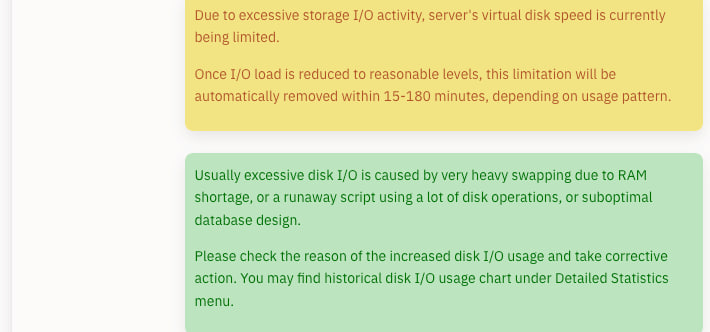

# 如有问题请反馈对应仓库

## 忘记了管理员密码怎么办

需要通过数据库操作强行更改密码

1. 生成密码哈希

```bash
# 使用 Python 生成（将 NewPassword123! 替换为您的新密码）
python3 -c "import bcrypt; print(bcrypt.hashpw(b'NewPassword123!', bcrypt.gensalt()).decode('utf-8'))"
```

输出示例：`$2b$12$xxxxxxxxxxxxxxxxxxxxxxxxxxxxxxxxxxxxxxxxxxxx`

2. 进入数据库

**Docker 部署（一体化版本）：**
```bash
docker exec -it oneclickvirt mysql -u root oneclickvirt
```

**独立数据库部署：**
```bash
mysql -h 127.0.0.1 -P 3306 -u root -p oneclickvirt
```

3. 更新密码

```sql
-- 查看管理员账户
SELECT id, username, user_type FROM users WHERE user_type = 'admin';

-- 更新密码（替换为第1步生成的哈希值）
UPDATE users 
SET password = '$2b$12$xxxxxxxxxxxxxxxxxxxxxxxxxxxxxxxxxxxxxxxxxxxx' 
WHERE username = 'admin';

-- 退出
EXIT;
```

4. 登录测试

使用新密码登录系统验证。

**注意事项**

- 哈希值必须以 `$2a$`、`$2b$` 或 `$2y$` 开头
- 默认管理员用户名为 `admin`，可通过查询确认
- 建议使用强密码（≥8位，含大小写字母、数字、特殊字符）
- 修改前建议备份数据库：
  ```bash
  docker exec oneclickvirt mysqldump -u root oneclickvirt > backup.sql
  ```

## Docker如何删除持久化的数据库和存储卷

删除对应的容器后

执行

```shell
docker volume rm oneclickvirt-data oneclickvirt-storage oneclickvirt-config
```

进行删除

## 开设实例过多导致节点异常

一个显著的现象是执行操作极其缓慢，甚至几分钟都执行不完毕一个命令

一般常见于节点的IO比较差，此时又开了很多SWAP超配内存

比如lxd环境下，执行```lxc list```会报错

```shell
internal error, please report: running “lxd.lxc” failed: cannot create transient scope: DBus error “org.freedesktop.DBus.Error.TimedOut”: [Failed to activate service ‘org.freedesktop.systemd1’: timed out (service_start_timeout=25000ms)]
```

原因就是设置的实例数量太多了，商家又高度限制IO



此时只有一种方法，重启节点服务器，强制重启

重启后立即登录SSH，使用对应的脚本删除swap的使用，然后删除一些实例释放资源

由于重启后容器虚拟机需要一段时间一个个自动重启，打这个时间差可能删不了多少，但每次重启都能删一些

最终还是需要在限制实例数量的时候，慎重考虑节点的性能，较弱或者限制较多的节点，建议不要开设过多实例

## 自编译出现问题

常见于 源码部署、Dockerfile、DockerCompose 方式部署

常见于 ARM 架构下前端编译出错

直接使用 预编译的Docker容器镜像 或 直接使用二进制文件部署(最稳妥)