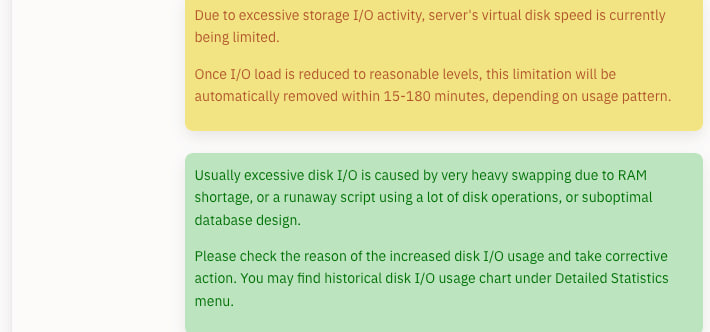

# 如有问题请反馈对应仓库

## 忘记了管理员密码怎么办

需要通过数据库操作强行更改密码

1. 生成密码哈希

```bash
# 使用 Python 生成（将 NewPassword123! 替换为您的新密码）
python3 -c "import bcrypt; print(bcrypt.hashpw(b'NewPassword123!', bcrypt.gensalt()).decode('utf-8'))"
```

输出示例：`$2b$12$xxxxxxxxxxxxxxxxxxxxxxxxxxxxxxxxxxxxxxxxxxxx`

2. 进入数据库

**Docker 部署（一体化版本）：**
```bash
docker exec -it oneclickvirt mysql -u root oneclickvirt
```

**独立数据库部署：**
```bash
mysql -h 127.0.0.1 -P 3306 -u root -p oneclickvirt
```

3. 更新密码

```sql
-- 查看管理员账户
SELECT id, username, user_type FROM users WHERE user_type = 'admin';

-- 更新密码（替换为第1步生成的哈希值）
UPDATE users 
SET password = '$2b$12$xxxxxxxxxxxxxxxxxxxxxxxxxxxxxxxxxxxxxxxxxxxx' 
WHERE username = 'admin';

-- 退出
EXIT;
```

4. 登录测试

使用新密码登录系统验证。

**注意事项**

- 哈希值必须以 `$2a$`、`$2b$` 或 `$2y$` 开头
- 默认管理员用户名为 `admin`，可通过查询确认
- 建议使用强密码（≥8位，含大小写字母、数字、特殊字符）
- 修改前建议备份数据库：
  ```bash
  docker exec oneclickvirt mysqldump -u root oneclickvirt > backup.sql
  ```

## Docker如何删除持久化的数据库和存储卷

删除对应的容器后

执行

```shell
docker volume rm oneclickvirt-data oneclickvirt-storage oneclickvirt-config
```

进行删除

## 开设实例过多导致节点异常

一个显著的现象是执行操作极其缓慢，甚至几分钟都执行不完毕一个命令

一般常见于节点的IO比较差，此时又开了很多SWAP超配内存

比如lxd环境下，执行```lxc list```会报错

```shell
internal error, please report: running “lxd.lxc” failed: cannot create transient scope: DBus error “org.freedesktop.DBus.Error.TimedOut”: [Failed to activate service ‘org.freedesktop.systemd1’: timed out (service_start_timeout=25000ms)]
```

原因就是设置的实例数量太多了，商家又高度限制IO



此时只有一种方法，重启节点服务器，强制重启

重启后立即登录SSH，使用对应的脚本删除swap的使用，然后删除一些实例释放资源

由于重启后容器虚拟机需要一段时间一个个自动重启，打这个时间差可能删不了多少，但每次重启都能删一些

最终还是需要在限制实例数量的时候，慎重考虑节点的性能，较弱或者限制较多的节点，建议不要开设过多实例

## 自编译出现依赖缺失或者兼容性问题

常见于 源码部署、Dockerfile、DockerCompose 方式部署

常见于 ARM 架构下前端编译出错

直接使用 预编译的Docker容器镜像 或 直接使用二进制文件部署(最稳妥)

## incus 和 lxd 进行 NAT 映射一些命令查不到映射规则

这是正常现象。

Incus / LXD 的端口映射默认使用 **内核态 NAT（DNAT + FORWARD）** 实现，并 **不会在宿主机上创建端口监听进程**。
因此，使用传统的端口占用查询工具通常**无法看到任何结果**。

例如，以下命令都 **查不到宿主机端口占用**：

```shell
ss -lntup
lsof -i
netstat -lntp
```

只有通过：

```shell
incus config device show 实例1
```

或：

```shell
lxd config device show 实例1
```

才能看到已配置的端口映射规则，因为流量不过宿主机直接对外转发。

正确的端口映射查找方式是查看 nftables 规则

```shell
nft list ruleset
```

或仅查看 NAT 表：

```shell
nft list table ip nat
```

在使用 `iptables` 的系统中可使用：

```shell
iptables -t nat -L
```

如果有流量进出，查看真实连接状态可使用：

```shell
conntrack -L | grep <端口>
```

## NAT IPv6 端口映射应该如何填写

`NAT IPv4 + IPv6` 模式下，IPv6 端口映射不需要在“端口映射”对话框里填写 IPv6 地址或 `/64`。对话框只填写：实例、容器内端口、宿主端口（留空自动分配）、端口数量和 TCP/UDP 协议；面板会为同一条映射同步创建 IPv4 和 IPv6 规则。

对于 Incus/LXD，`NAT IPv4 + IPv6` 使用宿主机公网 IPv6 和实例 ULA 做端口映射，**不使用**“IPv6 地址池 / 节点地址文件”。把 `/64` 文件配置到这个 NAT 模式会把独立公网地址与 NAT 地址混用；新版面板会隐藏该输入，控制端也不会再从该池为 Incus/LXD NAT 实例分配 `static_ipv6`。

只有“独立 IPv4 + 独立 IPv6”或“纯 IPv6”等需要实例持有路由地址的模式才配置 `/64` 或单个 IPv6 地址：

- 节点文件路径填写节点上的绝对路径，例如 `/etc/oneclickvirt/ipv6-pool.txt`；
- 文件每行填写一个 IPv6 地址或 CIDR，`/64` 只能表示地址池/前缀，不能当作某个实例的单个地址；
- 修改文件后先执行“同步节点文件”，再创建实例；这不是 NAT 端口映射的输入。

在 NAT 模式下，实例通常持有 `fd...` ULA，外部访问地址是“宿主机公网 IPv6 + 映射端口”，例如：

```text
http://[宿主机公网IPv6]:10004/
```

这不是实例独立公网 IPv6，也不能把宿主机公网 IPv6 填到实例的 `publicIPv6` 字段。需要实例直接持有可从公网访问的 IPv6 `/128` 时，应选择“独立 IPv4 + 独立 IPv6”或“纯 IPv6”模式，并同时满足上游路由/NDP、宿主转发和实例路由条件。验证时必须从另一台具备 IPv6 的公网主机访问，容器内 `curl` 或宿主机本地访问不能代替外部验收。

Incus/LXD NAT IPv6 的必要条件是：宿主机接口存在公网 IPv6、存在 IPv6 默认路由、外部可访问所分配的宿主端口，并且 `incusbr0`/LXD bridge 启用了 IPv6 ULA、DHCP 和 NAT。端口映射方式推荐 `device_proxy`；外部连接地址写成 `[宿主机公网IPv6]:宿主端口`，不是 `/64`。
## 无 CDN 模式（WITHOUTCDN）

如果服务器网络非常好无需加速，或希望完全禁用 CDN 加速，可在执行脚本前设置：

```shell
export WITHOUTCDN=TRUE
```

也可以只对单次命令生效：

```shell
WITHOUTCDN=TRUE
```

设置后，脚本执行过程中将不再尝试使用 CDN 加速地址。
