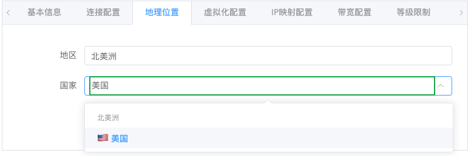

# 使用说明

这里将详细说明本面板的使用方式，如有问题请加群求助管理员或群友：https://t.me/oneclickvirt

## 用户管理

登录进入管理员界面后，打开用户管理页面后，必须点击重置密码，以确保admin账户的密码为强密码，确保不会被恶意爆破。如果初始化的时候，你使用了自行定义的密码，那么不重置密码也可以。


重置密码会自动生成强密码，仅展示一次，务必复制保存好，避免遗忘。


如果需要更改用户的类型，就需要点击对应用户进行编辑，编辑的弹窗支持更改用户类型。


管理员可以点击右上角头像，下拉栏目中有切换管理员和普通用户视图的按钮，如果需要测试任何功能，可以直接使用管理员用户测试。(普通用户没有这个视图切换按钮)

## 纳管节点

首先，需要确保要纳管的节点已经安装了四大虚拟化技术的其中之一。

部署了本面板的机器上ping对应的节点的IP，最好延迟在300ms以内且丢包率不要太高，否则可能出现无法连接导致控制中遗漏命令执行的情况。

以下是设置节点的设置步骤：

### 基本信息(必填)


服务器名称最好仅英文+数字，不哟用特殊字符，最好控制在6个字符以内，后续开设容器或虚拟机的时候，会自动带上这个服务器名称前缀。

服务器类型选择你实际安装了的虚拟化技术名称，docker默认只能开设容器，其他虚拟化技术可开设虚拟机。

SSH地址填写节点的公网IPV4地址或内网SSH链接地址，这个地址将被用作SSH连接，API连接

NAT端口映射优先使用端口IP进行映射，如果不提供具体的端口IP，将使用SSH地址的IP进行映射。

端口填写SSH连接的端口。

描述可备注当前节点的一些信息，仅管理员可见。

状态默认为启用状态，允许后面的健康检测后，被普通用户申请领取开设实例。

架构是节点本身的架构，目前支持纳管amd64架构和arm64架构的节点，自己对应选取。

### 连接配置(必填)


用户名推荐使用root用户，因为后面自动配置api的时候需要对应下载一些依赖。

密码就是SSH登录用的密码，当然如果你不使用密码，使用密钥登录也是可以的。

SSH超时配置是设计测试连通性和优化容错率的


前面信息填写完毕后，点击测试，会出现对应的提示值，点击应用即可，当然不进行应用也行，容错率更高一些。

这么设计是为了适配一些与面板机器连通性极差的节点，增加这些参数的数值意味着更高的容错率。

执行超时时间一般不需要进行修改，除非你的节点本身性能特别弱，执行命令耗时很久。

### 位置信息(可选)



直接输入具体国家进行点击勾选，大部分国家都已经有预设了，有对应的旗帜图标。

设置位置后，普通用户的申请领取界面将可以看到对应的旗帜和地区，还有自动匹配的所在大洲。

### 实例类型和数量限制(必填)


对于docker类型的节点，只能开设容器，其他虚拟化类型都支持开设容器和虚拟机(前提是节点本身支持)。

如果不需要开设虚拟机，务必取消虚拟机的勾选。

数量限制如果保持默认的参数0，意味着不进行节点层面的这个类型的实例数量限制。

对于容器类型，建议按照以下公式设置数量

节点空闲存储盘大小 / 将分发的实例的最小硬盘大小 = 实例最大数量

对于虚拟机类型，则

节点空闲内存大小(含虚拟内存) / 将分发的实例的最小内存大小 = 实例数量

这样计算的原因在于，容器一般不限制总的CPU数量和内存大小，但限制硬盘大小，虚拟机一般内存才是开设数量的瓶颈。

### 资源超配置(可选)


默认容器类型不限制CPU和内存预分配的总量，但限制预分配的硬盘总量，以达到最优化的资源共享和最大化的实例数量。


默认虚拟机类型限制所有资源，预分配的资源总量最大值不超过实际资源大小。

对于ProxmoxVE，还有一个开设的硬盘所在存储池名字可以设置，如果多盘的pve，需要设置开在哪个存储池上。

其他类型的虚拟化环境在安装过程中有询问具体存储池开设位置了，所以就不需要设置了。

总的来说，如果需要限制哪种资源不被超开，那么就点击限制，限制后将无法超开对应资源，不限制则可超开对应资源。

这里限制的是该节点上此类实例的总资源占用，用于计算可用资源和限制实例创建。

不推荐进行修改，除非你知道这块的设置在干什么。

### IP映射配置(可选)


一般不需要进行修改，这里可以设置每个实例的端口映射数量、区间、网络配置方式、端口映射方式。

默认开设带NAT映射公网IPV4端口的实例。

如果节点本身有一段IPV6子网大于等于/80大小的，那么选择网络配置更改，可开设带公网独立IPV6地址的实例。

极端一点，也可以开设仅独立IPV6地址的实例，自行选择吧。

不推荐对映射方式进行修改，除非你知道这块的设置在干什么。

### 带宽和流量配置(必填)


字面意思，设置节点开设出的实例的最大带宽和以自然月计算的可用流量总量，默认不自动启用流量监控和流量统计。

(目前流量统计有问题，无法区分公网内网流量导致统计量暴增不真实，不要启用)

(且由于设计缺陷，可能哪怕关闭了还在统计，此时建议给此节点的用户等级、系统的用户等级、此节点的流量限制都设置1000T流量避免触发自动限制，暂时没空修复该恶性BUG)

~~实例流量超过节点限制或用户限制时，将自动停止实例；节点总的流量超限时，将停止整个节点的所有实例。~~

~~月初会重置统计数据，并重新启动所有达到流量限制自动已停止的实例。~~

### 等级限制(必填)


这块预设了5个等级，用户申请领取的时候，将经过这个限制筛选配置。

在实际实例开设过程中，节点层面的等级限制 将与 全局的用户等级的资源限制 互相比对，取其中的最小值作为用户在当前节点可用的资源限制。

这样设置是为了特殊化当前节点对应等级的用户可开设的实例的配置限制，避免有时候全局限制不适用当前节点，全局限制在系统配置中可设置，一般用于用户整个账户层面的使用资源限制。

### 高级设置(可选)


过期时间：

防止用户继续操作已经过期的节点，过期节点将自动冻结，此时对应的实例将不允许任何操作，但不会自动删除，如果冻结了节点请及时清理删除节点。

任务并发控制：

默认单线程串联执行，同一时刻，只会存在一个增删改的任务(对应实例的开设删除重置操作)。

可以更改为多线程并发执行，同一时刻可以存在多个增删改任务，只有并发执行时，并发数量的设置才有意义。

串联执行适合节点本身性能弱或平台用户数量少的情况，并发操作适合节点本身性能强或用户数量多的情况，请自行选择模式。

个人推荐使用默认设置，并发执行可能存在未完全测试出来的边界条件，可能有BUG。

任务轮询设置：

控制是否启用任务执行，以及任务执行轮询检查状态的间隔，一般保持默认即可。

操作执行规则：

节点操作模式支持 仅API，仅SSH，自动切换 ，默认使用自动切换模式，一般来说没必要修改，除非有特殊需求。

如果需要启用API操作模式，需要在设置保存节点成功后，在外面点击自动配置API按钮，将执行后台任务自动对接虚拟化平台的API，无需人工配置。等待一段时间大概15~20秒后，应该已经配置成功，点击按钮可见配置历史任务及对应的日志。配置成功后，再点击健康检测，确保API状态为绿色在线状态，就配置启用API成功了。


### 健康检测(必选)


保存节点后，点击健康检测完成后，普通用户才能看到对应的服务器，才能进行申请开设，若未进行健康检测，用户无法申请开设领取。

健康检测后会显示对应的类型的连接状态是否在线，会自动检测整机的实际资源总量，这个资源总量就是前面设置的不超配开设的资源总量限制。

## 系统镜像


默认种子数据会录入所有虚拟化环境可用的镜像，默认仅启用alpine和debian镜像，避免用户可用镜像过多。

如果需要任何系统任何虚拟化环境任何架构对应的镜像，请自行搜索后进行启用，否则用户选择不了对应的镜像。

暂时不支持自定义镜像地址，目前前端录入的功能是不可用的，不要手动录入镜像。

## 系统配置

一般的选项这里不多赘述了，有必要特殊说明的就两个配置。

### 用户等级配置(必填)


这里限制的是普通用户等级对应的总的账户可用的资源总量。

在对应节点开设实例的时候，这个全局配置将和节点本身的等级配置共同筛选同时符合条件的配置提供给用户选择。

### 实例权限配置(必填)


这里可用控制用户敏感操作所需的最低等级，可以控制 实例创建、实例删除、实例重置系统 所需的最低用户等级。

## 配置文件

默认的系统配置已经足够轻度使用了，如果需要高级自定义则需要修改配置文件，或初始化后在管理员界面进行修改。

https://github.com/oneclickvirt/oneclickvirt/blob/main/server/config.yaml

这里是完整的初始化的配置文件，下面将讲解具体的配置项目：

### auth 认证配置

```yaml
auth:
    email-password: ""
    email-smtp-host: ""
    email-smtp-port: "3306"
    email-username: root
    enable-email: false
    enable-oauth2: false
    enable-public-registration: false
    enable-qq: false
    enable-telegram: false
    qq-app-id: ""
    qq-app-key: ""
    telegram-bot-token: ""
    frontend-url: ""
```

认证模块的配置项,用于控制用户登录注册的方式和第三方登录集成。

- `email-password`: 邮件服务的认证密码,用于SMTP发送邮件时的身份验证
- `email-smtp-host`: SMTP服务器地址,如 `smtp.gmail.com`
- `email-smtp-port`: SMTP服务器端口,常用端口为 `25`、`465`(SSL)、`587`(TLS)
- `email-username`: SMTP服务器登录用户名,通常是完整的邮箱地址
- `enable-email`: 是否启用邮箱登录功能
- `enable-oauth2`: 是否启用OAuth2第三方登录功能
- `enable-public-registration`: 是否允许公开注册,关闭后仅管理员可创建账号
- `enable-qq`: 是否启用QQ登录
- `enable-telegram`: 是否启用Telegram登录
- `qq-app-id`: QQ互联平台申请的App ID
- `qq-app-key`: QQ互联平台申请的App Key
- `telegram-bot-token`: Telegram Bot的API Token
- `frontend-url`: 前端访问地址,需要包含协议头(`http://`或`https://`),结尾斜杠可选。OAuth2回调地址依赖此配置

### captcha 验证码配置

```yaml
captcha:
    enabled: true
    expire-time: 300
    height: 40
    length: 4
    width: 120
```

图形验证码的生成和验证配置,用于前端登录注册页面的安全验证。

- `enabled`: 是否启用验证码功能
- `expire-time`: 验证码过期时间,单位为秒
- `height`: 验证码图片高度,单位为像素
- `length`: 验证码字符长度
- `width`: 验证码图片宽度,单位为像素

### cdn 内容分发网络配置

```yaml
cdn:
    base-endpoint: https://cdn.spiritlhl.net/
    endpoints:
        - https://cdn0.spiritlhl.top/
        - http://cdn3.spiritlhl.net/
        - http://cdn1.spiritlhl.net/
        - http://cdn2.spiritlhl.net/
```

系统镜像下载时使用的CDN加速节点配置。

- `base-endpoint`: 主CDN节点地址,优先使用
- `endpoints`: 备用CDN节点列表,按顺序进行重试。系统会自动选择可用节点进行镜像下载

一般情况下不需要修改此配置,预载的系统镜像都托管在本组织仓库中,默认CDN节点已能提供良好的下载加速。

### mysql 数据库配置

```yaml
mysql:
    auto-create: true
    config: charset=utf8mb4&parseTime=True&loc=Local
    db-name: oneclickvirt
    engine: InnoDB
    log-mode: error
    log-zap: false
    max-idle-conns: 10
    max-lifetime: 3600
    max-open-conns: 100
    password: ""
    path: ""
    port: ""
    prefix: ""
    singular: false
    username: root
```

MySQL数据库连接和行为配置。初始化判断逻辑:当`path`和`port`都为空时,系统认为需要进行初始化,此时必须确保目标数据库为空数据库。

- `auto-create`: 是否自动创建数据库(如果不存在)
- `config`: 数据库连接参数,包括字符集、时间解析等
- `db-name`: 数据库名称
- `engine`: 数据库存储引擎,推荐使用InnoDB
- `log-mode`: 数据库日志模式,可选值为`silent`、`error`、`warn`、`info`
- `log-zap`: 是否使用zap日志库记录数据库日志
- `max-idle-conns`: 最大空闲连接数
- `max-lifetime`: 连接最大生命周期,单位为秒
- `max-open-conns`: 最大打开连接数
- `password`: 数据库密码
- `path`: 数据库服务器地址
- `port`: 数据库服务器端口
- `prefix`: 数据表名前缀
- `singular`: 是否使用单数表名(默认为复数)
- `username`: 数据库用户名

### quota 配额限制配置

```yaml
quota:
    default-level: 1
    instance-type-permissions:
        min-level-for-container: 1
        min-level-for-delete: 2
        min-level-for-vm: 1
    level-limits:
        1:
            max-instances: 1
            max-resources:
                bandwidth: 10
                cpu: 1
                disk: 1025
                memory: 350
            max-traffic: 102400
        2:
            max-instances: 3
            max-resources:
                bandwidth: 20
                cpu: 2
                disk: 20480
                memory: 1024
            max-traffic: 204800
        3:
            max-instances: 5
            max-resources:
                bandwidth: 50
                cpu: 4
                disk: 40960
                memory: 2048
            max-traffic: 307200
        4:
            max-instances: 10
            max-resources:
                bandwidth: 100
                cpu: 8
                disk: 81920
                memory: 4096
            max-traffic: 409600
        5:
            max-instances: 20
            max-resources:
                bandwidth: 200
                cpu: 16
                disk: 163840
                memory: 8192
            max-traffic: 512000
```

用户等级和资源配额的控制配置。内存、硬盘、流量的默认单位均为MB。

#### 全局配置

- `default-level`: 新注册用户的默认等级

#### instance-type-permissions 实例类型权限

控制不同等级用户可以执行的操作类型。

- `min-level-for-container`: 创建容器实例所需的最低用户等级
- `min-level-for-delete`: 在普通用户端执行删除操作所需的最低等级
- `min-level-for-vm`: 创建虚拟机实例所需的最低用户等级

#### level-limits 等级配额限制

定义每个用户等级对应的资源配额上限,键为等级数字。

每个等级包含以下配置:

- `max-instances`: 该等级用户可创建的最大实例数量
- `max-resources`: 单个实例的最大资源限制
  - `bandwidth`: 最大带宽,单位为Mbps
  - `cpu`: 最大CPU核心数
  - `disk`: 最大硬盘空间,单位为MB
  - `memory`: 最大内存,单位为MB
- `max-traffic`: 该等级用户的最大总流量,单位为MB

### zap 日志配置

```yaml
zap:
    compress-logs: true
    director: storage/logs
    encode-level: LowercaseLevelEncoder
    format: console
    level: info
    log-in-console: false
    max-array-elements: 5
    max-backups: 15
    max-file-size: 5
    max-log-length: 2000
    max-string-length: 1000
    prefix: '[oneclickvirt]'
    retention-day: 3
    show-line: false
    stacktrace-key: stacktrace
```

系统日志记录的详细配置,基于zap日志库。

- `compress-logs`: 是否压缩归档的日志文件
- `director`: 日志文件存储目录
- `encode-level`: 日志级别编码方式,可选`LowercaseLevelEncoder`(小写)、`CapitalLevelEncoder`(大写)
- `format`: 日志输出格式,可选`console`(控制台格式)、`json`(JSON格式)
- `level`: 日志级别,可选`debug`、`info`、`warn`、`error`。开发调试时建议使用`debug`,生产环境使用`info`或`warn`
- `log-in-console`: 是否同时输出日志到控制台
- `max-array-elements`: 数组类型字段最大记录元素数
- `max-backups`: 保留的历史日志文件最大数量
- `max-file-size`: 单个日志文件最大大小,单位为MB
- `max-log-length`: 单条日志最大长度,超出部分会被截断
- `max-string-length`: 字符串字段最大记录长度
- `prefix`: 日志前缀标识
- `retention-day`: 日志文件保留天数,过期自动删除
- `show-line`: 是否显示日志调用的文件名和行号
- `stacktrace-key`: 堆栈跟踪信息的键名

注意:调试问题时应将`level`设置为`debug`以获取详细日志信息。
