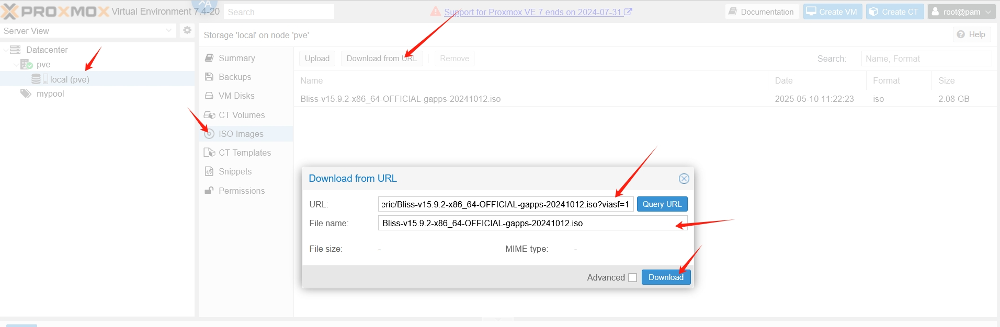
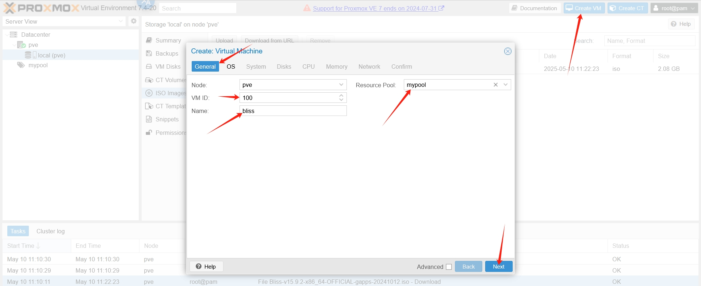
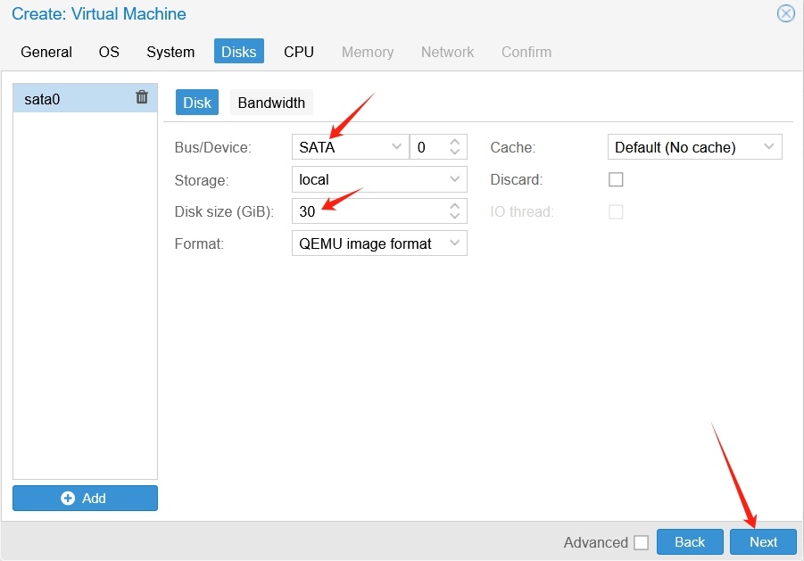
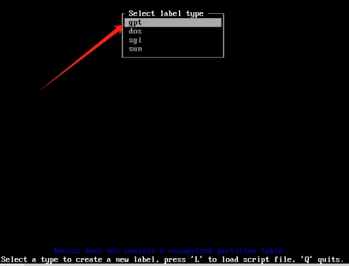
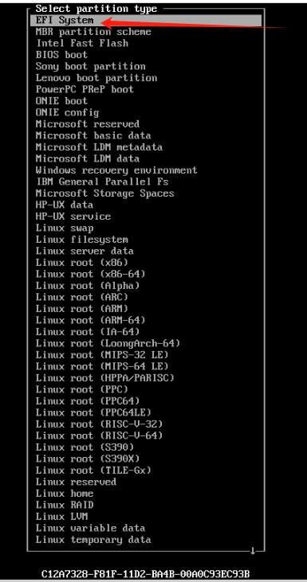
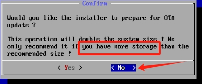

# Android 虚拟机

## 安卓系统镜像下载

Android系统版本9及以前的镜像下载地址：

国际

https://www.fosshub.com/Android-x86.html

https://sourceforge.net/projects/android-x86/files/

国内

https://mirrors.tuna.tsinghua.edu.cn/osdn/android-x86/

Android系统版本10及以后的新镜像下载地址：

https://blissos.org/index.html#download

## 虚拟机开设

### 以安卓版本9及以前的镜像开设Android虚拟机

本指南以

https://mirrors.tuna.tsinghua.edu.cn/osdn/android-x86/71931/android-x86_64-9.0-rc2.iso

作为示例进行演示


#### 模板设置

开设VMID为```100```的虚拟机选择对应的存储盘

  

选择安卓镜像，然后```Type```选择```Linux```，```Version```选择含2.6版本的选项

  

```Graphic card```选择```Vmware compatible```，其他选项选择默认如图所示

  

磁盘格式选择```SATA```，具体需要分配多大的磁盘自选，推荐至少30G

  

CPU数量至少2核

如果你的宿主机支持嵌套虚拟化，CPU的类型请选择```host```(经验证无问题)

如果你的宿主机不支持嵌套虚拟化，CPU的类型请选择```qemu64```，同时在模板设置成功后，需要在```Options```中点击```KVM hardware virtualization```取消勾选后再启动虚拟机(不保证后面系统初始化无问题)

  

内存至少4G内存，填写至少```4096```

  

绑定的网桥选择```vmbr1```，```Model```选择```VirtIO (paravirtualized)```，取消```Firewall```的勾选

  

后续点击continue按钮后，模板成功创建出来，需要手动点击启动并进入VNC界面

  

#### 系统安装

进入引导后，选择```Installation```开头的选项

  

然后需要创建分区写入，这块如果选择不了的话按键盘按钮c，就能选中了

  

选择不使用GPT格式

  

显示空白盘后，选择```New```

  

选择分区类型```Primary```

  

然后会提示划分多大的空间，默认回车就行，使用全部的空间

  

然后是选择```Flags```，移动到```Bootable```后，按回车，直到```Flags```下方显示```Boot```

  

然后移动到```Write```，回车，进行写入

  

这时候会让你确认是否继续，输入```yes```后回车继续

  

一段进度条跑过后，回到了最初的菜单，选择```Quit```退出菜单，一切准备就绪了

  

然后这时候回到了UI界面，使用前面初始化好的盘，选择```OK```按钮回车

  

文件系统按方向键选择```ext4```类型，选择```OK```按钮回车

  

确认进行格式化，选择```Yes```按钮回车

  

确认GRUB引导安装，选择```OK```按钮回车

  

确认文件系统可读写，选择```OK```按钮回车

  

跑了一段时间进度条后，显示安装成功，此时选择```Reboot```，选择```OK```按钮回车

  

然后一段时间后进入安卓LOGO界面

  

#### 镜像移除

然后会进入一段黑屏，大概3~5分钟后仍然黑屏的话，宿主机执行```qm stop 100```，然后开始移除镜像文件

移除已经按照完毕的ISO文件，在ProxmoxVE的web端手动在```Hardware[硬件]```中点击对应的```CD```选择```Remove[删除]```

  

然后宿主机再执行```qm start 100```，然后应该就会进入安卓系统的初始化界面了

#### 系统初始化

初始化界面选择语言，然后点击确定按钮

  

此时回尝试连接WIFI，由于本项目安装的PVE是完全的静态网络配置，直接跳过，稍后再进行设置

  

点击下一步按钮确认设置时间

  

点击取消屏幕保护，确认仍然跳过

  

然后一段时间黑屏后，会出现主屏幕应用的选择，如果等待3~5分钟这个界面仍然没有出现，那么像之前那样重启虚拟机，再进入VNC应该就会显示了

选择```Quickstep```


#### 网络设置

进入桌面，此时需要开始设置网络，左上角点击设置图标

  

出现下拉框，点击按住下拉

  

点击齿轮按钮

  

进入```网络和互联网```设置

  

左键双击```WIFI```

  

修改目前识别到的```VirtWIFI```，右键点击出现选择框后，点击```修改网络```

  

出现高级选项，点击打开隐藏的选项

  

如图进行对应的网络设置

IP地址 ```172.16.1.xxx```(xxx换成你想绑定的ip，我的vmid是100，为了方便写了100)

子网掩码 ```24```

默认网关 ```172.16.1.1```

DNS ```8.8.8.8``` 或 ```144.144.144.144```

然后点击保存按钮

  

此时出来后可能仍然未应用设置，点击关闭WIFI后，再启用WIFI，应该就会显示已连接

  

然后退出到主界面，点击谷歌浏览器，尝试打开一个网页

  

可以看到打开本指南的网址无问题，证明网络已联通


### 以安卓版本10及以后的新镜像开设Android虚拟机

本指南以

https://psychz.dl.sourceforge.net/project/blissos-x86/Official/BlissOS15/Gapps/Generic/Bliss-v15.9.2-x86_64-OFFICIAL-gapps-20241012.iso?viasf=1

作为示例进行演示

  

#### 模板设置

宿主机需要先执行以下命令安装图形环境依赖

```shell
apt install libgl1 libegl1 -y
```

然后开始创建虚拟机，点击右上角的```Create VM```按钮，填写```VMID```、```Name```、```Resource Pool```
  
  

选择安卓镜像，然后```Type```选择```Linux```，```Version```选择含2.6版本的选项

  

如果宿主机本身携带有GPU，那么```Graphic card```选择```VirGL GPU```。

如果宿主机本身不携带GPU，那么```Graphic card```选择```VirtIO```或```Vmware compatible```。

```Machine```选择```q35```，```BIOS```选择```OVMF (UEFI)```启动，```EFI Storage```选择```local```。

  

磁盘格式选择```SATA```，具体需要分配多大的磁盘自选，推荐至少30G

  

CPU数量至少2核

如果你的宿主机支持嵌套虚拟化，CPU的类型请选择```host```(经验证无问题)

如果你的宿主机不支持嵌套虚拟化，CPU的类型请选择```qemu64```，同时在模板设置成功后，需要在```Options```中点击```KVM hardware virtualization```取消勾选后再启动虚拟机(不保证后面系统初始化无问题)

  

内存至少4G内存，填写至少```4096```

  

绑定的网桥选择```vmbr1```，```Model```选择```VirtIO (paravirtualized)```，取消```Firewall```的勾选

  

后续点击continue按钮后，模板成功创建出来，需要手动点击启动并进入VNC界面。

#### 系统安装

进入引导后，选择```Installation```结尾的选项


然后需要创建分区写入，这块如果选择不了的话按键盘按钮c，就能选中了。

  

选择不使用GPT格式，依然使用cfdisk格式。

  

显示格式选择框，选择```gpt```。

   

显示空白盘后，选择```New```。

 

因为要划分EFI分区，这个盘需要修改大小，不能使用默认大小，数字改成1就行，分配1G硬盘，然后按回车。

  

然后回到了菜单栏，按方向键选择```Type```，然后回车，给分区选择格式类型

  

按方向键选择第一个选项```EFI System```，然后回车

  

此时回到菜单栏，页面上半部分就能看到具体的分区大小和格式

  

然后按下方向键，选择下一行空白的分区

  

菜单栏选择```New```，然后回车

  

这块需要填写分区大小，此时对照右上角选中的空白分区大小一致即可，然后回车。

  

回到菜单栏，选择```Write```，回车，写入分区。


会提示你输入```yes```进行确认，输入后回车。

  

然后一段进度条跑过，应该会回到菜单栏，选择```Quit```退出菜单，一切准备就绪了

  

然后这时候回到了UI界面，使用前面初始化好的1GB大小的盘，选择```OK```按钮回车。

  

文件系统按方向键选择```fat32```类型，选择```OK```按钮回车

  

确认不修改名字，选择```OK```按钮回车

  

确认进行格式化，选择```Yes```按钮回车

  

然后回到最初的UI栏，选择第二块不是1GB大小的分区，选择```OK```按钮回车

  

文件系统按方向键选择```ext4```类型，选择```OK```按钮回车

  

确认不修改名字，选择```OK```按钮回车

  

确认进行格式化，选择```Yes```按钮回车

  

默认不使用额外空间更新，选择```No```按钮回车

  

确认```GRUB2 EFI BootLoader```，选择```OK```按钮回车

  

跑了一段时间进度条后，显示安装成功，此时选择```Reboot```，选择```OK```按钮回车。

  

#### 系统初始化

然后一段时间后进入LOGO界面。

  

再过一段时间，应该就会进入初始的安卓界面了，能看到弹窗和时间，按住左键上划

  

会出现主屏幕应用的选择，选择```Quickstep```

如果等待3~5分钟这个界面仍然没有出现，那么就重启虚拟机，再进入VNC应该就会显示了

  

#### 镜像移除

出现了安卓的界面后，宿主机执行```qm stop 100```，然后开始移除镜像文件。

移除已经按照完毕的ISO文件，在ProxmoxVE的web端手动在```Hardware[硬件]```中点击对应的```CD```选择```Remove[删除]```

  

然后宿主机再执行```qm start 100```，然后应该就会进入系统的初始界面了。

#### 网络设置

进入桌面，此时需要开始设置网络，图示位置按住左键，上划

  

弹出一堆应用，在里面找到那个叫做```Bliss Ethernet Manager```的应用，点击并打开

  

```IP Assignment```点击打开，选择```Static```类型，点击OK按钮确认

  

```IP Address```点击打开，填入```172.16.1.xxx/24```(xxx我写的100，因为这里我的虚拟机VMID是100方便区分)，点击OK按钮确认

  

```Gateway Address```点击打开，填入```172.16.1.1```，点击OK按钮确认

  

```DNS Address```点击打开，填入```8.8.8.8```，点击OK按钮确认

  

然后在应用界面中，点击```Interface Up```和```Refresh```，然后键盘按```exit```键退出程序

  

主界面中打开浏览器，验证网络是否畅通

  

可以看到打开本指南无问题，网络畅通


