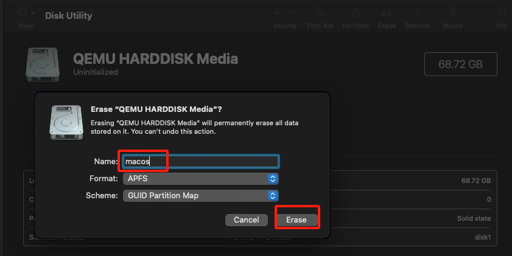
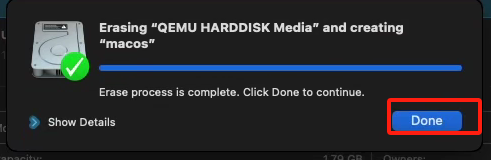
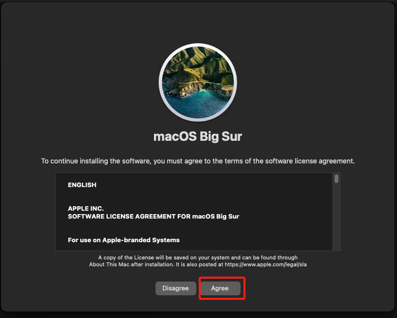
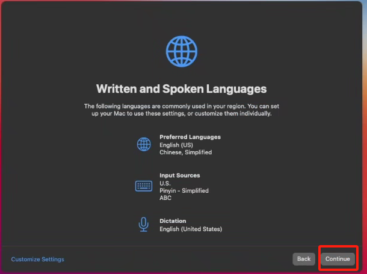
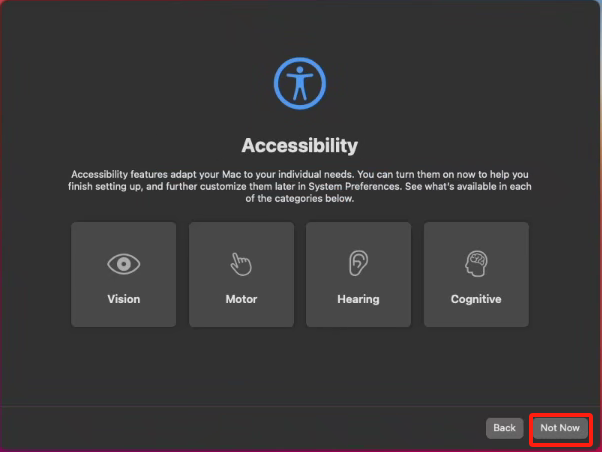
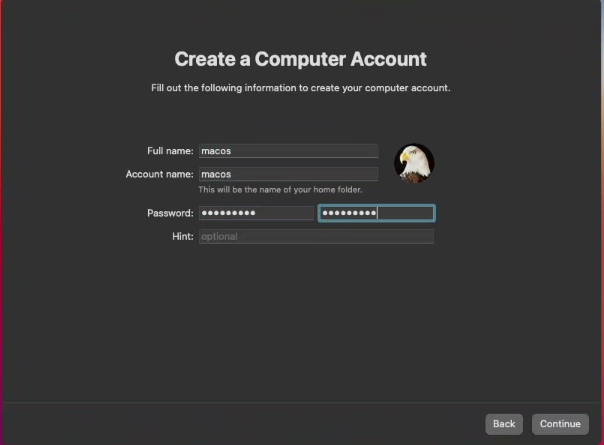

# 开设MacOS虚拟机

## 前置需求

系统和硬件配置要求 --> 检测环境

只有检测环境检测出宿主机支持KVM嵌套虚拟化时，才可以开设MACOS虚拟机，否则会被硬件识别无法开设。

## 前置环境设置

- 自动识别 CPU 类型（AMD 或 Intel），并根据类型设置嵌套虚拟化参数。  
- 修改 GRUB 启动参数，启用 IOMMU 和禁用默认 framebuffer。  
- 添加 VFIO 模块支持，便于直通硬件设备。  
- 黑名单声卡和显卡驱动模块，避免与 macOS 冲突。  
- 配置 KVM 相关内核参数，忽略 MSR 错误，提高兼容性。  
- 修补 Proxmox 前端状态检测逻辑，绕过状态限制。 

国际

```shell
curl -L https://raw.githubusercontent.com/oneclickvirt/pve/main/extra_scripts/configure_macos.sh -o configure_macos.sh && chmod +x configure_macos.sh && bash configure_macos.sh
```

国内

```shell
curl -L https://cdn.spiritlhl.net/https://raw.githubusercontent.com/oneclickvirt/pve/main/extra_scripts/configure_macos.sh -o configure_macos.sh && chmod +x configure_macos.sh && bash configure_macos.sh
```

执行成功后会显示15秒后重启本机，这是正常的流程，不重启无法使得内核参数生效。

## 系统镜像下载

- 所有镜像已预装组件，体积较大（最小约4.9GB），下载与解压任务将后台挂起执行。
- 镜像为完整系统含所有组件，无需联网即可引导使用。
- 若系统盘空闲空间不足镜像大小的2倍，将拒绝下载。
- 镜像为7z压缩格式，下载后需解压才能使用。
- 可随时查看当前下载与解压任务状态，完成后方可创建虚拟机。

国际

```shell
curl -L https://raw.githubusercontent.com/oneclickvirt/pve/main/scripts/install_macos_images.sh -o install_macos_images.sh && chmod +x install_macos_images.sh && bash install_macos_images.sh
```

国内

```shell
curl -L https://cdn.spiritlhl.net/https://raw.githubusercontent.com/oneclickvirt/pve/main/scripts/install_macos_images.sh -o install_macos_images.sh && chmod +x install_macos_images.sh && bash install_macos_images.sh
```

或

```shell
bash install_macos_images.sh
```

后台下载任务挂起执行后，可关闭SSH窗口，等待半小时到3个小时(具体等待时间取决于你的服务器带宽大小和连通性)，下载iso的7z压缩包。

下载任务执行完毕后，查询显示当前下载任务为空时，就可以选择解压任务执行了，解压挂起执行等待的时间取决于你的服务器CPU性能。

当解压任务执行完毕，查询显示当前解压任务为空时，一切准备工作就算准备好了。

相同类型的任务可以并发，也可以随时取消某个任务，取消时需要输入PID的值。

通过 https://github.com/oneclickvirt/macos 制作的目前支持的镜像压缩包：

```
# 按系统发布时间从旧到新
high-sierra.iso.7z (大小: 5.23GB)
mojave.iso.7z (大小: 6.03GB)
catalina.iso.7z (大小: 8.33GB)
big‑sur.iso.7z (大小: 12.21GB)
monterey.iso.7z (大小: 12.36GB)
ventura.iso.7z (大小: 12.31GB)
sonoma.iso.7z (大小: 14.41GB)
sequoia.iso.7z (大小: 15.02GB)
```

## MACOS虚拟机模板设置

- 系统```high-sierra```、```mojave```、```catalina```需要至少2核4G内存40G硬盘进行开设
- ```big‑sur```及更新版本的MACOS系统需要至少6核6G内存50G硬盘进行开设
- 系统版本越新(下载的序号越靠后)所需的硬件就越多
- 所有镜像均为启动盘镜像，未设置任何个人数据，所以关于硬盘分配，登录信息设置，网络设置都需要后续按照说明手动设置
- 需要手动在web端启动虚拟机，启动前可以查看所有模板是否符合预期再启动

### 下载模板脚本

国际

```shell
curl -L https://raw.githubusercontent.com/oneclickvirt/pve/main/scripts/buildvm_macos.sh -o buildvm_macos.sh && chmod +x buildvm_macos.sh
```

国内

```shell
curl -L https://cdn.spiritlhl.net/https://raw.githubusercontent.com/oneclickvirt/pve/main/scripts/buildvm_macos.sh -o buildvm_macos.sh && chmod +x buildvm_macos.sh
```

### 参数含义

```shell
# ./buildvm_macos.sh VMID CPU核数 内存 硬盘 SSH端口 VNC端口 系统 存储盘 独立IPV6(留空默认N)
```

:::tip
这块的硬盘大小只是你开设的虚拟机的硬盘大小，实际开设过程中，程序还会挂载引导盘和系统镜像，所以实际开设一个虚拟机的硬盘需求是 虚拟机硬盘大小+镜像本体大小+引导盘大小(500MB) 请时刻注意你的硬盘空间是否足够开设虚拟机
:::

### 示例命令

以最旧的版本(high-sierra)为例，实验支持的配置如下(非常卡顿)

```shell
./buildvm_macos.sh 100 2 4096 45 44022 45901 high-sierra local N
```

模板开设完毕可执行```cat vm100```查看信息，或到WEB端对应VM的NOTES中查看

以下为开设的示例VM的信息：

| 属性                    | 值          |
| ----------------------- | ----------- |
| VMID                    | 100         |
| CPU核数                 | 2           |
| 内存大小                | 4096MB      |
| 磁盘大小                | 45G         |
| SSH端口                 | 44022       |
| VNC端口                 | 45901       |
| 系统                    | high-sierra |
| 宿主机的存储盘          | local       |
| 绑定独立IPV6(留空默认N) | N           |

:::tip
注意这里的VMID仅可使用100到256，其他数字不可用
:::

## MACOS系统引导和安装

前面的流程走完后，面板端可以看到一个灰色的虚拟机待启动


点击启动后，进入VNC面板，左侧选择框有一个全屏按钮，实际操作时建议全屏操作，避免分辨率问题


经过大概3分钟的引导盘加载后，屏幕中央靠左侧会显示有一个启动盘可用，直接点击或回车

然后又是大概3~5分钟的启动盘加载后，会出现四个选择框，选择```Disk Utility```点击进入


进入后可以看到有三个盘和一个镜像，找到那个盘大小大于40G且名字叫```QEMU HARDDISK Media```的盘，点击```Erase```

  

此时会出现一个弹窗，需要给```name```重命名为```macos```方便后续识别使用，然后点击```Erase```继续初始化

  

初始化完毕后，点击```Done```

  

此时需要退出```Disk Utility```界面，右上角点击```Disk Utility```选择```Quit Disk Utility```退出当前选择框

  

然后回到了之前那四个选择框那里，选择```Install macOS XXXX```(由于我在以Big Sur为示例安装，所以XXXX为Big Sur系统)，点击```continue```

  

后续就是继续点击```continue```，然后点击```Agree```，然后又是点击```Agree```


  

  

直到又出现那三个盘，但在这块可以那个盘大小大于40G且名字叫```macos```的盘，选择它，然后点击```continue```

  

一段时间的文件复制硬盘加载(大概跑个12分钟)后，正式进入系统安装环节，这块看你宿主机在哪个地区选哪个

  

选择完地区后一路点击```continue```

  

  

直到出现数据迁移选项```Migration Assistant```，选择左下角的```Not Now```不导入用户数据

  

然后就会提示你创建用户，填写用户名和账户名，还有登录所需的密码，设置完毕后点击```continue```

  

然后后面就会一路畅通点击```continue```，直到系统安装完毕了

## 网络配置

由于是离线环境进行的系统安装，所以这块需要手动配置静态网络连接宿主机的网桥

右上角点击WIFI按钮，关闭WIFI后，点击```Network Preferences ...```

  

进入设置界面后，点击```Advanced```按钮，进入高级设置界面

  

在```TCP/IP```这一栏填写静态网络配置

Configure IPV4: ```Manually```

IPV4 Address: ```172.16.1.xxx```(xxx换成你想绑定的ip，我的vmid是100，为了方便写了100)

Subnet Mask: ```255.255.255.0```

Router: ```172.16.1.1```

如果你需要配置IPV6网络，类比上面的IPV4设置，需要填写的会是虚拟机绑定的公网IPV6地址(PVE面板中的Note框有写)，子网掩码填128，默认网关填写```cat /usr/local/bin/pve_check_ipv6```在宿主机执行后显示的地址。

  

在```DNS```这一栏填写静态网络的DNS配置

一般加入```8.8.8.8```和```1.1.1.1```足够了，中国境内使用```114.114.114.114```即可。

  

填写完毕且```apply```后，设置的左上角会显示网络已连通

  

此时打开默认的浏览器，随便打开一个网址，都是可访问公网资源的，证明网络已配置成功

  

## 卸载iso镜像

在ProxmoxVE的web端手动在```Hardware[硬件]```中点击对应的```CD```选择```Remove[删除]```然后再重启虚拟机，这样就能直接使用了


Macos系统就是卸载```opencore.iso```和```xxxx(安装使用的系统镜像).iso```，类似上面示例图片的Windows系统卸载win镜像和virtio镜像一样。


