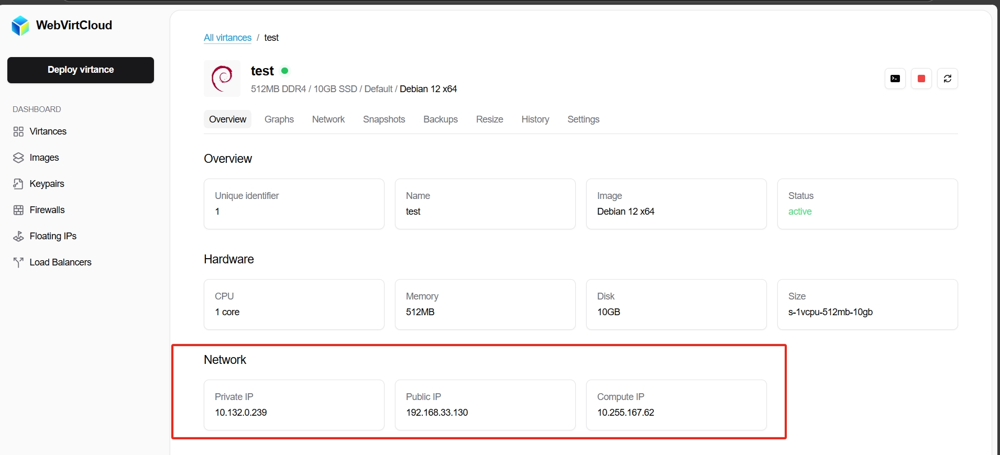

# WebVirtCloud 安装指南

[](https://hits.spiritlhl.net)

仓库地址: <https://github.com/oneclickvirt/webvirtcloud>

原项目对应仓库：<https://github.com/webvirtcloud/webvirtcloud>

应该算是全网中文第一份完整的部署指南，官方的指南实际上有很多地方是和本项目部署的方式有出入的。

## 1. 控制端安装

### 系统要求

**最低配置要求:**
- CPU: 1 核
- 内存: 1 GB RAM
- 硬盘: 空余 10 GB
- 系统：Debian11+，Ubuntu20.04+

### 默认登录信息
- 用户名: `admin@webvirt.cloud`
- 密码: `admin`

### 面板地址
- 用户面板: `https://192-168-0-114.nip.io`
- 管理后台: `https://192-168-0-114.nip.io/admin`

> **注意:** 请将 `192.168.0.114` 替换为你的公网 IP，以获取真实可访问地址。

### 安装命令

国际版本：
```bash
curl -slk https://raw.githubusercontent.com/oneclickvirt/webvirtcloud/main/scripts/install_webvirt_cloud.sh -o install_webvirt_cloud.sh \
&& chmod +x install_webvirt_cloud.sh \
&& bash install_webvirt_cloud.sh
```

国内版本：
```bash
curl -slk https://cdn.spiritlhl.net/https://raw.githubusercontent.com/oneclickvirt/webvirtcloud/main/scripts/install_webvirt_cloud.sh -o install_webvirt_cloud.sh \
&& chmod +x install_webvirt_cloud.sh \
&& bash install_webvirt_cloud.sh
```

## 2. 计算节点安装

> **重要提示:** Hypervisor 和 Controller 不能在同一虚拟机上安装，否则网络会出现冲突。

### 系统要求

**建议配置:**
- CPU: 2 核
- 内存: 4 GB RAM
- 硬盘: 空余 40 GB
- 系统：AlmaLinux8+，RockyLinux8+

> **额外说明:**
> - 实际使用建议更高配置，测试环境只够开 4 台最小的虚拟机。
> - 服务器推荐支持 KVM 嵌套虚拟化的，若`VM-x/AMD-V/Hyper-V`未启用也可以，会自动切换为QEMU使用TCG仿真开设虚拟机，只不过性能会有所损耗。
> - 跳过 env 检测安装，直接使用二进制文件，无需安装依赖。

### 环境检测

检测服务器是否支持 KVM 嵌套虚拟化：
```bash
curl -L https://cdn.spiritlhl.net/https://raw.githubusercontent.com/oneclickvirt/ecs/master/goecs.sh -o goecs.sh && chmod +x goecs.sh && ./goecs.sh install && goecs
```

选择硬件单项测试

### 计算节点安装步骤

1. 下载安装脚本：

   国际版本：
   ```bash
   curl -slk https://raw.githubusercontent.com/oneclickvirt/webvirtcloud/main/scripts/install_hypervisor.sh -o install_hypervisor.sh \
   && chmod +x install_hypervisor.sh
   ```

   国内版本：
   ```bash
   curl -slk https://cdn.spiritlhl.net/https://raw.githubusercontent.com/oneclickvirt/webvirtcloud/main/scripts/install_hypervisor.sh -o install_hypervisor.sh \
   && chmod +x install_hypervisor.sh
   ```

2. 执行安装（替换为你的 Controller IP）：
   ```bash
   bash install_hypervisor.sh x.x.x.x
   ```
   > 请将 `x.x.x.x` 替换为你的 Controller 控制端的实际 IP 地址。

3. 面板纳管节点  
   执行完毕后会有提示需要在Controller面板端需要填写的内容。  
   面板端要填入Hostname的是当前计算节点的IPV4地址，还有要填入Token识别节点。

### NetworkManager 版本问题

安装过程中可能会出现以下错误：
```
Connection 'eth0' (bed050e9-ff49-4665-8112-24ddf2a1cd3c) successfully deleted.
Warning: nmcli (1.48.10) and NetworkManager (1.42.2) versions don't match. Restarting NetworkManager is advised.
Error: Failed to add 'br-ext' connection: connection.autoconnect-ports: unknown property
```

**解决方法:** 重启服务器后重新执行安装命令。

### 安装耗时提示

- 整个过程大约耗时 **10~25 分钟**。
- 大部分时间用于下载 `finnix-125.iso` 至 `/var/lib/libvirt/isos/finnix-125.iso`。
- 该部分无法加速，**建议使用 tmux 或 screen** 等工具防止中断。

### 添加计算节点到控制面板

安装完成后会生成一个 **Token**，用于在控制端（Admin 面板）中添加计算节点：

路径: `Admin Panel > Computers > Add Computer`

- `HostName` 需要填写计算节点的公网IPV4地址
- `Token` 填在计算节点上获取到的token密钥

## 3. 公网IPV4端口映射

### 3.1 自动映射

自动映射功能特点：
- **自动监控**：实时监控虚拟机状态变化，自动应用或清理端口映射规则
- **智能端口分配**：根据虚拟机IP地址自动计算和分配不冲突的端口
- **规则持久化**：使用firewall-cmd确保端口映射规则在宿主机重启后依然有效
- **映射记录**：自动维护映射信息记录文件，便于查看和管理
- **冲突防护**：智能检测并避免端口冲突，确保每个虚拟机都有唯一的端口映射

#### 安装方法

1. 下载脚本到临时目录：
   国际版本：
   ```bash
   wget -O /tmp/vm_port_mapping_setup.sh https://raw.githubusercontent.com/oneclickvirt/webvirtcloud/refs/heads/main/extra_scripts/vm_port_mapping_daemon.sh
   ```

   国内版本：
   ```bash
   wget -O /tmp/vm_port_mapping_setup.sh https://cdn.spiritlhl.net/https://raw.githubusercontent.com/oneclickvirt/webvirtcloud/refs/heads/main/extra_scripts/vm_port_mapping_daemon.sh
   ```

3. 添加执行权限：
   ```bash
   chmod +x /tmp/vm_port_mapping_setup.sh
   ```

4. 运行安装程序：
   ```bash
   /tmp/vm_port_mapping_setup.sh
   ```

脚本会自动完成以下操作：
- 将自身复制到系统目录 `/usr/local/sbin/vm_port_mapping_daemon.sh`
- 创建systemd服务单元文件
- 启用并启动服务

#### 端口映射规则

守护进程会为每个虚拟机分配以下端口：

1. **SSH端口**：
   - 计算公式：`(IP最后一段) × 100 + 22 + 10000`
   - 示例：对于IP地址 192.168.33.114，映射的SSH端口为 114×100+22+10000 = 21422

2. **额外端口**：
   - 每个虚拟机分配10个额外端口
   - 起始端口：20000 + (IP最后一段) × 100
   - 结束端口：起始端口 + 9
   - 示例：对于IP地址 192.168.33.114，额外端口范围为 20000+(114×100) 至 20000+(114×100)+9

如果计算出的端口已被占用，程序会自动寻找下一个可用端口，确保不发生冲突。

#### 映射文件

所有端口映射信息保存在 `/etc/vm_port_mapping/mapping.txt` 文件中，格式为：
```
虚拟机名字 IP地址 MAC地址 SSH映射端口 额外端口起始 额外端口结束
```

例如：
```
Virtance-1 192.168.33.114 52:54:00:5f:77:92 21422 31400 31409
```

#### 服务管理

- **查看服务状态**：
  ```bash
  systemctl status vm-port-mapping
  ```

- **启动服务**：
  ```bash
  systemctl start vm-port-mapping
  ```

- **停止服务**：
  ```bash
  systemctl stop vm-port-mapping
  ```

- **禁用自启动**：
  ```bash
  systemctl disable vm-port-mapping
  ```

- **查看日志**：
  ```bash
  journalctl -u vm-port-mapping
  # 或
  cat /var/log/vm_port_mapping.log
  ```

- **手动触发规则更新**：
  ```bash
  systemctl restart vm-port-mapping
  ```

#### 常见问题

##### 端口映射不生效

检查以下内容：
- 确认服务正在运行：`systemctl status vm-port-mapping`
- 检查日志文件：`cat /var/log/vm_port_mapping.log`
- 确认防火墙服务正常：`systemctl status firewalld`
- 验证虚拟机网络接口配置：`virsh domiflist 虚拟机名称`

##### 手动添加映射规则

通常不需要手动添加规则，但如果需要，可以这样操作：

1. 停止服务：
   ```bash
   systemctl stop vm-port-mapping
   ```

2. 编辑映射文件：
   ```bash
   nano /etc/vm_port_mapping/mapping.txt
   ```

3. 启动服务：
   ```bash
   systemctl start vm-port-mapping
   ```

##### 清理所有规则

```bash
systemctl stop vm-port-mapping
grep -f /etc/vm_port_mapping/mapping.txt | while read -r vm_name ip_address mac ssh_port port_start port_end; do
  firewall-cmd --permanent --remove-forward-port="port=$ssh_port:proto=tcp:toport=22:toaddr=$ip_address"
  for ((port=port_start; port<=port_end; port++)); do
    firewall-cmd --permanent --remove-forward-port="port=$port:proto=tcp:toport=$port:toaddr=$ip_address"
  done
done
firewall-cmd --reload
```

##### 安全建议

- 定期检查映射文件和日志，确保没有未授权的映射
- 不要手动修改 `/etc/vm_port_mapping/` 目录下的文件，除非你完全了解其影响
- 确保 `firewalld` 服务正常运行，以便规则能够正确持久化

#### 卸载方法

如需卸载此服务：
```bash
systemctl stop vm-port-mapping
systemctl disable vm-port-mapping
rm -f /etc/systemd/system/vm-port-mapping.service
rm -f /usr/local/sbin/vm_port_mapping_daemon.sh
rm -rf /etc/vm_port_mapping
systemctl daemon-reload
```

### 3.2 手动映射

假设此时你的虚拟机在用户端控制面板显示为



且宿主机的命令执行`ip a | head -n 15`结果为

```shell
1: lo: <LOOPBACK,UP,LOWER_UP> mtu 65536 qdisc noqueue state UNKNOWN group default qlen 1000
    link/loopback 00:00:00:00:00:00 brd 00:00:00:00:00:00
    inet 127.0.0.1/8 scope host lo
       valid_lft forever preferred_lft forever
    inet6 ::1/128 scope host
       valid_lft forever preferred_lft forever
2: ens3: <BROADCAST,MULTICAST,UP,LOWER_UP> mtu 1500 qdisc fq_codel state UP group default qlen 1000
    link/ether 52:54:00:f1:d6:8b brd ff:ff:ff:ff:ff:ff
    altname enp0s3
    inet 你的公网IPV4地址/对应的子网掩码 scope global noprefixroute ens3
       valid_lft forever preferred_lft forever
    inet6 2a0b:4140:4c60::2/48 scope global noprefixroute
       valid_lft forever preferred_lft forever
    inet6 fe80::5054:ff:fef1:d68b/64 scope link noprefixroute
       valid_lft forever preferred_lft forever
```

可见公网IPV4地址绑定的接口是`ens3`，所以后面的命令这里用`ens3`

那么映射当前虚拟机的22端口到公网IPV4的3322端口的命令为：

```shell
# 添加 DNAT 规则：将公网3322流量转发到宿主机本地的192.168.33.130:22
iptables -t nat -A PREROUTING -i ens3 -p tcp --dport 3322 -j DNAT --to-destination 192.168.33.130:22
# 添加 POSTROUTING：本机 NAT 伪装，以便连接正常返回
iptables -t nat -A POSTROUTING -p tcp -d 192.168.33.130 --dport 22 -j MASQUERADE
# 需要允许 INPUT 的3322端口通过（firewalld 默认是开启了的）
iptables -I INPUT -p tcp --dport 3322 -j ACCEPT
```

这样内网的虚拟机就被映射出来，可以直接远程登录使用了。

## 4. 问题排查

### 添加计算节点错误排查

在Controller控制端执行：
```shell
telnet <node ip> 8884
```

在计算节点执行：
```shell
systemctl status webvirtcompute
systemctl status libvirtd
systemctl status prometheus
systemctl status prometheus-libvirt-exporter
```

如果以上都查不出问题，那么就需要到Controller控制端执行：
```shell
docker exec -it webvirtcloud-backend /bin/sh
vi webvirtcloud/settings/production.py
```

将 `DEBUG=False` 改成 `DEBUG=True`，然后保存文件后，容器内执行：
```shell
UV_PROJECT_ENVIRONMENT=/usr/local uv sync --dev
```

然后`exit`退出容器后，执行：
```shell
docker restart webvirtcloud-backend
sleep 3
docker logs webvirtcloud-backend -f
```

然后前端去触发错误的位置，这块日志实时加载就会看到对应的报错了。

### Controller 重启后 Docker 容器不自重启

如果 Docker 容器在系统重启后没有自动重启，执行以下命令：
```bash
docker start $(docker ps -a -q)
```

## 5. 缺点

系统镜像是写死的，没法使用自己制作的自定义镜像，也没办法导出使用。

同 https://github.com/retspen/webvirtcloud 不是同一个项目，不要搞混淆了。

## 致谢

<https://webvirt.cloud/>
