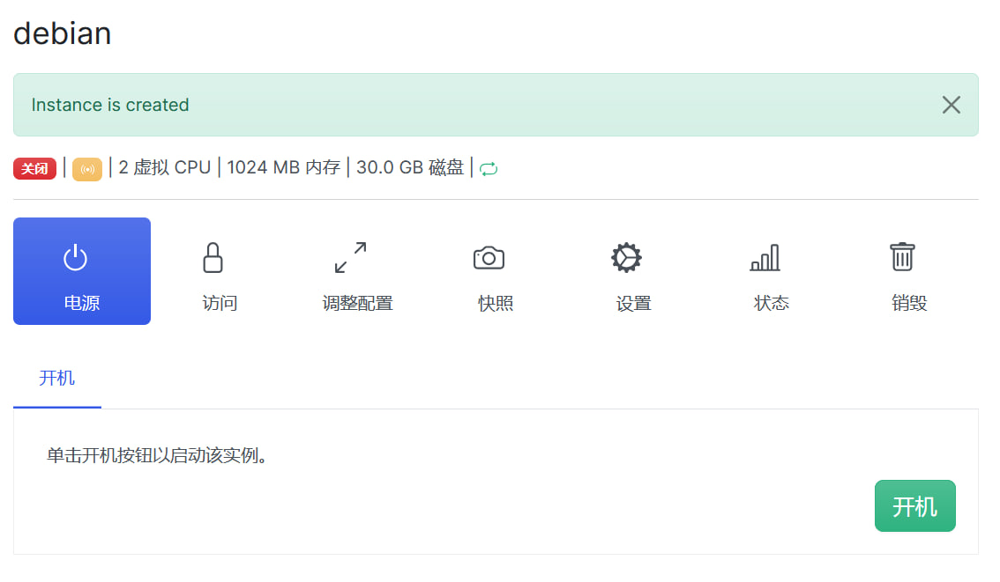
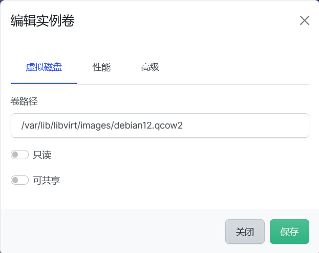
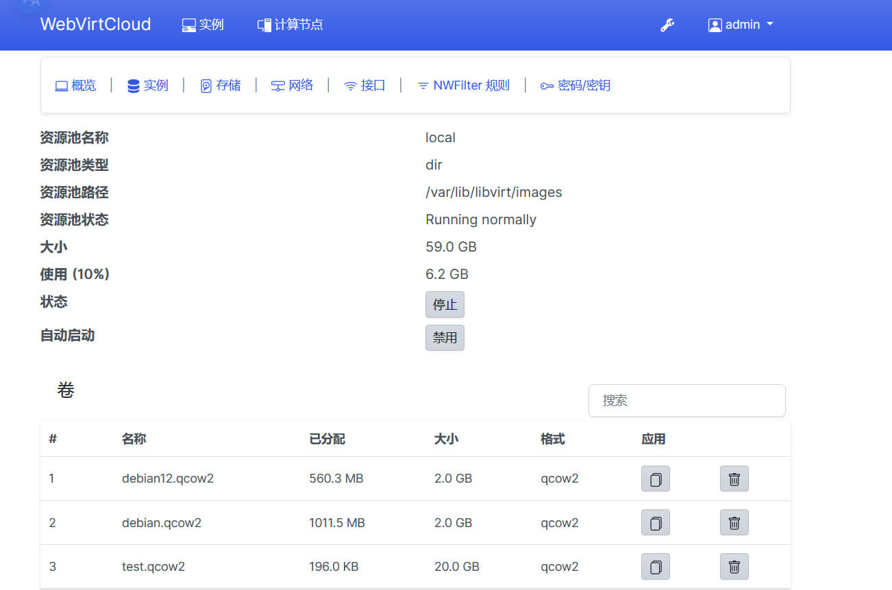
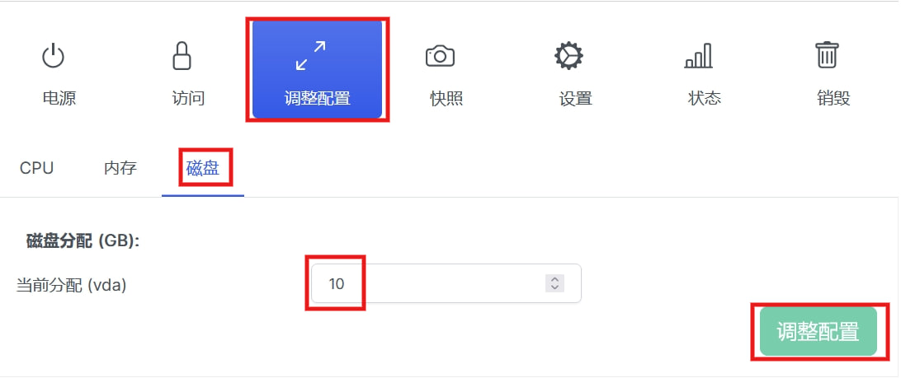

## WebVirtCloud 安装指南

[](https://hits.spiritlhl.net)

仓库地址: <https://github.com/oneclickvirt/webvirtcloud>

原项目对应仓库：<https://github.com/oneclickvirt/webvirtcloud_retspen>

## 控制节点和计算节点同时安装

- 支持系统：Debian10+, Ubuntu18.04+, Centos8+, AlmaLinux8+, RockyLinux8+
- 推荐系统：Debian12+，Ubuntu22.04+
- 低版本系统会自动编译python新版本的安装包后再进行部署，所以推荐使用新系统不必编译直接安装

国际

```bash
curl -slk https://raw.githubusercontent.com/oneclickvirt/webvirtcloud/main/scripts/install_webvirt_cloud_retspen.sh -o install_webvirt_cloud_retspen.sh \
&& chmod +x install_webvirt_cloud_retspen.sh \
&& bash install_webvirt_cloud_retspen.sh
```

国内

```bash
curl -slk https://cdn.spiritlhl.net/https://raw.githubusercontent.com/oneclickvirt/webvirtcloud/main/scripts/install_webvirt_cloud_retspen.sh -o install_webvirt_cloud_retspen.sh \
&& chmod +x install_webvirt_cloud_retspen.sh \
&& bash install_webvirt_cloud_retspen.sh
```

安装完成后打开公网IP地址，就能看到登录页面。

登录信息用户名和密码都是```admin```，记得登录后自行修改。

## 开设Linux虚拟机

进入控制面板后，修改完admin的密码后，需要自行设置计算节点。

  

选择```本地```类型，添加命名为local。

  

创建完成后，点击眼睛按钮，进入查看

  

在```存储```一栏中添加存储，选择```Dir```类型，添加名字叫```local```。如果你需要使用```ISO```类型的系统引导，那么需要创建ISO类型的存储，如果不需要的话跟着本指南走，就仅需要创建```Dir```类型。


创建完毕后，下载对应系统的qcow2文件，使用下面这个仓库的链接

https://github.com/oneclickvirt/pve_kvm_images/releases/tag/images

示例中下载使用debian12的qcow2镜像使用

```shell
cd /var/lib/libvirt/images
wget https://cdn.spiritlhl.net/https://github.com/oneclickvirt/pve_kvm_images/releases/download/images/debian12.qcow2
chmod 777 debian12.qcow2
```

回到实例页面创建实例

  

计算节点选择```local```

  

芯片组使用默认的就行，换不换都没问题

  

创建虚拟机可以使用预定义的配置大小，也可以自行使用自定义大小，看你的选择。

  

注意这块填写的实例名字不能和刚刚下载的镜像的文件名字重复，比如示例中就不能填写```debian12```。

  

创建成功后不能立即点击开机。

  

需要修改磁盘设置。


这块修改qcow2文件为```debian12.qcow2```，对应之前下载的qcow2的文件的名字，使用镜像。

  

修改确认后会在原来的计算节点的存储的```local```卷里看到有一个多余的盘，比如这里的```test.qcow2```，最好删除，避免占用磁盘

  

修改完成确认无误后，才可回到电源页面开机。


镜像的默认登录的用户名是```root```，密码是```password```或者是 ```oneclickvirt```。

开机后，你会发现硬盘只有原始镜像的大小，此时需要调整硬盘大小，需要再次关机，此时能见到下图页面的按钮可用且硬盘大小也识别出来了。

没有经过首次开机，硬盘的大小是识别不出来的，识别不出来就不能进行修改，所以首次开关机是必须的。



修改后重启虚拟机，会发现有新的盘空间未分配，此时需要按照下面的方法阔盘。

查看盘路径和剩余空白空间未分配的：

```shell
lsblk
```

然后使用下述命令阔盘

```shell
fdisk /dev/vda
```

按以下顺序操作：

输入```d```删除旧的分区（是的，需要删除旧的 vda1，数据不会丢失，因为后面不会格式化）。

输入```n```后回车新建一个分区。

类型选 primary（默认 p），直接回车就行

分区号同样选```1```

起始位置必须和旧分区一样（默认是对的）按回车就行

显示是否需要擦除指纹，输入```Y```回车

结束位置直接按回车，使用全部剩余空间

输入```w```保存并退出。

此时再使用```lsblk```可确认新的空闲硬盘被分配成功了。

## 缺点

网络还是没有自动配置，不如上一个项目智能，还得手动配置一下。

需要在已经开好的虚拟机的VNC中，登录后执行

```shell
systemctl enable cloud-init
reboot
```

手动启用配置为重启后自启动，然后重启服务器，就有网了。
